```{r}
#| label: setup
#| include: false
#| cache: false

## ---- Package management -----------------------------------------------------

# install librarian if needed
if (!requireNamespace("librarian", quietly = TRUE)) {
  install.packages("librarian")
}

# load required packages
librarian::shelf(
  tidyverse,
  easystats,
  mirai,
  sjPlot,
  here,
  parallel,
  tictoc,
  emmeans,
  interactions,
  jtools,
  usmap,
  fs,
  ggpubr,
  ggdist,
  ggrepel,
  faux,
  lme4,
  lmerTest,
  ggeffects,
  binom,
  ggthemes,
  sessioninfo,
  knitr,
  kableExtra,
  readxl,
  apa7,
  cowplot,
  viridisLite,
  flextable,
  sf
)

## ---- Source project functions -----------------------------------------------

myFunctions <- c(
  "f_lmer",
  "f_glmer",
  "f_plot_M1",
  "find_merMod",
  "FUNStormEventsData_filterData_day",
  "FUNStormEventsData_filterData"
)

for (f in myFunctions) {
  source(
    here::here("functions", paste0(f, ".R"))
  )
}

# Prepare state boundaries
poly_states <- plot_usmap(
  regions = "states",
  exclude = c("AK", "HI")
)$data

# Map for the US plots (use the 2021 map so that the counties in CT match those in the data)
myYearPlot <- 2021
```

```{r}
#| label: import final preprocessed data
#| results: 'hide'

# Read in preprocessed data
finaldata <- readRDS(
  here::here(
    "data",
    "20260702_out_05_prep_dataForAnalysis.RDS"
  )
)

# Read in EWE data (from 2024)
data_details_fips_2024 <- readRDS(
  here::here(
    "data",
    "20240816_data_details_fips.RDS"
  )
)

# Read in sample characteristics
data_sampleCharacteristics_demographics <- read_excel("../data/Nature_Submission_SampleCharacteristics.xlsx", sheet = "Table_S1_Age_by_Gender")
data_sampleCharacteristics_region <- read_excel("../data/Nature_Submission_SampleCharacteristics.xlsx", sheet = "Table_S2_Region")
data_sampleCharacteristics_party <- read_excel("../data/Nature_Submission_SampleCharacteristics.xlsx", sheet = "Table_S3_Party")

```

```{r}
#| label: Create and prepare smaller dataframe
#| results: 'hide'

# Create reduced dataframe
data_reduced <- finaldata |>
  dplyr::filter(
    applyExclusionCriteria == TRUE,
    filterDaysSinceEvent == 30
  ) |>
  dplyr::select(
    applyExclusionCriteria,
    filterDaysSinceEvent,
    dFull_withEpisodes
  ) |>
  mutate(
    dFull_withEpisodes = map(
      dFull_withEpisodes,
      ~ .x |>
        rename(racethn = racethn_simple) |>
        mutate(
          across(
            .cols = c(income, education, racethn),
            .fns = factor
          ),

          # Create recency_index
          recency_index = ifelse(
            is.na(daysSinceMostRecentEpisode),
            0,
            1 / (daysSinceMostRecentEpisode + 1)
          ),

          # Scale problematic continuous predictors
          countyIncome = as.numeric(scale(countyIncome)),
          countyPvi = as.numeric(scale(countyPvi)),
          sum_damage = as.numeric(scale(sum_damage)),
          sum_injuries = as.numeric(scale(sum_injuries)),
          sum_deaths = as.numeric(scale(sum_deaths)),
          abnormality_final = as.numeric(scale(abnormality_final)),
          population_density_peopPerSqKilometer =
            as.numeric(scale(population_density_peopPerSqKilometer))
        ) |>
        (\(df) {
          myVars <- c("income", "education", "racethn")

          for (myVar in myVars) {
            contrasts(df[[myVar]]) <- contr.sum(nlevels(df[[myVar]]))
            colnames(contrasts(df[[myVar]])) <-
              levels(df[[myVar]])[1:(nlevels(df[[myVar]]) - 1)]
          }

          df
        })()
    )
  )
```

# Methods

## Procedure

Participants were first directed from the panel provider’s page (MSI-ACI's FlexPanel) to a survey hosted in Qualtrics. After passing quality and attention checks, they were directed to a decision-making experiment programmed in MouselabWEB [@willemsen_revisiting_2019], which tracked their information search processes. Following the experiment, participants were informed which trial was randomly selected to be implemented and received details about their corresponding bonus payment and the amount of carbon emitted as a result of their choices. They then returned to the Qualtrics survey to answer questions about the experiment, their experience with extreme weather events, their climate change concern, political affiliation, and demographic information. Participants received a flat participation fee of 95 cents USD from the panel provider, with the opportunity to earn an additional bonus of 30 to 96 cents USD based on their decisions during the task (see [Carbon Emission Task: Trials](#cet-trials) below).

## Survey Structure and Questions

@supptbl-surveyStructureAndQuestions shows the general structure of the survey as well as specific questions.

```{r}
#| label: Create supptbl-surveyStructureAndQuestions

# Create the Qualtrics Survey Structure data frame
QualtricsSurvey <- tibble(
  Block_Name = c(
    "detectMobile", "Captcha", "InformationConsent", "Welcome", "AttentionChecks",
    "handleIDs", "Experiment", "QuestionsExperiment", "extremeWeatherExperiences",
    "personalEWE", "indirectEWE",
    "subjectiveAttribution", "climateChangeConcern",
    "politicalOrientation", "Demographics", "FIPS", "Thanks"
  ),
  Exact_Questions = c(
    "It seems like you are using a [device]. Please switch to a desktop/laptop.",
    "Please complete the captcha below.",
    "Welcome to this study on decision-making! Do you consent to participate?",
    "Dear Participant, To conduct the experiment calmly, please close other programs.",
    "What is your year of birth? / What does the current study investigate? / What is your age? / Choose 'Somewhat disagree'",
    "Thank you for answering the questions.",
    "You can go to the experiment now by clicking the button below.",
    "What kind of device did you use to display the experiment? / How did you complete the experiment? / What type of mouse did you use? / Did you experience any technical problems during the experiment? / Please describe the technical problems you experienced: / Please indicate your level of agreement with the following statement: Buying and retiring carbon emission certificates is an effective means to reduce carbon emissions.",
    "If any, which of the following extreme weather events did you experience in the past days? To access definitions of the different event types, click Info. / How often? / How much did they affect you? / Please indicate how many times you experienced each event type in the past days.",
    "My current or previous property was affected by an extreme weather event. / I experienced travel disruption or disruption to ability to work as a result of an extreme weather event. / I experienced disruption of essential services such as gas, electricity, water supply, drains, telephone or internet as a result of an extreme weather event. / Other people in my local area experienced damage to their property from an extreme weather event.",
    "Did you read or hear (through newspapers, online sources, social media, TV, radio, or other sources) about one or more extreme weather events in the past 120 days (i.e. last four months) in your county of residence or your state of residence or other states of the U.S.? / Were any of your significant others (e.g., family, friends, or colleagues) affected by one or more extreme weather events in the past 120 days (i.e. last four months)?",
    "Extreme weather events are caused in part by climate change. / Extreme weather events are a sign that impacts of climate change are happening now. / Extreme weather events show us what we can expect from climate change in the future.",
    "In general, how concerned are you about climate change?",
    "Generally speaking, do you think of yourself as a Democrat, Republican or Independent? /<br><i>In case “Independent” was chosen, participants were additionally asked:</i> If you had to identify with one party of the two parties, which one would you choose?",
    "For statistical purposes, what is the gender you identify with? / What is the highest level of education that you have completed and received credit for? / Last year, that is in 2024, what was your total family income from all sources, before taxes? / What is your cultural background? Choose all that apply. / How would you describe the area where you live?",
    "Please provide your State, County, and 5-digit FIPS code.",
    "Do you have any suggestions or comments on the study?"
  ),
  Answer_Options = c(
    "- No action<br>- Switch to desktop/laptop<br>- Adjust screen resolution",
    "- Captcha input field",
    "- I have read and understood and would like to participate<br>- I do not wish to participate",
    "- No response needed; instructions only",
    "- Free-text entry for year of birth<br>- Multiple-choice question on study topic<br>- Free-text entry for age<br>- Multiple-choice on instructed response",
    "- No response needed; system logs timing data",
    "- Button to start experiment<br>- Password input field<br>- Button to restart experiment",
    "- for device: “Laptop's internal screen“, “External monitor“, “Tablet“, “Mobile phone“, “Other (specify)“<br>- for how completing the experiment: “With a mouse“, “With a trackpad“, “With a touchscreen“<br>- for type of mouse: “Mouse with a cable“, “Wireless mouse (e.g., using Bluetooth or USB plug)“, “Other (specify)“<br>- for technical problems: yes-no question and free-text entry<br>- for agreement to carbon emission certificates: 5-point Likert scale ranging from “strongly disagree” to “strongly agree”",
    "- Checklist of extreme weather events<br>- Numeric input for frequency<br>- Likert scale for impact",
    "- Yes-no questions",
    "- for hear/read: 3 yes-no responses for my county of residence, my state of residence, other states of the U.S.<br>- for significant others: 4 yes-no responses for family, friends, colleagues, others [please specify]",
    "- 5-point Likert scales ranging from “strongly disagree” to “strongly agree”",
    "- slider scale ranging from 0 to 100 with labels “not at all concerned (0)”, “not very concerned (25)”, “somewhat concerned (50)”, “very concerned (75)”, and “extremely concerned (100)”",
    "- Strong Democrat<br>- Not very strong Democrat<br>- Independent, close to Democrat<br>- Independent<br>- Independent, close to Republican<br>- Not very strong Republican<br>- Strong Republican<br>- “Democratic Party” and “Republican Party” if Independent was chosen",
    "- for sex: “Male”, “Female”, “Other (specify)”<br>- for education: “Did not complete high school / GED“, “High school diploma / GED”, “Some college”, “Associate’s degree”, “Bachelor’s degree”, “Master’s degree or higher” <br>- for income: “Under $30,000”, “$30,000 - $49,999”, “$50,000 - $74,999”, “$75,000 - $99,999”, “$100,000 - $149,999”, “More than $150,000”<br>- for cultural background: “European”, “African”, “East Asian”, “South Asian”, “South East Asian”, “Hispanic or Latinx”, “Middle Eastern”, “First Nations or Indigeneous (specify)”, “Other (specify)”<br>- for area of residency: “Urban, a big city”, “Suburb, outskirt of a big city”, “Rural town or small city”",
    "- Free-text entry for FIPS code, State, and County",
    "- Free-text entry for feedback"
  )
)

# Create table
Qualtrics_tbl <- QualtricsSurvey %>%
  kable(
    format = "html",
    col.names = c(
      "Block Name",
      "Exact Questions",
      "Answer Options"
    ),
    align = "l",
    escape = FALSE,
    table.attr = 'class="survey-table" style="table-layout:fixed !important; width:680px !important;"'
  ) %>%
  kable_styling(
    full_width = FALSE,
    bootstrap_options = c("striped")
  ) %>%
  column_spec(
    1,
    width = "143px",
    extra_css = "width:143px !important; max-width:143px !important; min-width:143px !important; font-size:14px; line-height:1.15; vertical-align:top; overflow-wrap:break-word;"
  ) %>%
  column_spec(
    2,
    width = "286px",
    extra_css = "width:286px !important; max-width:286px !important; min-width:286px !important; font-size:14px; line-height:1.15; vertical-align:top; overflow-wrap:break-word;"
  ) %>%
  column_spec(
    3,
    width = "251px",
    extra_css = "width:251px !important; max-width:251px !important; min-width:251px !important; font-size:14px; line-height:1.15; vertical-align:top; overflow-wrap:break-word;"
  )

```

::: {#supptbl-surveyStructureAndQuestions}
```{r}
#| label: supptbl-surveyStructureAndQuestions
#| echo: false

Qualtrics_tbl
```

Structure of survey and specific survey questions.
:::



## Carbon Emission Task

### Carbon Emission Task: Everyday Examples

When shopping for groceries, consumers face trade-offs between the lower price of conventional products (e.g., cow milk) and the higher cost of environmentally sustainable alternatives (e.g., oat milk). Similarly, transportation decisions also require balancing personal costs with environmental impact. Ride-hailing services like Uber now display estimated carbon emissions for different travel options, allowing users to compare a cheaper, high-emission car ride with a more sustainable but potentially less convenient public transit alternative.

### Carbon Emission Task: Trials {#cet-trials}

@supptbl-CETTrials shows all trials in the new variant of the Carbon Emission Task (CET). Each row corresponds to one trial. *Carbon Diff.* and *Bonus Diff.* index the unique combinations of relative differences in carbon and bonus consequences in a trial. *Carbon Level Rand.* and *Bonus Level Rand.* correspond to the random carbon and bonus level used in the construction of a trial. The average carbon level over all trials is 19.85 lbs CO2, to which we add a random deviation with mean = 0 and SD = 0.9925 lbs CO~2~. The average bonus level over all trials is 60 cents, to which we add a random deviation with mean = 0 and SD = 3 cents USD. *Carbon Option Pro-Self* and *Bonus Option Pro-Self* represent the actual information available to participants related to the option that will lead to the greater bonus payment for participants. *Carbon Option Pro-Climate* and *Bonus Option Pro-Self* represent the same information but for the option leading to the greater benefit for the climate (lower carbon emissions).



```{r}
#| label: Create supptbl-CETTrials

# Read in the trials data
CETTrials <- read_csv("../data/CET_trials.csv")

# Select columns to display and round to two digits
CETTrials <- CETTrials %>% 
  select(
    carbon_prcnt, bonus_prcnt,
    carbon_level_rand, bonus_level_rand,
    carbon_self, carbon_env,
    bonus_self, bonus_env
  ) %>% 
  mutate(across(-ends_with("_prcnt"), ~ round(.x, 2)))

# Define column names
CETTrials_colnames <- c(
  "Carbon Diff (%)",
  "Bonus Diff (%)",
  "Carbon Level Rand (lbs.CO2)",
  "Bonus Level Rand (cent USD)",
  "Carbon Option Pro-Self (lbs.CO2)",
  "Carbon Option Pro-Climate (lbs.CO2)",
  "Bonus Option Pro-Self (cent USD)",
  "Bonus Option Pro-Climate (cent USD)"
)

# Display table with custom width for certain columns
CETTrials_tbl <- kable(CETTrials, col.names = CETTrials_colnames) %>% 
  column_spec(column = 1:2, width = "1cm") %>% 
  column_spec(column = 3:8, width = "2cm")
```

::: {#supptbl-CETTrials}
```{r}
#| label: supptbl-CETTrials
#| echo: false

CETTrials_tbl
```

Trials in the new variant of the CET
:::



In response to a reviewer's feedback, we implemented five additional trials with an inverted incentive structure to reduce predictability and potential learning effects (@supptbl-CETTrialsAdditionalInverted). In these trials, the initial pro-self option is now associated with lower emissions and higher bonus amounts – a deliberate modification of the initial structure. These trials are designed to encourage attentive processing, reduce reliance on heuristics (e.g., "more money = more emissions"), and maintain cognitive engagement throughout the task.

To ensure structured variation across the inverted trials, we began by stratifying the original trial set into five blocks based on the size of the carbon difference between options (10%, 15%, 20%, 50%, and 100%). From each block, we randomly selected one trial. In these selected trials (see @supptbl-CETTrialsAdditionalInverted), we swapped the CO~2~ values of the pro-self and pro-climate options while keeping the bonus amounts unchanged. This means that in the inverted versions, the pro-self option offers both a higher bonus and lower emissions, thus intentionally contrasting with the structure of the original task. Crucially, this inversion preserves the absolute and relative differences in emissions and incentives, maintaining the comparability of trade-off strength across conditions. At the same time, it introduces controlled irregularities that disrupt predictable patterns (e.g., "more money = more emissions") and reduces the strategy-driven (or heuristic) responding over time.

```{r}
#| label: Create supptbl-CETTrialsAdditionalInverted

# Read in the trials data
CETTrials_inv <- read_csv("../data/CET_trials_additionalInverted.csv")

# Select columns to display and round to two digits
CETTrials_inv <- CETTrials_inv %>% 
  select(
    carbon_prcnt, bonus_prcnt,
    carbon_level_rand, bonus_level_rand,
    carbon_self, carbon_env,
    bonus_self, bonus_env
  ) %>% 
  mutate(across(-ends_with("_prcnt"), ~ round(.x, 2)))

# Define column names
CETTrials_inv_colnames <- c(
  "Carbon Diff (%)",
  "Bonus Diff (%)",
  "Carbon Level Rand (lbs.CO2)",
  "Bonus Level Rand (cent USD)",
  "Carbon Option Pro-Self Inverted (lbs.CO2)",
  "Carbon Option Pro-Climate Inverted (lbs.CO2)",
  "Bonus Option Pro-Self (cent USD)",
  "Bonus Option Pro-Climate (cent USD)"
)

# Display table with custom width for certain columns
CETTrials_inv_tbl <- kable(CETTrials_inv, col.names = CETTrials_inv_colnames) %>% 
  column_spec(column = 1:2, width = "1cm") %>% 
  column_spec(column = 3:8, width = "2cm")
```

::: {#supptbl-CETTrialsAdditionalInverted}
```{r}
#| label: supptbl-CETTrialsAdditionalInverted
#| echo: false

CETTrials_inv_tbl
```

Additional inverted trials in the new variant of the CET
:::



## Process-tracing with MouselabWEB

While we focus on ΔDuration and Choice in the present analyses, the process-tracing paradigm also yielded additional measures that may be explored for exploratory reasons to provide further insights into information search and attention processes during climate-relevant decision-making. These additional measures are described here.

The frequency of (re-)visiting each piece of information provides an alternative way of assessing the amount of attention and, by extension, the weight this information receives in participants’ decision-making processes, with more frequent acquisitions indicating more attention and decision-weight [@willemsen_revisiting_2019; @rahal_understanding_2019]. For each trial, we assessed ΔFrequency as follows (with f representing the number of times a specific piece of information was acquired):

$$
\Delta Frequency =
\frac{(f_{Carbon_A} + f_{Carbon_B}) - (f_{Bonus_A} + f_{Bonus_B})}
     {f_{Carbon_A} + f_{Carbon_B} + f_{Bonus_A} + f_{Bonus_B}}
$$

Other established process-tracing measures focus on transitions between different pieces of information. Most notably, the Payne Index combines the number and kind of transitions into a single measure reflecting comparison or information integration processes during decision-making [@willemsen_revisiting_2019; @reeck_search_2017]. For each trial, we assessed the Payne Index as follows, with trans reflecting the number of transitions within options (e.g., between bonus and carbon attribute of Option A) or between options (e.g., between the bonus attributes of Option A and Option B):

$$
\textit{Payne Index} =
\frac{trans_{withinOptions} - trans_{betweenOptions}}
     {trans_{withinOptions} + trans_{betweenOptions}}
$$

As for ΔDuration and ΔFrequency, the Payne Index varies between -1 and +1, with negative values indicating more between options search patterns (i.e., more comparative information processing) and positive values indicating more within options search patterns (i.e., more integrative information processing).

Moreover, process-tracing data also contain information on the order in which information is searched for, i.e., when in the decision-making process a specific piece of information is attended to. First and last acquisitions, i.e., information that is acquired at the beginning of the decision-making process and the last piece of information acquired right before choice, have been interpreted as indexing preference-driven information weighting capable of predicting subsequent choice [@rahal_understanding_2019; @ghaffari_power_2018; @gwinn_spillover_2019; @parnamets_biasing_2015]. For each trial, we assessed the first and last acquisition as follows:

$$
\textit{First Acquisition} =
\begin{cases}
0, & \textit{if Bonus} \\
1, & \textit{if Carbon}
\end{cases}
$$

$$
\textit{Last Acquisition} =
\begin{cases}
0, & \textit{if Bonus} \\
1, & \textit{if Carbon}
\end{cases}
$$



## Extreme Weather Data

### Details About NOAA's Storm Events Database

We measured extreme weather exposure using data from NOAA’s Storm Events Database, maintained by the NWS. This database archives (1) the occurrence of storms and other significant weather phenomena that are sufficiently intense to cause loss of life, injuries, significant property damage and/or disruption to commerce, (2) rare or unusual weather phenomena that generate media attention, and (3) other significant meteorological events, such as record maximum or minimum temperatures or precipitation [@nws_storm_2016]. The NWS gathers information from various sources, including state and local officials, emergency responders, media reports, insurance data, the general public, and NWS-trained "skywarn spotters". Each event in the database is validated and compiled and includes detailed records of start and end dates, geographic location with a resolution up to county-level, and any associated damages, injuries, or deaths.

In the database, each event is associated with an episode, and each episode typically includes multiple events. For instance, one extreme weather episode might encompass several contiguous excessive heat events in combination with wildfires that took place in a single county over several days. We conjectured that individuals are more likely to perceive such contiguous or cooccurring events as one coherent extreme weather episode and that exposure to such episodes might affect information search processes. For this reason, and to avoid over-counting of extreme weather events [@konisky_extreme_2016], we aggregated extreme weather events up to the episode level for our analyses. Note, however, that event-level data are still available for additional analyses investigating how different event types might differently affect information search and attention processes.

### Extreme Weather Episode Variables for use in Sensitivity Analyses

Previous research found that the abnormality of extreme weather events relative to local historical activity is positively associated with attention to climate change on social media [@sisco2017]. To account for this potential influence in sensitivity analyses, we calculated a score representing abnormal frequency of extreme weather episodes. To this end, we divided the number of episodes (E) in a given county (c), time interval (i), and year (Y) by the historical average for that time interval and county in the last ten years [@konisky_extreme_2016]. The formula is:

$$
abnormality_{raw}(E_{ciY}) =
\frac{E_{ciY}}
     {E_{ci(Y-10, Y-1)}}
$$

For example, if 4 episodes occurred in New Jersey in July 2023 and the historical average is 2, the abnormality ratio is 4/2=2. If two episodes occurred, the ratio is 1/1 = 1. If only 1 episode occurred, the ratio is 1/2=0.5. If the denominator was zero, we replaced it with 0.1 to avoid undefined scores. We then subtracted 1 from the raw ratio so that a score of zero indicates no abnormality. For example, a ratio of 1/1 → 0 shows no deviation, while 1/2 → -0.5 indicates fewer events than average., i.e., this subtraction also resulted in negative scores for below-average frequencies. Next, we took the absolute value of this adjusted score, making both deviations (above and below average) positive. This produced a skewed distribution, so we log-transformed the scores for normal distribution. We added 1 before the log transformation to avoid taking the logarithm of zero:

$$
abnormality_{final} =
log(|abnormality_{raw}-1|+1) 
$$

Another study found that when the severity of extreme weather events is considered, the time frame in which these events predict climate change concern can extend from 30 days up to 120 days before a survey [@konisky_extreme_2016]. Following the same procedure as outlined in this study, we calculated a severity-weighted count of extreme weather episodes for the use in additional analyses. The duration of an extreme weather episode can be argued to be a reasonable indicator of the episode’s severity, as long-lived episodes like a month-long drought might be perceived as more severe than short-lived episodes like a 10 minutes long hail event [@konisky_extreme_2016]. Thus, for each extreme weather episode, we calculated the duration of extreme weather in days by using the earliest start and latest end dates of associated events. As in the original study [@konisky_extreme_2016], episodes lasting for less than a day were assigned a duration of 0.5 days. We then summed these durations to create a weighted count of episodes for the 30 days prior to each participant’s study completion. As an alternative measure of extreme weather episodes’ severity, we also calculated the total amount of financial damage (sum of *damage_property* and *damage_crops*), the total number of injuries (sum of *injuries_direct* and *injuries_indirect*), and the total number of deaths (sum of *deaths_direct* and *deaths_indirect*) associated with each episode based on records in the Storm Events Database. Additionally, more recent exposure to extreme weather episodes might impact information search processes differently compared to more distant exposure. To account for this, we calculated the number of days since the most recent extreme weather episode in each participant's county of residence prior to study completion. Finally, while county-level occurrence of extreme weather episodes may indicate individual exposure to such episodes [@konisky_extreme_2016], this link might be stronger in densely populated counties than in sparsely populated ones. Therefore, we also considered each county’s population density, measured in people per square kilometer [@us_census_bureau_average_2023].

### Risk Management

Predicting the specific type and timing of future extreme weather events remains difficult, which makes planning and preregistering studies on extreme weather exposure challenging. A possible concern is the potential lack of variability in extreme weather exposure between participants, due to the uncertainty of whether any significant extreme weather events will occur in temporal proximity to data collection. To mitigate this risk, we conducted the following analyses of extreme weather events prior to data collection. The following section is reproduced from the Supplementary Information submitted at Stage 1 and outlines this preparatory risk-management procedure.

#### Purpose & Rationale

As outlined in the Registered Report, we will assess the number of extreme weather episodes recorded in each participant's county of residence within the 30 days prior to study completion. Regarding the time window during which we plan to conduct the study, we aim for maximizing the likelihood of capturing suitable variability in the exposure to extreme weather episodes with notable geographic variability. To this end, we analyzed records of extreme weather episodes over the last ten years.

#### Filter Data

We filter the storm events data for the specific years, months, and extreme weather event types we are interested in. We filter for all years from 2014 to 2023 (as data are not complete for the year 2024 yet), we highlight the month of July, and we focus on those types of extreme weather events that are predicted to increase in frequency and severity due to climate change : Excessive Heat, Drought, Wildfire, Flash Flood, Coastal Flood, Strong Wind, Hail, and Tornado [@ipcc_weather_2023].

```{r}
#| label: callFUNStormEventsData_filterData

# Define variables of interest
myYears <- seq(2014, 2023)
myMonths <- c("July")
myEventTypes <- c(
  "Excessive Heat",
  "Drought",
  "Wildfire",
  "Flash Flood",
  "Coastal Flood",
  "Strong Wind",
  "Hail",
  "Tornado"
)

# Call function
out <- FUNStormEventsData_filterData(
  myData = data_details_fips_2024,
  myYears = myYears,
  myMonths = myMonths,
  myEventTypes = myEventTypes
)
```

#### Analysis

```{r}
#| label: histSeasonalDistr

p.hist <- out$dataForHist %>% 
  group_by(year) %>% 
  mutate(
    max_nEpisodes = max(nEpisodes),
    yearlyMean_nEpisodes = mean(nEpisodes)
  ) %>% 
  ungroup() %>% 
  mutate(max_month = ifelse(nEpisodes == max_nEpisodes, TRUE, FALSE)) %>% 
  ggplot(aes(
    x = month_name, y = nEpisodes,
    linewidth = max_month,
    fill = month_name %in% myMonths
  )) +
  geom_hline(
    mapping = aes(yintercept = yearlyMean_nEpisodes),
    linetype = "dashed",
    color = "black"
  ) +
  geom_bar(
    stat = "identity",
    color = "black",
    alpha = .7,
    show.legend = FALSE
  ) +
  scale_linewidth_manual(values = c(0.5, 2)) +
  scale_x_discrete(labels = month.abb) +
  scale_fill_manual(
    values = c("darkgrey", "orange"),
  ) +
  labs(
    title = "Number of Extreme Weather Episodes by Month over the Years 2014 to 2023",
    x = "Month",
    y = "Number of Episodes"
  ) +
  theme_bw() +
  theme(
    text = element_text(size = 15),
    plot.title = element_text(hjust = .5),
    axis.text.x = element_text(angle = 90, hjust = 1, vjust = 0.5)
  ) +
  facet_wrap(~year, ncol = 5)


jpeg(
  file = "../images/histogramSeasonalDistribution.jpeg",
  width = 14, height = 7.5, units = "in", res = 600
)
print(p.hist)
invisible(dev.off())
```

```{r}
#| label: mapGeoDistr_bin

p.map_bin <- plot_usmap(
  data = out$dataForUsPlot,
  values = "episodes_bin",
  regions = "counties",
  exclude = c("AK", "HI"),
  color = "black",
  linewidth = 0.1
  ) +
  geom_sf(
    data = poly_states %>% 
      filter(!(abbr %in% c("AK", "HI"))),
    color = "black",
    fill = NA,
    linewidth = .3,
    inherit.aes = FALSE,
  ) +
  scale_fill_manual(
    name = "Number of Episodes > 0",
    values = c("white", "orange")
  ) +
  labs(
    title = "Extreme Weather Episodes in July over the Years 2014 to 2023"
  ) +
  theme_bw() +
  theme(
    text = element_text(size = 15),
    legend.position = "bottom",
    plot.title = element_text(hjust = .5),
    panel.grid = element_blank(),
    axis.ticks = element_blank(),
    axis.text = element_blank()
  ) +
  facet_wrap(~year, ncol = 5)

jpeg(
  file = "../images/mapGeographicalDistribution_bin.jpeg",
  width = 14, height = 7.5, units = "in", res = 600
)
print(p.map_bin)
invisible(dev.off())
```

```{r}
#| label: histJulyEventTypes

p.histJulyEventTypes <- data_details_fips_2024 %>% 
  mutate(fips = state_county_fips) %>% 
  filter(year %in% myYears) %>% 
  filter(month_name %in% myMonths) %>% 
  filter(event_type %in% myEventTypes) %>% 
  distinct(event_id, fips, .keep_all = TRUE) %>% 
  group_by(year, event_type) %>% 
  summarise(
    nEvents = n(),
    .groups = 'drop'
  ) %>% 
  ggplot(aes(y = event_type, x = nEvents)) +
  geom_bar(
    stat = 'identity',
    color = "black",
    fill = "darkgrey",
    alpha = .7,
  ) +
  geom_text(
    aes(label = scales::comma(nEvents)),
    hjust = -0.1,
    vjust = 0.5,
    size = 2.5
  ) +
  scale_x_continuous(
    labels = scales::comma_format(), 
    breaks = seq(0, 2.5e3, 1e3)
  ) +
  coord_cartesian(xlim = c(0, 2.5e3)) +
  labs(
    title = "Number of Extreme Weather Events in July by Event Type over the Years 2014 to 2023",
    x = "Number of Events",
    y = "Event Type"
  ) +
  theme_bw() +
  theme(
    text = element_text(size = 15),
    plot.title = element_text(hjust = .5)
  ) +
  facet_wrap(~year, ncol = 5)

jpeg(
  file = "../images/histogramJulyEventTypes.jpeg",
  width = 14, height = 7.5, units = "in", res = 600
)
print(p.histJulyEventTypes)
invisible(dev.off())
```

```{r}
#| label: calculateAdditionalStats

additionalStats <- data_details_fips_2024 %>% 
  filter(year %in% myYears) %>% 
  filter(month_name %in% myMonths) %>% 
  filter(event_type %in% myEventTypes) %>% 
  distinct(episode_id, state_county_fips, .keep_all = TRUE) %>% 
  group_by(year) %>% 
  summarise(
    nEpisodes = n(), 
    .groups = 'drop'
  ) %>% 
  summarise(
    meanNEpisodes = round(mean(nEpisodes), 2),
    sdNEpisodes = round(sd(nEpisodes), 2)
  )

meanNEpisodesJuly <- 
  additionalStats %>% 
  pull(meanNEpisodes) %>% 
  scales::comma()
sdNEpisodesJuly <- 
  additionalStats %>% 
  pull(sdNEpisodes) %>% 
  scales::comma()
```

Our analysis spanning the last ten years evidenced high numbers of occurrences of extreme weather episodes in every single year (@suppfig-p.hist) as well as considerable geographical variability (@suppfig-p.map_bin). Analyzing the seasonal distribution of extreme weather episodes, @suppfig-p.hist shows that July consistently shows a high number of extreme weather episodes over the last ten years, with an average occurrence of `r meanNEpisodesJuly` episodes in each year (SD = `r sdNEpisodesJuly`). Note that numbers represent counts of distinct episode-county combinations to represent how many counties were affected. @supptbl-julyMeanNumberOfEventsByEventType shows the average number of extreme weather events by event type in July over the last ten years, demonstrating that July typically witnesses a multitude of different extreme weather event types. Additionally, @suppfig-p.map_bin indicates that within the month of July, these extreme weather episodes also display a high geographical variability.

::: {#suppfig-p.hist}
```{r}
#| echo: false
#| include: true

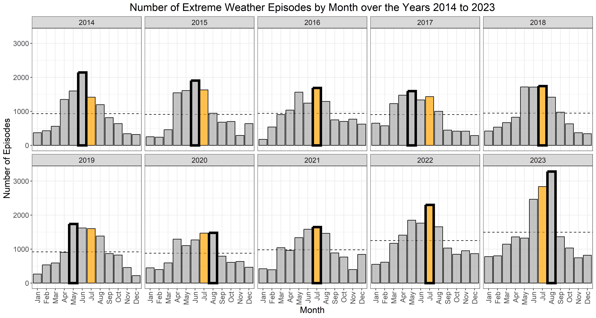
```

Histograms showing the number of extreme weather episodes by month from 2014 to 2023. The dashed horizontal line indicates the mean number of extreme weather episodes in each year. The thick-bordered bar marks the month with the most extreme weather events each year. The orange bar represents July. July had the most extreme weather events in 4 out of 10 years, and in another 4 years, it was right before or after the peak month. Only episodes that included at least one of the following event types were considered: excessive heat, drought, wildfire, flash flood, coastal flood, strong wind, hail, tornado.
:::

```{r}
#| label: Create supptbl-julyMeanNumberOfEventsByEventType

NumberEWE_tbl <- data_details_fips_2024 %>% 
  mutate(fips = state_county_fips) %>% 
  filter(year %in% myYears) %>% 
  filter(month_name %in% myMonths) %>% 
  filter(event_type %in% myEventTypes) %>% 
  distinct(event_id, fips, .keep_all = TRUE) %>% 
  group_by(year, event_type) %>% 
  summarise(
    nEvents = n(),
    .groups = 'drop'
  ) %>% 
  group_by(event_type) %>% 
  summarise(
    meanNEvents = format(round(mean(nEvents), 2), nsmall = 2),
    sdNEvents = format(round(sd(nEvents), 2), nsmall = 2),
    .groups = 'drop'
  ) %>% 
  knitr::kable(col.names = c(
    "Event Type", "Mean Number of Events", "SD"
  ), align = c("l", "r", "r"))
```

::: {#supptbl-julyMeanNumberOfEventsByEventType}
```{r}
#| label: supptbl-julyMeanNumberOfEventsByEventType
#| echo: false

NumberEWE_tbl
```

Mean number of extreme weather events in July over the years 2014 to 2023 by event type.
:::

::: {#suppfig-p.map_bin}
```{r}
#| echo: false
#| include: true

knitr::include_graphics("../images/mapGeographicalDistribution_bin.jpeg")
```

Maps displaying the geographical distribution of the occurrence of at least one extreme weather episode in July over the years 2014 to 2023. Only episodes that included at least one of the following event types were considered: excessive heat, drought, wildfire, flash flood, coastal flood, strong wind, hail, tornado.
:::

```{r}
#| label: mapGeoDistr_cont

dataForPlot <- out$dataForUsPlot %>% 
  mutate(nEpisodes_withNA = ifelse(nEpisodes == 0, NA_integer_, nEpisodes))

p.map_cont <- plot_usmap(
  data = dataForPlot,
  values = "nEpisodes_withNA",
  regions = "counties",
  exclude = c("AK", "HI"),
  color = "black",
  linewidth = 0.1
  ) +
  geom_sf(
    data = poly_states %>% 
      filter(!(abbr %in% c("AK", "HI"))),
    color = "black",
    fill = NA,
    linewidth = .3
  ) +
  scale_fill_binned(
    name = "Number of Episodes",
    n.breaks = 10,
    type = "viridis",
    na.value = "white"
  ) +
  labs(
    title = "Extreme Weather Episodes in July over the Years 2014 to 2023"
  ) +
  theme_bw() +
  theme(
    text = element_text(size = 15),
    legend.position = "bottom",
    plot.title = element_text(hjust = .5),
    panel.grid = element_blank(),
    axis.ticks = element_blank(),
    axis.text = element_blank(),
    legend.key.width = unit(0.4, "in")
  ) +
  facet_wrap(~year, ncol = 5)

jpeg(
  file = "../images/mapGeographicalDistribution_cont.jpeg",
  width = 14, height = 7.5, units = "in", res = 600
)
print(p.map_cont)
invisible(dev.off())

p.hist_count <- out$dataForUsPlot %>% 
  group_by(year, nEpisodes) %>% 
  summarise(
    count = n(),
    prcnt = count / n_distinct(out$dataForUsPlot$fips)
  ) %>% 
  ggplot(aes(x = nEpisodes, y = prcnt)) +
  geom_bar(stat = "identity", color = "black", fill = "darkgrey") +
  scale_y_continuous(labels = scales::label_percent()) +
  labs(
    x = "Number of Episodes",
    y = "Proportion of Counties"
  ) +
  theme_bw() +
  labs(
    title = "Extreme Weather Episodes in July over the Years 2014 to 2023"
  ) +
  theme(
    text = element_text(size = 15),
    legend.position = "bottom",
    plot.title = element_text(hjust = .5)
  ) +
  facet_wrap(~year, ncol = 5)

jpeg(
  file = "../images/frequencyDistribution_cont.jpeg",
  width = 14, height = 7.5, units = "in", res = 600
)
print(p.hist_count)
invisible(dev.off())

# Calcualte some proportions for display in text
props2023 <- out$dataForUsPlot %>% 
  filter(year == 2023) %>% 
  count(episodes_bin) %>% 
  mutate(
    freq = n/sum(n),
    freq_prcnt = paste0(format(round(freq*100, 2), nsmall = 2), "%")
  )
```

While @suppfig-p.map_bin visualizes the occurrence of at least one extreme weather episode in July for each county and year (binary variable), @suppfig-p.map_cont displays the actual number of such episodes (continuous). The vast majority of counties were exposed to few episodes, indicating that most of the variability is due to whether an extreme weather episode occurred at all or not. This is further supported by @suppfig-p.hist_cont showing histograms for the number of extreme weather episodes in July over the past ten years. Most counties reported either zero or one extreme weather episode in July, and the ratio of counties experiencing no episodes to counties experiencing at least one episode seems to gradually approach 1:1. In July 2023, for instance, this ratio reached `r round(props2023$n[1]/props2023$n[2], 2)`, with `r props2023$freq_prcnt[1]` of counties being exposed to zero and `r props2023$freq_prcnt[2]` of counties being exposed to at least one extreme weather episode.

::: {#suppfig-p.map_cont}
```{r}
#| echo: false
#| include: true

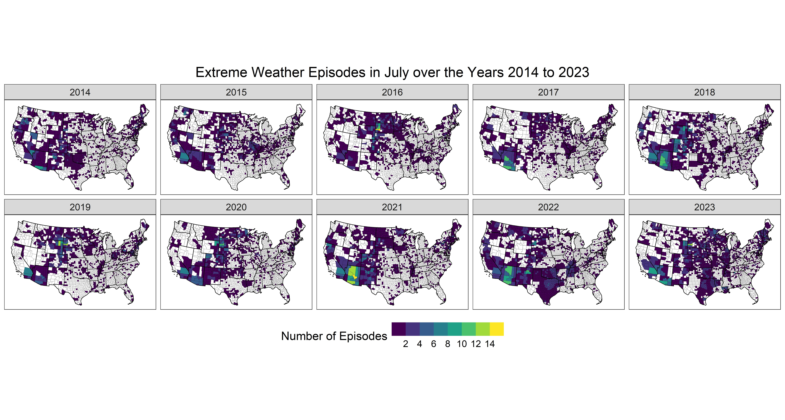
```

Maps displaying the geographical distribution of the raw number of extreme weather episodes in July over the years 2014 to 2023. The color palette indicates numbers greater than zero, and white represent a count of zero episodes.
:::

::: {#suppfig-p.hist_cont}
```{r}
#| echo: false
#| include: true

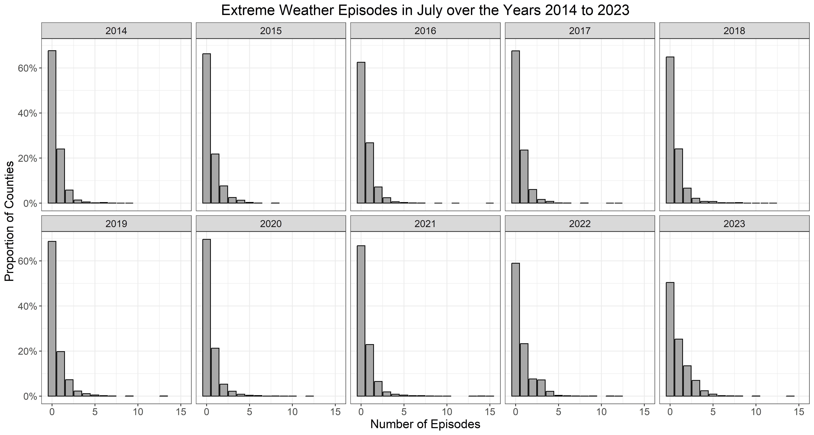
```

Histograms displaying the distribution of the raw number of extreme weather episodes in July over the years 2014 to 2023. For each number of episodes on the x-axis, the y-axis shows the proportion of counties that recorded this number of episodes.
:::

Finally, as reported in the analysis plan and the design table, we plan to run a set of additional analyses regarding hypotheses H~2~ and H~3~, in which we will test the sensitivity of results to the time period prior to study completion used to assess extreme weather exposure. Regarding H~2~, we will estimate the two-way interaction effect of political affiliation and extreme weather exposure on ΔDuration for different time periods from 30 days to 360 days in increments of 30 days. Similarly for H~3~, we will estimate the three-way interaction effect of political affiliation, extreme weather exposure, and attribution of extreme weather events to climate change on ΔDuration for the same time periods. We will visualize results of these additional analyses by plotting the two-way (or three-way) interaction regression coefficients as points surrounded by their 95%-CI on the y-axis and the 12 time periods on the x-axis, as displayed in @suppfig-p.sensitivity with simulated data. Based on previous research [@konisky_extreme_2016], we expect that the estimated effects will decay as the number of days prior to study completion used to assess the occurrence of extreme weather episodes increases.

```{r}
#| label: sensitivityAnalysesPlot

set.seed(123)
p.sensitivity <- tibble(
  Days = seq(30, 360, 30),
  Coefficient = accumulate(1:11, ~ .x * .7, .init = 0.1143),
  Error = rnorm(12, .07, 0.005),
  CI_high = Coefficient + .5 * Error,
  CI_low = Coefficient - .5 * Error
) %>% 
  ggplot(aes(x = Days, y = Coefficient, color = CI_low < 0)) +
  geom_hline(yintercept = 0, linetype = "dashed") +
  geom_errorbar(aes(ymin = CI_low, ymax = CI_high), width = 3) +
  geom_point(
    shape = "circle filled",
    fill = "white",
    size = 3,
    stroke = 1
  ) +
  scale_color_manual(values = c("black", "grey")) +
  scale_x_continuous(breaks = seq(30, 360, 30)) +
  labs(
    x = "Days used to assess occurence of extreme weather episodes",
    y = "Regression coefficient\n(surrounded by 95%-CI)"
  ) +
  theme_bw() +
  theme(
    panel.grid.minor = element_blank(),
    legend.position = "None"
  )
set.seed(NULL)

jpeg(
  file = "../images/sensitivityAnalyses_simulation.jpeg",
  width = 7, height = 5, units = "in", res = 600
)
print(p.sensitivity)
invisible(dev.off())
```

::: {#suppfig-p.sensitivity}
```{r}
#| echo: false
#| include: true

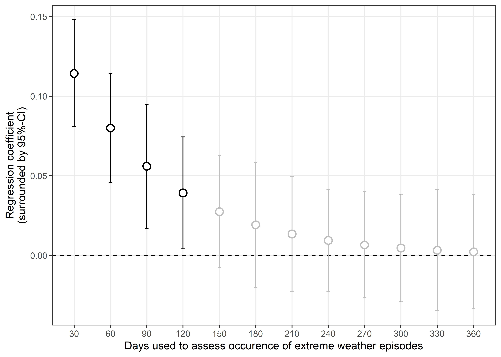
```

Simulated regression coefficients of interaction effects for different number of days prior to study completion used to assess the occurrence of extreme weather episodes. Point estimates are surrounded by their 95% confidence intervals. The dashed line represents the absence of an interaction effect (regression coefficient of zero). Significance of regression coefficients is color-coded, with black indicating regression coefficients significantly different from zero, and grey indicating no significant difference from zero.
:::

#### Conclusion

Our analyses indicate that July consistently shows a high number of extreme whether episodes with notable geographic variability (@suppfig-p.hist and @suppfig-p.map_bin). Therefore, to maximize the likelihood of capturing suitable variability in exposure to extreme weather episodes, we plan to conduct our study at the beginning of August, ensuring that the 30-day period prior to study completion falls within July. Moreover, the main source of variability in exposure to extreme weather episodes in July is due to whether at least one episode occurred or not (@suppfig-p.map_cont and @suppfig-p.hist_cont). Thus, our main analyses will focus on whether a participant was exposed to at least one extreme weather episode in the 30 days prior to study completion, treated as a binary variable. In additional analyses, we will test the sensitivity of our results to different time periods used to assess extreme weather exposure prior to study completion. We will also conduct these analyses separately for different types of extreme weather events to examine whether different types of extreme weather events may have distinct effects.



## Design Table

@supptbl-analysisTbl provides an overview of the research questions, hypotheses, sampling plan, analysis plan, and interpretation as preregistered.

```{r}
#| label: Create prepregistered analysis plan table 
#| results: 'hide'

PreregistrationTable <- tribble(
  ~Question, ~Hypothesis, ~Sampling_Plan, ~Analysis_Plan, ~Interpretation,
  "RQ<sub>1</sub>: Does political affiliation impact how individuals search for and attend to information during climate-relevant decision-making?<br><br>RQ<sub>S1</sub>: Does political affiliation impact the choices individuals make in a climate-relevant decision-making context?",
  "H<sub>1</sub>: Compared to Republicans, Democrats prioritize searching for and attending to carbon over bonus information during decision-making in the Carbon Emission Task (CET). That is, Democrats display higher ΔDuration values compared to Republicans.<br><br>H<sub>S1</sub>: Compared to Republicans, Democrats are more likely to make choices that prioritize climate protection over personal financial gain in the CET. That is, Democrats have a higher probability of making pro-climate choices compared to Republicans.",
  "Our target sample size is based on a sample-size determination power analysis. We determined the sample size required to detect a smallest effect size of interest (SESOI) of the effect of political affiliation on ΔDuration. We derived this SESOI based on the common practice of filtering out information acquisitions lasting less than 200 msec as such spurious acquisiitons are very unlikely to be consciously processed. Translating this threshold into the metric of ΔDuration results in a SESOI of 0.1143 (see Power Analysis). Sample-size determination analysis with simulated data suggested that N = 600 would provide > 95% statistical power to detect this SESOI. To ensure broad geographical sampling coverage and to account for smaller statistical power of models investigating interaction effects (H<sub>2</sub> and H<sub>3</sub>), we will aim for a target sample size of N = 2,000.",
  "To test H<sub>1</sub>, we will run mixed-effects models with the dependent variable ΔDuration (<i>deltaDuration</i>) and random intercepts for participants (<i>subject</i>, an identifier for each of the N participants) and trials (<i>trialNum_fixed</i>, an identifier for each of the 30 CET trials).<br><br>In a first model (M1.1), we will include political affiliation (<i>polAff</i>, subject-level binary variable with 0 = Republican and 1 = Democrat) as a fixed effect. To test the sensitivity of this model to our exclusion criteria, we will also run this model with data for all participants.<br><br>In a second model (M1.2), we will test the sensitivity of results of M1.1 to the addition of control variables related to the CET. To this end, we will add to M1.1 fixed effects for: (1) the level of percentage difference in carbon emissions between Options A and B (<i>carbon_prcnt_level</i>, trial-level integer variable ranging from 1 [=10%] to 5 [=100%]), (2) the level of percentage difference in bonus payments between Option A and B (<i>bonus_prcnt_level</i>, trial-level integer variable ranging from 1 [=10%] to 5 [=100%]), (3) the sequential position a trial was presented at within the sequence of all 30 trials (<i>trialNum</i>, trial-level integer variable ranging from 1 to 30), (4) whether the carbon or bonus attributes of Options A and B were presented in the top row of the information matrix (<i>CB_carbonUp</i>, subject-level binary variable with 0 = bonus displayed on top and 1 = carbon displayed on top), and (5) whether the option leading to a higher bonus payment and higher carbon emission was presented in the left or in the right column of the information matrix (<i>CB_selfishLeft</i>, trial-level binary variable with 0 = higher bonus/carbon option presented in the right column and 1 = higher bonus/carbon option presented in the left column).<br><br>In a third model (M1.3), we will test the sensitivity of results of M1.1 to the addition of demographic control variables. To this end, we will add to M1.1 fixed effects for: (1) gender (<i>gender</i>, subject-level binary variable with 0 = Male and 1 = Female), (2) age (<i>age</i>, subject-level integer variable indicating participant’s age in years at the time of study completion), (3) education (<i>education</i>, subject-level factor with 6 levels: [1] “Did not complete high school / GED”, [2] “High school diploma / GED”, [3] “Some college”, [4] “Associates degree”, [5] “Bachelor's degree”, [6] “Master's degree or higher”), (4) income (<i>income</i>, subject-level factor with 6 levels: [1] “Under $30,000”, [2] “$30,000 - $49,999”, [3] “$50,000 - $74,999”, [4] “$75,000 - $99,999”, [5] “$100,000 - $149,999”, and [6] “More than $150,000”), (5) race / ethnicity (<i>racethn_simple</i>, subject-level factor with 6 levels: [1] “European”, [2] “Hispanic”, [3] “African”, [4] “Asian”, [5] “More Than One”, and [6] “Other”), and (6) area of residency (<i>ruralUrb</i>, subject-level factor with 3 levels: [1] “Urban, a big city”, [2] “Suburb, outskirt of a big city”, and [3] “Rural town or small city”).<br><br>To test H<sub>S1</sub>, we will run mixed-effects logistic regressions with the actual decision (<i>choice</i>, trial-level variable with 0 = pro-self and 1 = pro-climate) as dependent variable and random intercepts for <i>subject</i> and <i>trialNum_fixed</i>. We will rerun models M1.1 to M1.3, exchanging <i>deltaDuration</i> with <i>choice</i> as dependent variable.",
  "If the fixed effect of <i>polAff</i> in M1.1 should not be significantly different from zero at α = 0.05 (two-tailed), we will test whether the effect of political affiliation is smaller than the SESOI (unstandardized β = 0.1143, see Sampling Plan) using equivalence testing. If the narrow confidence interval (1-2*α) surrounding the effect of political affiliation is completely inside the interval [-SESOI; +SESOI], we accept practical equivalence. That is, we will interpret results as suggestive evidence that political affiliation does not impact how individuals search for and attend to information during climate-relevant decision-making.<br><br>If M1.2 or M1.3, compared to M1.1, imply different conclusions regarding the significance of political affiliation, we will interpret results as suggestive evidence that the effect of political affiliation is sensitive to features of the CET trials (M1.2) or demographic variables (M1.3).<br><br>In case of significant effects of control variables in M1.2 or M1.3, we will additionally assess whether these control variables interact with political affiliation. For instance, if <i>trialNum</i> turns out to be a significant predictor, we will assess an additional mixed-effects model with the dependent variable <i>deltaDuration</i>, random intercepts for <i>subject</i> and <i>trialNum_fixed</i>, and fixed effects for <i>polAff</i>, <i>trialNum</i>, and <i>polAff</i> × <i>trialNum</i>. If the interaction term is significant, we will interpret results as suggestive evidence that the effect of political affiliation on information search processes depends on the respective moderating variable. We will then probe the interaction to assess whether and at which values/levels of the moderating variable the effect of political affiliation is significantly different from zero.",
  "RQ<sub>2</sub>: Does exposure to extreme weather events interact with political affiliation to shape these information search processes?<br><br>RQ<sub>S2</sub>: Does exposure to extreme weather events interact with political affiliation to shape these climate-relevant choices?", 
  "H<sub>2</sub>: Exposure to extreme weather events amplifies the polarization in information search processes during the CET, increasing the difference in time spent on carbon relative to bonus information between Republicans and Democrats among individuals with (vs. without) such exposure. That is, we predict a positive two-way interaction effect of extreme weather exposure and political affiliation on ΔDuration.<br><br>H<sub>S2</sub>: Exposure to extreme weather events amplifies the polarization in climate-relevant choices, increasing the difference in climate-protecting choices made by Republicans and Democrats. That is, we predict a positive two-way interaction between extreme weather exposure and political affiliation on choice.", 
  "We conducted effect-size sensitivity power analyses to estimate the smallest two-way interaction effect size for which our target sample size of N = 2,000 will provide ≥ 95% statistical power. Analyses based on simulated data suggested that two-way interactions ≥ 0.1619 will be detected with high statistical power, even after accounting for a participant exclusion-rate of 5% (N = 950). We conclude that a target sample size of N = 2000 provides high statistical power to detect a theoretically informative two-way interaction effect between political affiliation and extreme weather exposure.", 
  "To test H<sub>2</sub>, we will run mixed-effects models with deltaDuration as dependent variable and random intercepts for subject and trialNum_fixed. We will add fixed effects in a stepwise manner.<br><br>In a first model (M2.1), which builds on M1.1 of RQ<sub>1</sub>, we will include fixed effects for (1) <i>polAff</i> and (2) whether a participant was exposed to at least one extreme weather episode in the 30 days prior to CET completion (<i>ewe</i>, subject-level binary variable with 0 = participant was exposed to zero extreme weather episodes and 1 = participant was exposed to at least one extreme weather episode). This model provides insights into a potential main effect of extreme weather exposure on <i>deltaDuration</i> independent of political affiliation.<br><br>In a second model (M2.2), we will add to M2.1 a fixed effect interaction term <i>polAff</i> × <i>ewe</i>. In case of a significant two-way interaction, we will probe the interaction by testing the effect of political affiliation among the two levels of exposure to extreme weather events. That is, we will test whether the difference in deltaDuration between Democrats and Republicans is significantly different among participants that were exposed to extreme weather episodes and among participants that were not. To test the sensitivity of this model to our exclusion criteria, we will also run this model with data for all participants.<br><br>In a third model (M2.3), we will test the sensitivity of results of M2.2 to the addition of control variables found to be significant predictors in sensitivity analyses testing H<sub>1</sub>. For instance, if <i>trialNum</i> and <i>gender</i> were significant predictors in the previous sensitivity analyses, these variables will be included as fixed effects in M2.3.<br><br>In a fourth model (M2.4), we will test the sensitivity of results of M2.2 to the addition of control variables related to the exposure to extreme weather episodes. To this end, we will add to M2.2 fixed effects for: (1) the abnormality of the number of extreme weather episodes in participants’ county of residence relative to the same 30 days period over the past ten years 64 (<i>abnormality_final</i>, subject-level continuous variable), (2) total damage in USD associated with the extreme weather episodes participants were exposed to in the 30 days prior to CET completion (<i>sum_damage</i>, subject-level continuous variable), (3) total number of injuries associated with these extreme weather episodes (<i>sum_injuries</i>, subject-level integer variable), (4) total number of deaths associated with these extreme weather episodes (<i>sum_deaths</i>, subject-level integer variable), (5) the number of days since the most recent extreme weather episode in each participant’s county of residence prior to study completion (<i>daysSinceMostRecentEpisode</i>, subject-level continuous variable), (6) the population density in participants’ county of residence (<i>population_density_peopPerSqKilometer</i>, subject-level continuous variable), (7) county-level median household income estimates (<i>countyIncome</i>, continuous variable), and (8) county’s Partisan Voting Index (PVI) (<i>countyPvi</i>, continuous variable).<br><br>To explore potential contextual heterogeneity, we will conduct additional moderation analyses. We will extend model M2.2 by testing three-way interactions of the form <i>polAff</i> × <i>ewe</i> × <i>moderator</i>, where the moderator is one of the following county-level variables: <i>population_density_peopPerSqKilometer</i>, <i>countyIncome</i>, <i>countyPvi</i>. These analyses are intended to provide context on potential effect heterogeneity across structural conditions. To maintain parsimony in the main models and avoid straining statistical power, these moderation analyses are exploratory.<br><br>In a fifth model (M2.5), we will test the sensitivity of results of M2.2 to an alternative operationalization of exposure to extreme weather episodes. To this end, we will rerun M2, exchanging ewe with a duration-weighted count of extreme weather episodes in the 30 days prior to CET completion (<i>nEpisodes_durationWeighted</i>, subject-level continuous variable), which takes the severity of these episodes into account.<br><br>Furthermore, in a set of additional analyses (A2.1), we will test the sensitivity of results of M2.2 to the time period prior to study completion used to assess extreme weather exposure. We will estimate the two-way interaction effect of political affiliation and extreme weather exposure for different time periods from 1 standard month (30 days) to 12 standard months (360 days) in increments of 1 standard month. In these analyses, we will operationalize extreme weather exposure as the raw number of extreme weather episodes participants were exposed to (<i>ewe_n</i>, subject-level integer variable). That is, for each of the 12 time periods, we will report the two-way interaction effect of <i>polAff</i> × <i>ewe_n</i>.<br><br>Finally, in a second set of additional analyses (A2.2) we will refine analyses A2.1 by taking into account the different extreme weather event types under consideration (excessive heat, droughts, wildfires, flash floods, coastal floods, hail, strong wind, and tornados). Specifically, we will rerun analyses of A2.1 separately for the different extreme weather event types. This will provide a nuanced picture of the two-way interaction between political affiliation and extreme weather exposure, accounting for the exposure’s recency and involved event types.<br><br>To test H<sub>S2</sub>, we will run mixed-effects logistic regressions with choice as dependent variable and random intercepts for <i>subject</i> and <i>trialNum_fixed</i>. We will rerun models M2.1 to M2.5, exchanging <i>deltaDuration</i> with <i>choice</i> as dependent variable.", 
  "If the fixed two-way interaction effect of <i>polAff</i> × <i>ewe</i> in M2.2 should not be significantly different from zero at α = 0.05 (two-tailed), we will test whether the interaction effect is smaller than the SESOI (unstandardized β = 0.1143, see Sampling Plan) using equivalence testing. If the narrow confidence interval (1-2*α) surrounding the interaction effect is completely inside the interval [-SESOI; +SESOI], we accept practical equivalence. That is, we will interpret results as suggestive evidence that there is no interaction effect of political affiliation and whether individuals were exposed to at least one extreme weather episode in the 30 days prior to CET completion or not on information search processes.<br><br>If M2.3 or M2.4, compared to M2.2, imply different conclusions regarding the significance of the two-way interaction, we will interpret results as suggestive evidence that the interaction effect of political affiliation and extreme weather exposure is sensitive to features of the CET trials or demographic variables (M2.3) or variables related to the exposure to extreme weather episodes (M2.4).<br><br>If M2.5 reveals a significant two-way interaction <i>polAff</i> × <i>nEpisodes_durationWeighted</i>, while M2.2 results in no significant interaction, we will interpret results as suggestive evidence that there is indeed an interaction effect of political affiliation and extreme weather exposure on information search processes, but only if the episodes severity is considered, operationalized by their durations.",
  "RQ<sub>3</sub>: Does the interaction of the exposure to extreme weather events and political affiliation on information search processes depend on individuals’ subjective attribution of these events to climate change?<br><br>RQ<sub>S3</sub>: Does the interaction of the exposure to extreme weather events and political affiliation on choices depend on individuals' subjective attribution of these events to climate change?",
  "H<sub>3</sub>: The amplifying effect of exposure to extreme weather events on the polarization in attention allocation during information search processes between Republicans and Democrats is more pronounced for individuals who attribute these events more strongly to climate change. That is, we predict a positive three-way interaction effect of political affiliation, exposure to extreme weather events, and their attribution to climate change on ΔDuration.<br><br>H<sub>S3</sub>: The amplifying effect of exposure to extreme weather events on the polarization in climate-relevant choices between Republicans and Democrats is more pronounced for individuals who attribute these events more strongly to climate change. That is, we predict a positive three-way interaction effect of political affiliation, exposure to extreme weather events, and their attribution to climate change on choice.",
  "We conducted effect-size sensitivity power analyses to estimate the smallest three-way interaction effect size for which our target sample size of N = 2,000 will provide ≥ 95% statistical power. Analyses based on simulated data suggested that three-way interactions ≥ 0.1890 will be detected with high statistical power, even after accounting for a conservative participant exclusion-rate of 5% (N = 950). We conclude that a target sample size of N = 2000 provides high statistical power to detect a theoretically informative three-way interaction effect between political affiliation, extreme weather exposure, and subjective attribution of extreme weather events to climate change.",
  "To test H<sub>3</sub>, we will run mixed-effects models with <i>deltaDuration</i> as dependent variable and random intercepts for <i>subject</i> and <i>trialNum_fixed</i>. We will add fixed effects in a stepwise manner.<br><br>All models testing H<sub>3</sub> will include both, participants’ political affiliation and subjective attribution of extreme weather events to climate change (<i>subjAttr</i>, subject-level continuous variable, ranging from 1 to 5 indicating strong disagreement [1] to [5] strong agreement that extreme weather events can be attributed to climate change, mean centered to ease interpretation of simple effects in models including interaction terms). Previous research suggests that <i>polAff</i> and <i>subjAttr</i> covary 50,108. Thus, including <i>polAff</i> and <i>subjAttr</i> in the same statistical model might raise concerns regarding multicollinearity. While multicollinearity does not affect coefficient estimates, it increases standard errors, thereby reducing statistical efficiency. Variance inflation factor (VIF) values are commonly reported to detect multicollinearity in statistical models, with higher values indicating higher multicollinearity. Importantly, however, if interaction terms are included in a model, high VIF values are necessarily expected. This type of multicollinearity between the components of an interaction, known as inessential ill-conditioning, leads to inflated VIF values commonly observed in models with interaction terms. Thus, VIF values are not informative of multicollinearity in models including interaction terms, which is why we will check VIF values only in models without interaction terms (see model M3.1).In a first model (M3.1), which builds on M2.1 of RQ<sub>2</sub>, we will include fixed effects for: (1) <i>polAff</i>, (2) <i>ewe</i>, and (3) <i>subjAttr</i>.<br><br>In a second model (M3.2), we will include the two-way interaction terms <i>polAff</i> × <i>subjAttr</i>.<br><br>In a third model (M3.3), we will include the two-way interaction terms <i>ewe</i> × <i>subjAttr</i>.<br><br>In a fourth model (M3.4), will add to M3.1 all fixed effect two-way interaction terms: (1) <i>polAff</i> × <i>ewe</i>, (2) <i>polAff</i> × <i>subjAttr</i>, and (3) <i>ewe</i> × <i>subjAttr</i>.<br><br>In a fifth model (M3.5), we will add to M3.2 the fixed effect three-way interaction term <i>polAff</i> × <i>ewe</i> × <i>subjAttr</i>. To test the sensitivity of this model to our exclusion criteria, we will also run this model with data for all participants. In case of a significant three-way interaction, we will probe the interaction by testing the two-way interaction effects of political affiliation and extreme weather exposure at different levels of subjective attribution of extreme weather events to climate change. Specifically, we will assess these two-way interactions for individuals scoring low (mean - 1 SD), average (mean), and high (mean + 1 SD) on subjective attribution of extreme weather events to climate change.<br><br>In a sixth model (M3.6), we will test the sensitivity of results of M3.5 to the addition of control variables found to be significant predictors in sensitivity analyses testing H<sub>1</sub>.<br><br>In a seventh model (M3.7), we will test the sensitivity of results of M3.5 to the addition of control variables related to the exposure to extreme weather episodes. To this end, we will add to M3.5 fixed effects for: (1) <i>abnormality_final</i>, (2) <i>sum_damage</i>, (3) <i>sum_injuries</i>, (4) <i>sum_deaths</i>, (5) <i>daysSinceMostRecentEpisode</i>, (6) <i>population_density_peopPerSqKilometer</i>, (7) <i>countyIncome</i>, (8) <i>countyPvi</i>.<br><br>To explore potential contextual heterogeneity, we will conduct additional exploratory moderation analyses. We will extend model M3.7 by testing four-way interactions of the form <i>polAff</i> × <i>ewe</i> × <i>subjAttr</i> × moderator, where the moderator is one of the following county-level variables: <i>population_density_peopPerSqKilometer</i>, <i>countyIncome</i>, <i>countyPvi</i>.<br><br>In an eighth model (M3.8), we will test the sensitivity of results of M3.5 to an alternative operationalization of exposure to extreme weather episodes. To this end, we will rerun M3.4, exchanging <i>ewe</i> with <i>nEpisodes_durationWeighted</i>.<br><br>Furthermore, in a set of additional analyses (A3.1), we will test the sensitivity of results of M3.3 to the time period prior to study completion used to assess extreme weather exposure. We will estimate the three-way interaction effect <i>polAff</i> × <i>ewe_n</i> × <i>subjAttr</i> for different time periods from 1 to 12 standard months in increments of 1 standard month.<br><br>Finally, in a second set of additional analyses (A3.2) we will refine analyses A3.1 by taking into account the different extreme weather event types under consideration (excessive heat, droughts, wildfires, flash floods, coastal floods, hail, strong wind, and tornados). Specifically, we will rerun analyses A3.1 separately for the different extreme weather event types. This will provide a nuanced picture of the interaction between political affiliation, extreme weather exposure, and subjective attribution of extreme weather events to climate change, accounting for the recency and event type of exposure.<br><br>To test H<sub>S3</sub>, we will run mixed-effects logistic regressions with <i>choice</i> as dependent variable and random intercepts for <i>subject</i> and <i>trialNum_fixed</i>. We will rerun models M3.1 to M3.8, exchanging <i>deltaDuration</i> with <i>choice</i> as dependent variable.",
  "If VIF values for <i>polAff</i> or <i>subjAttr</i> in M3.1 are greater than 10, we will report these VIF values as well as the factor by which the standard error is estimated to be increased. We will proceed with running the remaining models but emphasize that readers should prioritize interpretation of the unbiased regression coefficients and pay less attention to statistical significance, which might be affected by increased standard errors.<br><br>If the fixed three-way interaction effect of <i>polAff</i> × <i>ewe</i> × <i>subjAttr</i> in M3.5 should not be significantly different from zero at α = 0.05 (two-tailed), we will test whether the interaction effect is smaller than the SESOI (unstandardized β = 0.1345, see Sampling Plan) using equivalence testing. If the narrow confidence interval (1-2*α) surrounding the interaction effect is completely inside the interval [-SESOI; +SESOI], we accept practical equivalence. That is, we will interpret results as suggestive evidence that the interaction effect of political affiliation and extreme weathere exposure 30 days prior to CET completion on information search processes does not depend on the subjective attribution of extreme weather events to climate change.<br><br>If M3.6 or M3.7, compared to M3.5, imply different conclusions regarding the significance of the three-way interaction, we will interpret results as suggestive evidence that the three-way interaction effect of political affiliation, exposure to extreme weather events, and subjective attribution of such events to climate change is sensitive to features of the CET or demographic variables (M3.6) or variables related to the exposure to extreme weather episodes (M3.7).<br><br>If M3.8 reveals a significant three-way interaction <i>polAff</i> × <i>nEpisodes_durationWeighted</i> × <i>subjAttr</i>, while M3.3 results in no significant three-way interaction, we will interpret results as suggestive evidence that the moderating role of exposure to extreme weather events on the relationship between political affiliation and information search processes does indeed depend on the subjective attribution of extreme weather events to climate change, but only if the episodes severity is considered, operationalized by their durations."
)

Preregistration_tbl <- PreregistrationTable %>%
  kable(
    format = "html",
    col.names = c(
      "Question", "Hypothesis", "Sampling Plan",
      "Analysis Plan", "Interpretation Given To Different Outcomes"
    ),
    escape = FALSE,
    table.attr = 'class="prereg-table" style="table-layout:fixed !important; width:680px !important;"'
  ) %>%
  kable_styling(
    full_width = FALSE,
    bootstrap_options = c("striped")
  ) %>%
  column_spec(
  1,
  width = "89px",
  extra_css = "width:89px !important; max-width:89px !important; min-width:89px !important; font-size:12px; line-height:1.15; vertical-align:top; overflow-wrap:break-word;"
) %>%
column_spec(
  2,
  width = "125px",
  extra_css = "width:125px !important; max-width:125px !important; min-width:125px !important; font-size:12px; line-height:1.15; vertical-align:top; overflow-wrap:break-word;"
) %>%
column_spec(
  3,
  width = "125px",
  extra_css = "width:125px !important; max-width:125px !important; min-width:125px !important; font-size:12px; line-height:1.15; vertical-align:top; overflow-wrap:break-word;"
) %>%
column_spec(
  4,
  width = "179px",
  extra_css = "width:179px !important; max-width:179px !important; min-width:179px !important; font-size:12px; line-height:1.15; vertical-align:top; overflow-wrap:break-word;"
) %>%
column_spec(
  5,
  width = "162px",
  extra_css = "width:162px !important; max-width:162px !important; min-width:162px !important; font-size:12px; line-height:1.15; vertical-align:top; overflow-wrap:break-word;"
)

```

::: {#supptbl-analysisTbl}
```{r}
#| label: analysisTbl
#| echo: false

Preregistration_tbl
```

Exclusion criteria: We employ several exclusion criteria on participant- and trial-level to ensure high data quality in survey and experimental data. We will screen-out respondents who (1) fail the CAPTCHA or (2) do not give informed consent or (3) fail any of the attention checks described in the Methods Section or (4) do not finish the study. Such screen-outs are not included in the targeted sample size. Additionally, we apply exclusion criteria based on process-tracing metrics in the CET on trial- and participant-level. We exclude trials and participants with exceptionally short or long box opening times as identified by an aggregate function of five different outlier detection algorithms (see Methods Section for details). Finally, we will exclude participants who report having conducted the CET on a mobile phone.
:::



## Power Analyses

### Purpose & Rationale

The primary goal of the present analyses is to determine the number of participants required to achieve 95% statistical power to detect a Smallest Effect Size Of Interest (SESOI) for a main effect of political affiliation (Democrat vs. Republican) on attentional information search behavior as assessed by ΔDuration. That is, we primarily aim for conducting a power analysis for *sample-size determination,* also called *a priori* power analysis [@giner-sorolla_power_2024]. To this end, we use power simulations with parameters informed by previous studies to assess the statistical power for different sample sizes. This will allow us to decide on a sample size that will provide high statistical power to detect a true and theoretically relevant main effect of political affiliation.

Given this sample size, our secondary goal is to then assess the statistical power to detect different effect sizes for (1) the two-way interaction between political affiliation and extreme weather exposure and (2) the three-way interaction between political affiliation, extreme weather exposure, and the subjective attribution of extreme weather events to climate change. That is, we conduct power analyses for assessing *effect-size sensitivity* for these two- and three-way interactions [@giner-sorolla_power_2024].

The present report is organized as follows:

1.  We describe all important variables of the planned study and how we will assess them.

2.  We derive a SESOI for the main effect of political affiliation on ΔDuration.

3.  We conduct power simulations for *sample-size determination analysis* based on this political affiliation main effect SESOI.

4.  We conduct power simulations for *effect-size sensitivity analyses* for a two-way interaction effect between political affiliation and extreme weather exposure.

5.  We conduct power simulations for *effect-size sensitivity analyses* for a three-way interaction effect between political affiliation, extreme weather exposure, and subjective attribution of extreme weather events to climate change.

### Important Variables

#### ΔDuration

Participants will complete 25 trials in a new variant of the Carbon Emission Task [CET, @berger_measuring_2021] optimized for online process-tracing using MouselabWEB [@willemsen_revisiting_2019]. An example trial of the task is displayed and explained in @suppfig-decisionScreen.

::: {#suppfig-decisionScreen}
```{r}
#| echo: false
#| include: true

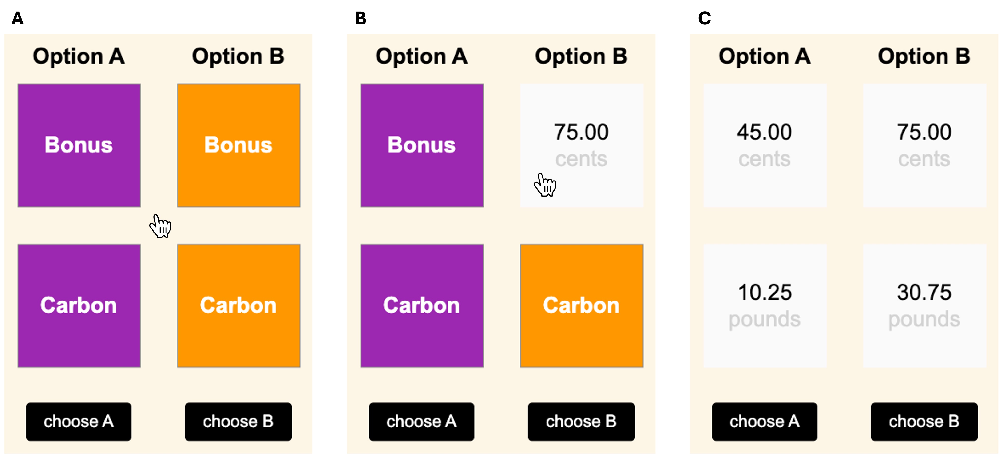
```

An example trial of the new variant of the CET. **(A)** Participants are presented with two options which are associated with different bonus payment and carbon emission consequences. **(B)** Participants inspect the exact consequences regarding each attribute of each option by hovering their mouse over the respective boxes. Moving the mouse outside of a box occludes the information again. Note that whether the bonus or carbon attributes are displayed in the top row is randomized across participants but held constant within participants. **(C)** By visiting all boxes, participants can acquire all available information in a trial (all boxes opened simultaneously for demonstration purposes only). Note that whether the option maximizing the bonus payment for participants is presented in the left or right row is randomized within participants.
:::

In all analyses, the criterion (dependent variable) will be ΔDuration (`deltaDuration`), which is calculated in each trial as:

$$
\Delta Duration = \frac{(t_{Carbon_{A}} + t_{Carbon_{B}}) - (t_{Bonus_{A}} + t_{Bonus_{B}})}{t_{Carbon_{A}} + t_{Carbon_{B}} + t_{Bonus_{A}} + t_{Bonus_{B}}}
$$

with $t$ representing the summed up dwell time on $Carbon/Bonus$ boxes in Option $A/B$. ΔDuration varies between -1 and 1 with:

-   a value of -1 indicating that the entire dwell time was spent on gathering Bonus information
-   a value of 0 indicating that the dwell time was equally split between gathering Bonus and Carbon information
-   a value of 1 indication that the entire dwell time was spent on gathering Carbon information

#### Political Affiliation

We will assess political affiliation using the following question:

*Generally speaking, do you think of yourself as a Democrat, Republican or Independent?*

Participants will answer on the following 7-point Likert scale:

*\[1\] Strong Republican, \[2\] Not strong Republican, \[3\] Independent, close to Republican, \[4\] Independent, \[5\] Independent, close to Democrat, \[6\] Not strong Democrat, \[7\] Strong Democrat*

Additionally, if participants self-identify as \[4\] Independent, they will be asked:

*You said that you think of yourself as an Independent politically. If you had to identify with one party of the two parties, which one would you choose?*

Participants will answer on the following scale:

*\[1\] Republican Party, \[2\] Democratic Party*

Based on these questions, we classify participants as either Republican or Democrat as represented by the variable `polAff` that can take on the following values:

*\[rep\] Republican Party, \[dem\] Democratic Party*

#### Extreme Weather Exposure

For each participant, we will assess the number of extreme weather episodes that occurred in the participants' county of residence in the 30 days prior to study completion. We then create a variable `ewe` which equals to *TRUE* if at least one extreme weather episode occurred in the specified time interval, and *FALSE* otherwise.

#### Subjective Attribution

We will assess the degree to which participants attribute extreme weather events to climate change [see @ogunbode_attribution_2019]. Participants will rate their agreement to the following three questions:

1.  *Extreme weather events are caused in part by climate change.*

2.  *Extreme weather events are a sign that the impacts of climate change are happening now.*

3.  *Extreme weather events show us what we can expect from climate change in the future.*

Participants will answer on the following 5-point Likert scale:

*\[1\] Strongly disagree, \[2\] Somewhat disagree, \[3\] Neither agree nor disagree, \[4\] Somewhat agree, \[5\] Strongly agree*

Subjective attribution of EWE to climate change will be operationalised as the mean agreement to these three statements. Note that @ogunbode_attribution_2019, who used the same questions, response options, and aggregation, report a mean of 3.67 and a SD of 0.85 for this variable.

### SESOI

As argued in the Registered Report, we hypothesize that (H~1~) compared to Republicans, Democrats prioritize searching for and attending to carbon over bonus information during decision-making in the CET. That is, Democrats display higher ΔDuration values compared to Republicans.

While H~1~ describes the direction of the expected effect, it does not specify the expected magnitude of the effect. This later point is clarified by asking the question what would be the smallest effect size that researchers would still consider theoretically relevant, i.e., what is the smallest effect size of interest (SESOI)? We argue for such a SESOI on theoretical grounds and based on previous MouselabWEB research.

In mouselabWEB studies, it is standard practice to filter out any information acquisition lasting less than 200 msec because such very short (spurious) acquisitions are very unlikely to be consciously processed [@willemsen_revisiting_2019]. Therefore, we derive the SESOI based on the consideration that for an effect to be meaningful, the increase in ΔDuration from a Republican to a Democrat should be due to an increase of the time spent gathering carbon (relative to bonus) information of at least 200 msec. We need to translate these considerations into the metric of ΔDuration.

Suppose that Republicans on average spend $t_{Carbon}$ msec on gathering carbon information and $t_{Bonus}$ msec on gathering bonus information in each trial, with a total time of gathering any information $t_{Total} = t_{Carbon} + t_{Bonus}$. Thus, for Republicans, this results in:

$$
\Delta Duration_{Rep} = \frac{t_{Carbon} - t_{Bonus}}{t_{Total}}
$$

Suppose that Democrats have the same $t_{Total}$ as Republicans, but they spend 200 msec more on gathering carbon information and, correspondingly, 200 msec less on gathering bonus information. Thus, for Democrats, this results in:

$$
\Delta Duration_{Dem} = \frac{(t_{Carbon} + 200) - (t_{Bonus} - 200)}{t_{Total}} \\
                      = \frac{400 + t_{Carbon} - t_{Bonus}}{t_{Total}}
$$

Therefore, the difference in $\Delta Duration$ for Democrats and Republicans is:

$$
\begin{split}
\Delta Duration_{Dem} - \Delta Duration_{Rep} = \frac{400 + t_{Carbon} - t_{Bonus}}{t_{Total}} -  \frac{t_{Carbon} - t_{Bonus}}{t_{Total}} \\
  = \frac {(400 + t_{Carbon} - t_{Bonus}) - (t_{Carbon} - t_{Bonus})}{t_{Total}} \\
  = \frac {400}{t_{Total}}
\end{split}
$$

Thus, we define our SESOI as:

$$SESOI_{polAff} = \frac{400\ msec}{t_{Total}}$$

As this definition shows, the SESOI depends on our expectation regarding $t_{Total}$. We form these expectations based on previous research. In our lab, we recently conducted another MouselabWEB study whose setup was very similar to the one described in the Registered Report (Studler et al., in preparation). In short, student participants completed a behavioral task in which they searched for and attended to information presented in a 2-by-2 decision matrix adapted from @reeck_search_2017. The average time participants spent on acquiring information in each trial ($t_{Total}$) was 3.3 seconds. In the planned study we will assess a representative US sample. That is, the average age of our sample will be higher than in a typical student sample. As processing speed is known to decline with age [@salthouse_aging_2000], we assume a slightly higher total information acquisition time in our sample of $t_{Total} = 3500\ msec$. Therefore, we define our SESOI as:

$$
SESOI_{polAff} = \frac{400\ msec}{3500\ msec} = 0.1143
$$

To account for uncertainty in this estimation, we also provide sample-size determination analysis results based on $t_{Total} = 4000\ msec$ and $t_{Total} = 3000\ msec$. This results in a high and low estimate of SESOI:

$$
\begin{split}
SESOI_{polAff_{high}} = \frac{400\ msec}{3000\ msec} = 0.1333 \\
SESOI_{polAff_{low}} = \frac{400\ msec}{4000\ msec} = 0.1000
\end{split}
$$

### Main Effect

As argued in the Registered Report, we hypothesize:

**(H~1~)** *Compared to Republicans, Democrats prioritize searching for and attending to carbon over bonus information during decision-making in the Carbon Emission Task. That is, Democrats display higher ΔDuration values compared to Republicans.*

```{r}
#| label: trueEffects_mainEffect
#| echo: true

# Create a data frame with predicted true effects

# Smallest Effect Size Of Interest (SESOI)
SESOI <- 0.4/3.5

# Betas
beta_p <- SESOI

# Predicted "true" effects
polAff_trueEffects <- expand_grid(
  polAff = factor(c("rep", "dem"), levels = c("rep", "dem"))
) %>% 
  add_contrast("polAff", contrast = "anova", colnames = "X_p") %>% 
  mutate(
    trueDeltaDuration =
      0 +         # intercept
      X_p * beta_p # main effect polAff
  )
```

#### Data Simulation Function

We first define a function that simulates data for the main effect of political affiliation on ΔDuration: `FUN_sim`. The function will simulate data according to the following model, expressed in lme4-lingo:

`deltaDuration ~ polAff + (1|subj) + (1|trial)`

The function `FUN_sim` takes, among others, the following important arguments:

-   `n_subj`: **Number of subjects**. Chaning this parameter allows us to assess statistical power for different sample sizes.

-   `beta_0`: **Fixed intercept (grand mean)**. We assume that the average participant (irrespective of political affiliation or any other predictor variable) spends about the same time on searching for and attending to carbon as to bonus information in the CET. Therefore, we set `beta_0` to zero. The effects of predictor variables will be modeled as deviations from this grand mean.

-   `beta_p`: **Fixed effect of political affiliation**. This value represents the average difference in ΔDuration between Democrats and Republicans (Democrats - Republicans). As discussed above, we set this value to `r round(SESOI, 4)` by default, and we assess the effect of changing this variable on statistical power.

-   `subj_0`: **By-subject random intercept SD**. We simulate that a participants’ deviations from the grand mean for ΔDuration follows a normal distribution with a mean of 0 and a standard deviation of `subj_0` = 0.29. We base our default value on a study by @reeck_search_2017. They investigated whether variability in information search behavior is driven predominantly by differences in the features of a choice (i.e., in our case: the relative differences between carbon and bonus outcomes in options A and B) or by individual differences. To this end, they predicted information acquisition using a intercept-only model that included random intercepts for subjects and items. They estimated the random intercept of subjects to be 0.29.

-   `trial_0`: **By-trial random intercept SD**. We simulate that a items’ deviations from the grand mean for ΔDuration follows a normal distribution with a mean of 0 and a standard deviation of `trial_0` = 0.04. Again, we base our default value on the study by @reeck_search_2017, who estimated a random intercept for trials of 0.04.

-   `sigma`: **Trial-level noise (error) SD**. We model the error SD to be of the same size as the sum of the random intercept SDs = 0.29 + 0.04 = 0.33. We also report simulation results for an error SD that is twice the size of the random intercept SDs, i.e., 0.66.

The function `FUN_sim` is defined below (code visible in html output only):

```{r}
#| label: defineFUN_sim
#| code-fold: show

# Define data simulation function
FUN_sim <- function(
  n_subj       =        1000, # number of subjects
  n_subj_prop  =   c(.5, .5), # proportion of republican and democrat subjects
  n_trial      =          25, # number of trials
  beta_0       =           0, # intercept (grand mean) for deltaDuration
  beta_p       =     0.4/3.5, # effect of political affiliation on deltaDuration
  subj_0       =         .29, # by-subject random intercept sd for dt carbon
  trial_0      =         .04, # by-trial random intercept sd
  sigma        = 1*(.29+.04), # residual (error) sd
  
  truncNums    =        TRUE, # should impossible deltaDuration values be truncuated?
  setSeed      =        NULL  # seed number to achieve reproducible results. Set to NULL for simulations!
) {
  
  # Set seed to achieve reproducible results for demonstration purposes
  set.seed(setSeed)
  
  # Simulate data for dwell time on carbon information
  dataSim <- 
    # add random factor subject
    add_random(subj = n_subj) %>% 
    # add random factor trial
    add_random(trial = n_trial) %>% 
    # add between-subject factor political affiliation (with anova contrast)
    add_between("subj", polAff = c("rep", "dem"), .prob = n_subj_prop*n_subj, .shuffle = FALSE) %>% 
    add_contrast("polAff", colnames = "X_p", contrast = "anova") %>% 
    # add by-subject random intercept
    add_ranef("subj", S_0 = subj_0) %>% 
    # add by-trial random intercept
    add_ranef("trial", T_0 = trial_0) %>% 
    # add error term
    add_ranef(e_st = sigma) %>% 
    # add response values
    mutate(
      # add together fixed and random effects for each effect
      B_0 = beta_0 + S_0 + T_0,
      B_p = beta_p,
      # calculate dv by adding each effect term multiplied by the relevant
      # effect-coded factors and adding the error term
      deltaDuration = B_0 + (B_p * X_p) + e_st
    )
  
  # Unset seed
  set.seed(NULL)
  
  #Truncuate impossible deltaDurations
  if(truncNums) {
    dataSim <- dataSim %>% 
      mutate(deltaDuration = if_else(deltaDuration < -1, -1,
        if_else(deltaDuration > 1, 1, deltaDuration)))
  }
  
  # Run a linear mixed effects model and check summary
  mod <- lmer(
    deltaDuration ~ polAff + (1 | subj) + (1 | trial),
    data = dataSim,
  )
  mod.sum <- summary(mod)
  
  # Get results in tidy format
  mod.broom <- broom.mixed::tidy(mod)
  
  return(list(
    dataSim = dataSim,
    modelLmer = mod,
    modelResults = mod.broom
  ))
  
}
```

We call the function once and extract the results of this single simulation (code visible in html output only):

```{r}
#| label: demo_FUN_sim

# Call function
out <- FUN_sim(
  n_subj       =        1000, # number of subjects
  n_subj_prop  =   c(.5, .5), # proportion of republican and democrat subjects
  n_trial      =          25, # number of trials
  beta_0       =           0, # intercept (grand mean) for deltaDuration
  beta_p       =     0.4/3.5, # effect of political affiliation on deltaDuration
  subj_0       =         .29, # by-subject random intercept sd for dt carbon
  trial_0      =         .04, # by-trial random intercept sd
  sigma        = 1*(.29+.04), # residual (error) sd
  
  truncNums    =        TRUE, # should impossible deltaDuration values be truncuated?
  setSeed      =        1234  # seed number to achieve reproducible results. Set to NULL for simulations!
)

# Get results table
resultsTable <- out$modelResults %>% 
  select(-c(std.error, statistic, df)) %>% 
  mutate(across(where(is_double), ~ round(.x, 4))) %>% 
  knitr::kable()
formulaUsedForFit <- paste(as.character(formula(out$modelLmer))[c(2,1,3)], collapse = " ")

# Create plot
p.demo.mainEffect <-  out$dataSim %>% 
  ggplot(aes(x = polAff, y = deltaDuration, color = polAff)) +
  geom_hline(yintercept = 0) +
  geom_violin(alpha = 0.3) +
  geom_point(
    data = polAff_trueEffects,
    mapping = aes(x = polAff, y = trueDeltaDuration),
    shape = "circle open",
    size = 3.5,
    stroke = 2,
    color = "black"
  ) +
  stat_summary(
    fun = mean,
    fun.min = \(x){mean(x) - sd(x)},
    fun.max = \(x){mean(x) + sd(x)},
    position = position_dodge(width = .9)
  ) +
  ggrepel::geom_label_repel(
    data = polAff_trueEffects,
    mapping = aes(x = polAff, y = trueDeltaDuration, label = round(trueDeltaDuration, 4)),
    color = "black",
    box.padding = 1
  ) +
  scale_color_manual(values = c("#E81B23", "#0047AB")) +
  scale_y_continuous(breaks = seq(-1, 1, .2)) +
  labs(title = "Demo Output of One Simulation for Main Effect") +
  theme_bw() +
  theme(legend.position = "none")

jpeg(
  file = "../images/pa_demoMainEffect.jpeg",
  width = 9.1, height = 6.5, units = "in", res = 600
)
print(p.demo.mainEffect)
invisible(dev.off())
```

@suppfig-demoFUNSim visualizes the results of this single simulation and @supptbl-demoFUNSim summarises the statistical results of fitting the actual model used in data generation to the simulated data.

::: {#suppfig-demoFUNSim}
```{r}
#| echo: false
#| include: true

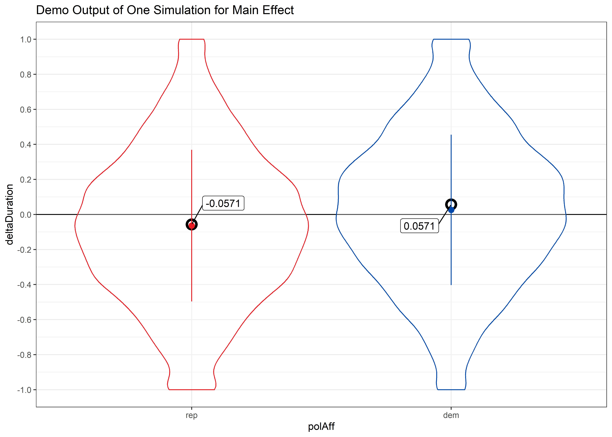
```

Visual representation of results of one simulation created using `FUN_sim`. Violin plots display the full distribution of the data. Points and surrounding lines indicate the mean ± 1 SD. The black horizontal line displays the true sample mean and the black open circles indicate the true means for each cell.
:::

::: {#supptbl-demoFUNSim}
```{r}
#| label: supptbl-demoFUNSim
#| include: true

resultsTable
```

Statistical results of one simulation created using `FUN_sim`. Data was fit using `r formulaUsedForFit`.
:::

#### Power Simulation

We now simulate multiple random samples drawn from the same synthetic population with a known true effect of political affiliation. For each random sample, we fit our statistical model to the data. The statistical power to detect a true effect of political affiliation is calculated as the proportion of significant effects out of the total number of simulations. We aim for a statistical power of 95%.

In the following code, the simulations are calculated. We do not recommend executing this code junk as it takes several hours to run (code only shown in the html version).

```{r}
#| label: doSims_mainEffect
#| eval: false

FUN_sim_pwr <- function(sim, ...){
  out <- FUN_sim(...)
  modelResults <- out$modelResults %>% 
    mutate(sim = sim) %>% 
    relocate(sim)
  return(modelResults)
}

# How many simulations should be run?
n_sims <- 1000

# What are the breaks for number of subjects we would like to calculate power for?
breaks_subj <- seq(200, 1000, 200)

# What are the breaks for SESOI?
breaks_sesoi <- c(0.4/3, 0.4/3.5, 0.4/4)

# What are the breaks for different errer SDs?
breaks_sigma <- c(1:2)*(.29+.04)

res_mainEffect <- tibble()
for (s in seq_along(breaks_sigma)) {
  
  res_sesoi <- tibble()
  for (sesoi in seq_along(breaks_sesoi)) {
    
    res_nSubj <- tibble()
    for (nSubj in seq_along(breaks_subj)) {
      
      # Give feedback regarding which model is simulated
      cat(paste0(
        "Simulation:\n",
        "  sigma = ", round(breaks_sigma[s], 4), "\n",
        "  sesoi = ", round(breaks_sesoi[sesoi], 4), "\n",
        "  nSubject = ", breaks_subj[nSubj], "\n"
      ))
      
      # Start timer
      cat(paste0("Start date time: ", lubridate::now(), "\n"))
      tic()
      
      # Loop over simulations
      pwr <- map_df(
        1:n_sims, 
        FUN_sim_pwr,
        n_subj = breaks_subj[nSubj],
        beta_p = breaks_sesoi[sesoi],
        sigma = breaks_sigma[s]
      )
      
      # Stop timer and calculate elapsed time
      elapsed_time <- toc(quiet = TRUE)
      elapsed_seconds <- elapsed_time$toc - elapsed_time$tic
      elapsed_minutes <- elapsed_seconds / 60
      cat(paste0("End date time: ", lubridate::now(), "\n"))
      cat("Elapsed time: ", elapsed_minutes, " minutes\n\n")
      
      # Add number of subjects to pwr
      pwr <- pwr %>% 
        mutate(
          nSubjects = breaks_subj[nSubj],
          sesoi = breaks_sesoi[sesoi],
          sigma = breaks_sigma[s]
        )
      
      # Add results to the results table
      res_nSubj <- res_nSubj %>%
        rbind(pwr)
    }
    
    # Add results to the results table
    res_sesoi <- res_sesoi %>% 
      rbind(res_nSubj)
  }
  
  # Add results to the results table
  res_mainEffect <- res_mainEffect %>% 
    rbind(res_sesoi)
  
}

res_mainEffect.summary <- res_mainEffect %>% 
  filter(term == "polAff.dem-rep") %>% 
  group_by(sigma, sesoi, nSubjects) %>% 
  summarise(
    power = mean(p.value < 0.05),
    ci.lower = binom.confint(power*n_sims, n_sims, methods = "exact")$lower,
    ci.upper = binom.confint(power*n_sims, n_sims, methods = "exact")$upper,
    .groups = 'drop'
  ) %>% 
  mutate(
    sigma_fact = factor(format(round(sigma, 4), nsmall = 4)),
    sigma_level = match(sigma_fact, levels(sigma_fact)),
    sesoi_fact = factor(format(round(sesoi, 4), nsmall = 4)),
    sesoi_level = match(sesoi_fact, levels(sesoi_fact))
  )

# Save results in a list object
time <- format(Sys.time(), "%Y%m%d_%H%M")
fileName <- paste0("res_mainEffect", "_", time, ".RDS")
saveRDS(
  list(
    res_mainEffect = res_mainEffect,
    res_mainEffect.summary = res_mainEffect.summary
  ),
  file = file.path("../powerSimulationsOutput", fileName)
)
```

We retrieve pre-run results:

```{r}
#| label: loadSims_mainEffect
#| echo: true

# Load power simulation data
resList_mainEffect <- readRDS(file.path("../powerSimulationsOutput", "res_mainEffect_20240813_2141.RDS"))
resList_mainEffect.summary <- resList_mainEffect$res_mainEffect.summary

# Extract power values for some specific effect sizes at N = 1000
chosenN <- 600
chosenSigma <- c("0.3300", "0.6600")
chosenSESOI <- c("0.1000", "0.1143")
powerValues <- resList_mainEffect.summary %>% 
  filter(sigma_fact %in% chosenSigma) %>% 
  filter(sesoi_fact %in% chosenSESOI) %>% 
  filter(nSubjects %in% chosenN) %>% 
  mutate(power_str = paste0(round(ci.lower*100, 2), "%")) %>% 
  pull(power_str)

# Extract number of simulations
label_nSimulations <- resList_mainEffect$res_mainEffect$sim %>% n_distinct()
```

@suppfig-checkSims-mainEffect displays the distribution of estimated fixed effects across all simulations. The figure shows that the estimated fixed effects are close to the true ones provided as input in the data simulation function, validating that simulations worked as expected.

```{r}
#| label: suppfig-checkSims-mainEffect
#| echo: false

# Define some filters
filter_nSubjects <- 1000
filter_sesoi <- unique(resList_mainEffect$res_mainEffect$sesoi)[2]
filter_sigma <- unique(resList_mainEffect$res_mainEffect$sigma)[1]

# Prepare data for plot
fixedEstimates <- resList_mainEffect$res_mainEffect %>% 
  mutate(
    group = ifelse(is.na(group), "", group),
    group_term = str_remove(str_c(group, term, sep = "_"), "^_")
  ) %>% 
  filter(effect == "fixed") %>% 
  filter(nSubjects == filter_nSubjects) %>% 
  filter(sesoi == filter_sesoi) %>% 
  filter(sigma == filter_sigma)
fixedEstimates_medians <- fixedEstimates %>% 
  group_by(group_term) %>% 
  summarise(
    median = median(estimate, na.rm = TRUE),
    median_rounded = format(round(median, 4), nsmall = 4, scientific = FALSE),
    .groups = 'drop'
  )

# Create plot
p.checkSims.mainEffect <- fixedEstimates %>% 
  ggplot(aes(x = estimate, y = group_term)) +
  ggdist::stat_halfeye() +
  ggrepel::geom_label_repel(
    data = fixedEstimates_medians,
    mapping = aes(x = median, y = group_term, label = median_rounded),
    box.padding = .5
  ) +
  labs(
    title = "Distribution of Estimated Fixed Effects",
    subtitle = paste0(
      "SESOI = ", round(filter_sesoi, 4), ", ",
      "σ = ", round(filter_sigma, 4), ", ",
      "N = ", filter_nSubjects, ", ",
      "Number of Simulations = ", label_nSimulations
    ),
    x = "Estimate",
    y = "Term"
  ) +
  theme_bw()

jpeg(
  file = "../images/pa_checkSimsMainEffect.jpeg",
  width = 9.1, height = 6.5, units = "in", res = 600
)
print(p.checkSims.mainEffect)
invisible(dev.off())
```

{#suppfig-checkSims-mainEffect}

@suppfig-powC-mainEffect shows results of our sample-size determination analyses. We find that a sample size of `r chosenN` provides a statistical power of `r min(powerValues)` (lower bound of 95%-CI) even under the most conservative assumptions (SESOI = `r chosenSESOI[1]`, Error SD = `r chosenSigma[2]`).

```{r}
#| label: interpolatePower_mainEffect

# Get power values of interest
chosenN <- c(800, 1000)
chosenSigma <- c("0.3300", "0.6600")
chosenSESOI <- c("0.1000")
powerValues <- resList_mainEffect.summary %>% 
  filter(sigma_fact %in% chosenSigma) %>% 
  filter(sesoi_fact %in% chosenSESOI) %>% 
  filter(nSubjects %in% chosenN)

# Get lower CI for power values for conservative sigma assumptions
powerValues_sigmaCons <- powerValues %>% 
  filter(sigma_fact == "0.6600")

# Interpolate the effect sizes at which we achieve 99% power
eff_sigmaCons <- approx(powerValues_sigmaCons$ci.lower, powerValues_sigmaCons$nSubjects, xout = 0.99)$y
# Round results for display in text
eff_sigmaCons_txt <- toString(round(eff_sigmaCons))
```

Moreover, we inspect the lower bounds of the 95%-CI power estimates in @suppfig-powC-mainEffect. Specifically, we focus on the power simulation results for a conservative SESOI of `r chosenSESOI` and an error SD of `r chosenSigma[2]`. Then, we use interpolation between sample sizes of `r chosenN[1]` and `r chosenN[2]` to estimate the number of participants needed to achieve 99% statistical power (lower bounds of 95%-CI power estimates). Results reveal that with a sample size of N = `r eff_sigmaCons_txt`, we would achieve 99% statistical power (lower bound of 95%-CI power estimate) to detect a true effect of at least `r chosenSESOI`.

We optimize the study design to detect a true SESOI for political affiliation. However, we are also interested in two-way and three-way interaction effects, which are known to require greater sample sizes to achieve the same statistical power as for main effects. Moreover, greater sample sizes are more likely to accurately represent target populations with respect to variables like exposure to extreme weather events and subjective attribution of extreme weather events to climate change. Therefore, we opt for a sample size of N = 1000 for further effect-size sensitivity analyses regarding interaction effects.

```{r}
#| label: suppfig-powC-mainEffect
#| echo: false

# Create data for plot
dataForPlot <- resList_mainEffect.summary %>% 
  filter(sigma_level != 3) %>% 
  mutate(
    sigma_level = as.numeric(scale(sigma_level, scale = FALSE)),
    nSubjects_shifted = nSubjects + sigma_level * 20,
    sesoi_fact = paste0("SESOI = ", sesoi_fact)
  )

# Create plot
powC.mainEffect <- dataForPlot %>% 
  ggplot(aes(
    x = nSubjects_shifted, y = power,
    ymin = ci.lower, ymax = ci.upper,
    color = sigma_fact, fill = sigma_fact
  )) +
  geom_hline(yintercept = .95, color = "grey70", linetype = "dashed") +
  geom_ribbon(alpha = .1, color = NA) +
  geom_errorbar(width = 1.5) +
  geom_line() +
  geom_point() +
  scale_x_continuous(breaks = seq(200, 1000, 200), labels = seq(200, 1000, 200)) +
  scale_y_continuous(
    limits = c(.5, 1),
    breaks = seq(0, 1, .05),
    labels = scales::label_percent()
  ) +
  ggthemes::scale_color_colorblind(name = "Error SD") +
  ggthemes::scale_fill_colorblind(name = "Error SD") +
  labs(
    title = "Power Curves Main Effect polAff",
    subtitle = paste0("Number of Simulations per Data Point = ", label_nSimulations),
    x = "Number of Participants",
    y = "Power",
    color = waiver(),
    fill = waiver()
  ) +
  theme_bw() +
  facet_wrap(~sesoi_fact)

jpeg(
  file = "../images/pa_powCMainEffect.jpeg",
  width = 10.5, height = 5, units = "in", res = 600
)
print(powC.mainEffect)
invisible(dev.off())
```

::: {#suppfig-powC-mainEffect}
```{r}
#| echo: false
#| include: true

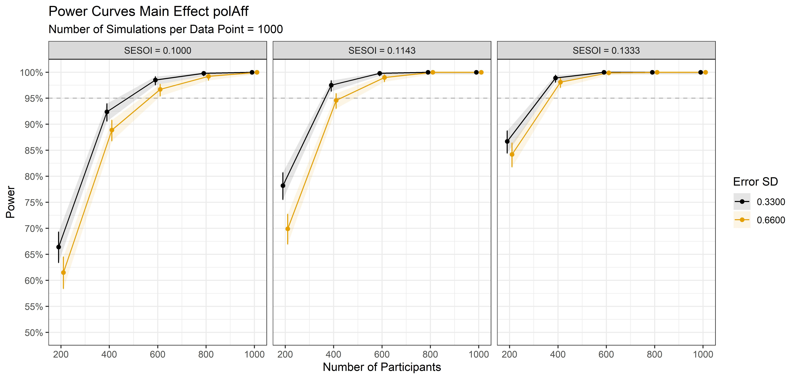
```

Power curves for the main effect of polAff. Points represent statistical power surrounded by a 95%-CI based on 1000 simulations with α = 0.05.
:::

### Two-Way Interaction Effect

As argued in the Registered Report, we hypothesize:

**(H~2~)**: *Exposure to extreme weather events amplifies the polarization in attentional information search processes, increasing the difference in ΔDuration between Republicans and Democrats among individuals with (vs. without) such exposure. In other words, there is a positive two-way interaction effect of extreme weather exposure and political affiliation on ΔDuration.*

```{r}
#| label: trueEffects_2wayInt
#| echo: true

# Create a data frame with predicted true effects

# Smallest Effect Size Of Interest (SESOI)
SESOI <- 0.4/3.5

# Betas
beta_p <- SESOI
beta_e <- 0
beta_p_e_inx <- SESOI

# Predicted "true" effects
polAff_ewe_trueEffects <- expand_grid(
  polAff = factor(c("rep", "dem"), levels = c("rep", "dem")),
  ewe = factor(c(FALSE, TRUE), levels = c(FALSE, TRUE))
) %>% 
  add_contrast("polAff", contrast = "anova", colnames = "X_p") %>% 
  add_contrast("ewe", contrast = "anova", colnames = "X_e") %>% 
  mutate(
    trueDeltaDuration =
      0 +                        # intercept
      X_p * beta_p +             # main effect polAff
      X_e * beta_e +             # main effect ewe
      X_p * X_e * beta_p_e_inx   # interaction effect polAff*ewe
  )
```

#### SESOI for Two-Way Interaction {#sec-SESOI_2wayInt}

For deriving a SESOI for the two-way interaction of interest, similar considerations apply as in the case of the SESOI for the main effect of interest. In this section, we make these considerations explicit. We start by noticing that the complete fixed two-way interaction polAff × ewe is modeled as:

$$
\Delta Duration = \beta_{0} + \beta_{1} \cdot polAff + \beta_{2} \cdot ewe  + \beta_{3} \cdot (polAff \times ewe)
$$

By rearranging terms, one can show that the effect of polAff is given by:

$$
Effect_{polAff} = \beta_{1} + \beta_{3} \cdot ewe
$$

Now, let's calculate this effect for two individuals who differ in their levels of ewe. As ewe is a binary variable, we have two types of individuals: individuals with (ewe = 1) and without (ewe = 0) extreme weather exposure. For an individual without extreme weather exposure, the effect of polAff will be:

$$
Effect_{noEWE} = \beta_{1} + \beta_{3} \cdot 0 = \beta_{1}
$$

For an individual with extreme weather exposure, the effect of polAff will be:

$$
Effect_{EWE} = \beta_{1} + \beta_{3} \cdot 1 = \beta_{1} + \beta_{3}
$$

The difference in the effect of polAff between these two individuals is given by:

$$
\begin{split}
Effect_{EWE} - Effect_{noEWE} = (\beta_{1} + \beta_{3}) - \beta_{1} = \beta_{3}
\end{split}
$$

We consider this difference as theoretically relevant if it is at least of the same size as the SESOI for the effect of polAff:

$$
SESOI_{polAff \times ewe} = Effect_{EWE} - Effect_{noEWE} = SESOI_{polAff} = 0.1143
$$

#### Data Simulation Function

We next define a function that simulates data for the two-way interaction effect of political affiliation with extreme weather exposure on ΔDuration: `FUN_sim_2wayInt`. The function will simulate data according to the following model, expressed in lme4-lingo:

`deltaDuration ~ polAff * ewe + (1|subj) + (1|trial)`

The function `FUN_sim_2wayInt` takes, among others, the following important arguments (in addition to the arguments discussed for `FUN_sim`):

-   `beta_p`: **Fixed main effect of political affiliation**. Compatible with H~1~, we keep this value at the SESOI of 0.1143. That is, we model that the average effect of political affiliation across all participants, irrespective of their extreme weather exposure, is 0.1143.

-   `beta_e`: **Fixed main effect of extreme weather exposure**. As we are interested in the moderating role of extreme weather exposure, we set this main effect to zero. That is, we assume that the effect of extreme weather exposure is highly dependent on participants' political affiliation.

-   `beta_p_e_inx`: **Fixed two-way interaction effect of political affiliation and extreme weather exposure**. We set this initial value to the SESOI derived above, but we investigate how changing this effect size impacts statistical power, as we are conducting effect-size sensitivity analyses for interaction effects.

The function `FUN_sim_2wayInt` is defined below:

```{r}
#| label: defineFUN_sim_2wayInt
#| code-fold: show

# Define data simulation function
FUN_sim_2wayInt <- function(
  n_subj         =        1000, # number of subjects
  n_subj_prop_p  =   c(.5, .5), # proportion of republican and democrat subjects
  n_subj_prop_e  =   c(.5, .5), # proportion of subjects without and with extreme weather exposure
  n_trial        =          25, # number of trials
  beta_0         =           0, # intercept (grand mean) for deltaDuration
  beta_p         =     0.4/3.5, # main effect of political affiliation (polAff)
  beta_e         =           0, # main effect of extreme weather exposure (ewe)
  beta_p_e_inx   =     0.4/3.5, # two-way interaction effect of polAff and ewe
  subj_0         =         .29, # by-subject random intercept sd for dt carbon
  trial_0        =         .04, # by-trial random intercept sd
  sigma          = 1*(.29+.04), # residual (error) sd
  
  truncNums      =        TRUE, # should impossible numbers be truncuated?
  setSeed        =        NULL  # seed number to achieve reproducible results. Set to NULL for simulations!
) {
  
  # Set seed to achieve reproducible results for demonstration purposes
  set.seed(setSeed)
  
  # Simulate data for dwell time on carbon information
  dataSim <- 
    # add random factor subject
    add_random(subj = n_subj) %>% 
    # add random factor trial
    add_random(trial = n_trial) %>% 
    # add between-subject factor political affiliation (with anova contrast)
    add_between("subj", polAff = c("rep", "dem"), .prob = n_subj_prop_p*n_subj, .shuffle = TRUE) %>% 
    add_contrast("polAff", colnames = "X_p", contrast = "anova") %>% 
    # add between-subject factor extreme weather exposure (with anova contrast)
    add_between("subj", ewe = c(FALSE, TRUE), .prob = n_subj_prop_e*n_subj, .shuffle = TRUE) %>% 
    add_contrast("ewe", colnames = "X_e", contrast = "anova") %>% 
    # add by-subject random intercept
    add_ranef("subj", S_0 = subj_0) %>% 
    # add by-trial random intercept
    add_ranef("trial", T_0 = trial_0) %>% 
    # add error term
    add_ranef(e_st = sigma) %>% 
    # add response values
    mutate(
      # add together fixed and random effects for each effect
      B_0 = beta_0 + S_0 + T_0,
      B_p = beta_p,
      B_e = beta_e,
      B_p_e_inx = beta_p_e_inx,
      # calculate dv by adding each effect term multiplied by the relevant
      # effect-coded factors and adding the error term
      deltaDuration = 
        B_0 + e_st +
        (X_p * B_p) +
        (X_e * B_e) +
        (X_p * X_e * B_p_e_inx)
    )
  
  # Truncuate impossible deltaDurations
  if(truncNums) {
    dataSim <- dataSim %>% 
      mutate(deltaDuration = if_else(deltaDuration < -1, -1,
        if_else(deltaDuration > 1, 1, deltaDuration)))
  }
  
  # Run a linear mixed effects model and check summary
  mod <- lmer(
    deltaDuration ~ polAff*ewe + (1 | subj) + (1 | trial),
    data = dataSim
  )
  mod.sum <- summary(mod)
  
  # Get results in tidy format
  mod.broom <- broom.mixed::tidy(mod)
  
  return(list(
    dataSim = dataSim,
    modelLmer = mod,
    modelResults = mod.broom
  ))
  
}
```

We call the function once and extract the results of this single simulation:

```{r}
#| label: demo_FUN_sim_2wayInt

out <- FUN_sim_2wayInt(
  n_subj         =        1000, # number of subjects
  n_subj_prop_p  =   c(.5, .5), # proportion of republican and democrat subjects
  n_subj_prop_e  =   c(.5, .5), # proportion of subjects without and with extreme weather exposure
  n_trial        =          25, # number of trials
  beta_0         =           0, # intercept (grand mean) for deltaDuration
  beta_p         =     0.4/3.5, # main effect of political affiliation (polAff)
  beta_e         =           0, # main effect of extreme weather exposure (ewe)
  beta_p_e_inx   =     0.4/3.5, # two-way interaction effect of polAff and ewe
  subj_0         =         .29, # by-subject random intercept sd for dt carbon
  trial_0        =         .04, # by-trial random intercept sd
  sigma          = 1*(.29+.04), # residual (error) sd
  
  truncNums      =        TRUE, # should impossible numbers be truncuated?
  setSeed        =        1234  # seed number to achieve reproducible results. Set to NULL for simulations!
)

# Get results table
resultsTable <- out$modelResults %>% 
  select(-c(std.error, statistic, df)) %>% 
  mutate(across(where(is_double), ~ round(.x, 4))) %>% 
  knitr::kable()
formulaUsedForFit <- paste(as.character(formula(out$modelLmer))[c(2,1,3)], collapse = " ")

# Create plot
p.demo.2wayInt <-  out$dataSim %>% 
  ggplot(aes(x = ewe, y = deltaDuration, color = polAff)) +
  geom_hline(yintercept = 0) +
  geom_violin(alpha = 0.3) +
  geom_point(
    data = polAff_ewe_trueEffects,
    mapping = aes(x = ewe, y = trueDeltaDuration, fill = polAff),
    shape = "circle open",
    size = 3.5,
    stroke = 2,
    color = "black",
    position = position_dodge(width = .9),
    show.legend = FALSE
  ) +
  stat_summary(
    fun = mean,
    fun.min = \(x){mean(x) - sd(x)},
    fun.max = \(x){mean(x) + sd(x)},
    position = position_dodge(width = .9)
  ) +
  ggrepel::geom_label_repel(
    data = polAff_ewe_trueEffects,
    mapping = aes(x = ewe, y = trueDeltaDuration, fill = polAff, label = round(trueDeltaDuration, 4)),
    color = "black",
    box.padding = 1,
    position = position_dodge(width = .9),
    show.legend = FALSE
  ) +
  scale_color_manual(values = c("#E81B23", "#0047AB")) +
  scale_fill_manual(values = c("white", "white")) +
  scale_y_continuous(breaks = seq(-1, 1, .2)) +
  labs(title = "Demo Output of One Simulation for Two-Way Interaction") +
  theme_bw()

jpeg(
  file = "../images/pa_demo2wayInt.jpeg",
  width = 9.1, height = 6.3, units = "in", res = 600
)
print(p.demo.2wayInt)
invisible(dev.off())
```

@suppfig-demoFUNSim_2wayInt visualizes the results of this single simulation and @supptbl-demoFUNSim_2wayInt summarizes the statistical results of fitting the actual model used in data generation to the simulated data.

::: {#suppfig-demoFUNSim_2wayInt}
```{r}
#| echo: false
#| include: true

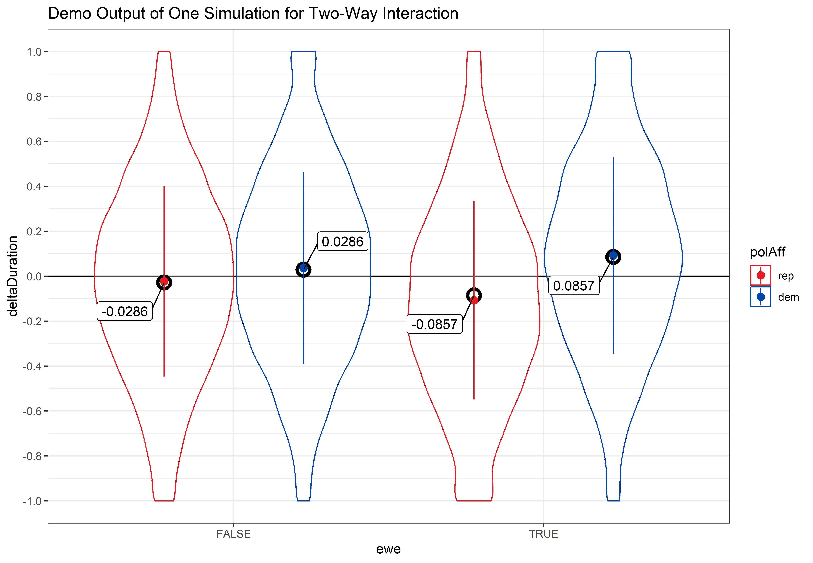
```

Visual representation of results of one simulation created using `FUN_sim_2wayInt`. Violin plots display the full distribution of the data. Points and surrounding lines indicate the mean ± 1 SD. The black horizontal line displays the true sample mean and the black open circles indicate the true means for each cell.
:::

::: {#supptbl-demoFUNSim_2wayInt}
```{r}
#| label: supptbl-demoFUNSim_2wayInt
#| echo: false

resultsTable
```

Statistical results of one simulation created using `FUN_sim_2wayInt`. Data was fit using `r formulaUsedForFit`.
:::

#### Power Simulation

In the following code, the simulations are calculated. We do not recommend executing this code junk as it takes several hours to run.

```{r}
#| label: doSims_2wayInt
#| eval: false

FUN_sim_2wayInt_pwr <- function(sim, ...){
  out <- FUN_sim_2wayInt(...)
  modelResults <- out$modelResults %>% 
    mutate(sim = sim) %>% 
    relocate(sim)
  return(modelResults)
}

# How many simulations should be run?
n_sims <- 1000

# What are the breaks for number of subjects we would like to calculate power for?
breaks_subj <- c(900, 950, 1000)

# What are the breaks for SESOI?
breaks_sesoi <- (0.4/3.5)*seq(1, 2, .25)

# What are the breaks for different error SDs?
breaks_sigma <- c((.29+.04), 2*(.29+.04))

res_2wayInt <- tibble()
for (s in seq_along(breaks_sigma)) {
  
  res_sesoi <- tibble()
  for (sesoi in seq_along(breaks_sesoi)) {
    
    res_nSubj <- tibble()
    for (nSubj in seq_along(breaks_subj)) {
      
      # Give feedback regarding which model is simulated
      cat(paste0(
        "Simulation:\n",
        "  sigma = ", round(breaks_sigma[s], 4), "\n",
        "  sesoi = ", round(breaks_sesoi[sesoi], 4), "\n",
        "  nSubject = ", breaks_subj[nSubj], "\n"
      ))
      
      # Start timer
      cat(paste0("Start date time: ", lubridate::now(), "\n"))
      tic()
      
      # Loop over simulations
      pwr <- map_df(
        1:n_sims, 
        FUN_sim_2wayInt_pwr,
        n_subj = breaks_subj[nSubj],
        beta_p_e_inx = breaks_sesoi[sesoi],
        sigma = breaks_sigma[s]
      )
      
      # Stop timer and calculate elapsed time
      elapsed_time <- toc(quiet = TRUE)
      elapsed_seconds <- elapsed_time$toc - elapsed_time$tic
      elapsed_minutes <- elapsed_seconds / 60
      cat(paste0("End date time: ", lubridate::now(), "\n"))
      cat("Elapsed time: ", elapsed_minutes, " minutes\n\n")
      
      # Add number of subjects to pwr
      pwr <- pwr %>% 
        mutate(
          nSubjects = breaks_subj[nSubj],
          sesoi = breaks_sesoi[sesoi],
          sigma = breaks_sigma[s]
        )
      
      # Add results to the results table
      res_nSubj <- res_nSubj %>%
        rbind(pwr)
    }
    
    # Add results to the results table
    res_sesoi <- res_sesoi %>% 
      rbind(res_nSubj)
  }
  
  # Add results to the results table
  res_2wayInt <- res_2wayInt %>% 
    rbind(res_sesoi)
  
}

res_2wayInt.summary <- res_2wayInt %>% 
  filter(term == "polAff.dem-rep:ewe.TRUE-FALSE") %>% 
  group_by(sigma, sesoi, nSubjects) %>% 
  summarise(
    power = mean(p.value < 0.05),
    ci.lower = binom.confint(power*n_sims, n_sims, methods = "exact")$lower,
    ci.upper = binom.confint(power*n_sims, n_sims, methods = "exact")$upper,
    .groups = 'drop'
  ) %>% 
  mutate(
    sigma_fact = factor(format(round(sigma, 4), nsmall = 4)),
    sigma_level = match(sigma_fact, levels(sigma_fact)),
    sesoi_fact = factor(format(round(sesoi, 4), nsmall = 4)),
    sesoi_level = match(sesoi_fact, levels(sesoi_fact))
  )

# Save results in a list object
time <- format(Sys.time(), "%Y%m%d_%H%M")
fileName <- paste0("res_2wayInt", "_", time, ".RDS")
saveRDS(
  list(
    res_2wayInt = res_2wayInt,
    res_2wayInt.summary = res_2wayInt.summary
  ),
  file = file.path("../powerSimulationsOutput", fileName)
)
```

We retrieve pre-run results:

```{r}
#| label: loadSims_2wayInt
#| echo: true

# Load power simulation data
resList_2wayInt <- readRDS(file.path("../powerSimulationsOutput", "res_2wayInt_20240814_1052.RDS"))
resList_2wayInt.summary <- resList_2wayInt$res_2wayInt.summary

# Extract power values for some specific assumptions
chosenN <- 950
chosenSigma <- c("0.3300", "0.6600")
chosenSESOI <- c("0.1429", "0.1714")
powerValues <- resList_2wayInt.summary %>% 
  filter(sigma_fact %in% chosenSigma) %>% 
  filter(sesoi_fact %in% chosenSESOI) %>% 
  filter(nSubjects %in% chosenN) %>% 
  mutate(power_str = paste0(round(power*100, 2), "%")) %>% 
  pull(power_str)

# Extract number of simulations
label_nSimulations <- resList_2wayInt$res_2wayInt$sim %>% n_distinct()

# Repeat breaks_sesoi
breaks_sesoi <- (0.4/3.5)*seq(1, 2, .25)
```

@suppfig-checkSims-twoWayInt displays the distribution of estimated fixed effects across all simulations. The figure shows that the estimated fixed effects are close to the true ones provided as input in the data simulation function, validating that simulations worked as expected.

```{r}
#| label: suppfig-checkSims-twoWayInt
#| echo: true

# Define some filters 
filter_nSubjects <- 1000
filter_sesoi <- unique(resList_2wayInt$res_2wayInt$sesoi)[1]
filter_sigma <- unique(resList_2wayInt$res_2wayInt$sigma)[1]

# Prepare data for plot
fixedEstimates <- resList_2wayInt$res_2wayInt %>% 
  mutate(
    group = ifelse(is.na(group), "", group),
    group_term = str_remove(str_c(group, term, sep = "_"), "^_")
  ) %>% 
  filter(effect == "fixed") %>% 
  filter(nSubjects == filter_nSubjects) %>% 
  filter(sesoi == filter_sesoi) %>% 
  filter(sigma == filter_sigma)
fixedEstimates_medians <- fixedEstimates %>% 
  group_by(group_term) %>% 
  summarise(
    median = median(estimate, na.rm = TRUE),
    median_rounded = format(round(median, 4), nsmall = 4, scientific = FALSE),
    .groups = 'drop'
  )

# Create plot
p.checkSims.2wayInt <-fixedEstimates %>% 
  ggplot(aes(x = estimate, y = group_term)) +
  ggdist::stat_halfeye() +
  ggrepel::geom_label_repel(
    data = fixedEstimates_medians,
    mapping = aes(x = median, y = group_term, label = median_rounded),
    box.padding = .5
  ) +
  labs(
    title = "Distribution of Estimated Fixed Effects",
    subtitle = paste0(
      "SESOI = ", round(filter_sesoi, 4), ", ",
      "σ = ", round(filter_sigma, 4), ", ",
      "N = ", filter_nSubjects, ", ",
      "Number of Simulations = ", label_nSimulations
    ),
    x = "Estimate",
    y = "Term"
  ) +
  theme_bw()

jpeg(
  file = "../images/pa_checkSims2wayInt.jpeg",
  width = 9.1, height = 6.5, units = "in", res = 600
)
print(p.checkSims.2wayInt)
invisible(dev.off())
```

::: {#suppfig-checkSims-twoWayInt}
```{r}
#| echo: false
#| include: true

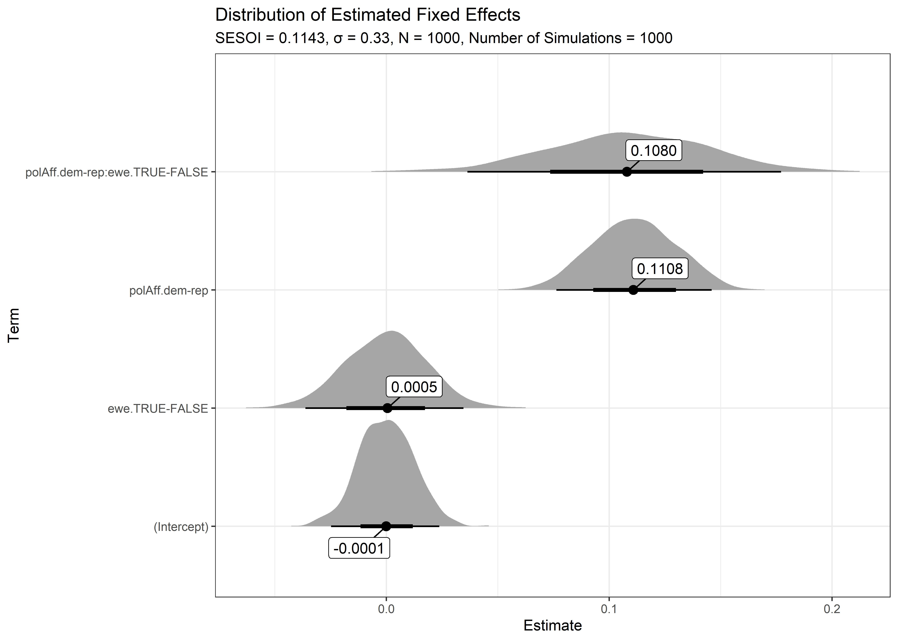
```

Distribution of estimated fixed effects resulting from `r label_nSimulations` simulations for the model `r formulaUsedForFit`. Shaded area represent densities, annotated points indicate medians, and thick and thin lines represent 66% and 95% quantiles.
:::

@suppfig-powC-twoWayInt shows results of our effect-size sensitivity analyses. We plot statistical power (y-axis) for different effect sizes (x-axis), taking into account different assumptions for the error SD (color) and sample size (panel). Regarding the latter, we report results not only for the full sample size we aim for (N = 1000), but also for sample sizes taking into account different participant exclusion-rates due to exclusion criteria defined in the Registered Report.

```{r}
#| label: suppfig-powC-twoWayInt
#| echo: false

# Create data for plot 
dataForPlot <- resList_2wayInt.summary %>% 
  mutate(
    nSubjects_fact = factor(nSubjects),
    nSubjects_level = match(nSubjects_fact, levels(nSubjects_fact)),
    nSubjects_level = as.numeric(scale(nSubjects_level, scale = FALSE)),
    sigma_level = match(sigma_fact, levels(sigma_fact)),
    sigma_level = as.numeric(scale(sigma_level, scale = FALSE)),
    sesoi_shifted = sesoi + sigma_level*0.005
  )

# Create plot
powC.2wayInt <- dataForPlot %>% 
  mutate(
    nSubjects_labels = paste0("N = ", nSubjects),
    nSubjects_labels = factor(nSubjects_labels, levels = paste0("N = ", seq(900, 1000, 50)))
  ) %>% 
  ggplot(aes(
    x = sesoi_shifted, y = power,
    ymin = ci.lower, ymax = ci.upper,
    color = sigma_fact, fill = sigma_fact
  )) +
  geom_hline(yintercept = .95, color = "grey70", linetype = "dashed") +
  geom_ribbon(alpha = .1, color = NA) +
  geom_errorbar(width = .001) +
  geom_line() +
  geom_point() +
  scale_x_continuous(
    breaks = breaks_sesoi,
    labels = paste0(
      format(round(breaks_sesoi, 4), nsmall = 4), "\n",
      "(+", paste0(seq(0, 1, .25)*100, "%"), ")"
    )
  ) +
  scale_y_continuous(
    limits = c(.7, 1),
    breaks = seq(0, 1, .05),
    labels = scales::label_percent()
  ) +
  ggthemes::scale_color_colorblind(name = "Error SD") +
  ggthemes::scale_fill_colorblind(name = "Error SD") +
  labs(
    title = "Power Curves Two-Way Interaction polAff × ewe",
    subtitle = paste0("Number of Simulations per Data Point = ", label_nSimulations),
    x = "Effect Size",
    y = "Power",
    color = waiver(),
    fill = waiver()
  ) +
  theme_bw() +
  facet_wrap(~nSubjects_labels)

jpeg(
  file = "../images/pa_powC2wayInt.jpeg",
  width = 10.5, height = 5, units = "in", res = 600
)
print(powC.2wayInt)
invisible(dev.off())
```

::: {#suppfig-powC-twoWayInt}
```{r}
#| echo: false
#| include: true

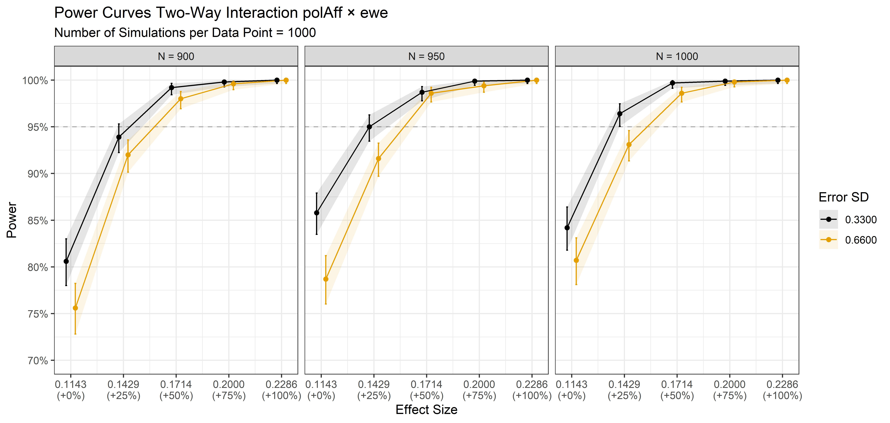
```

Power curves for the two-way interaction polAff × ewe. Points represent simulated power surrounded by a 95%-CI based on 1000 simulations with α = 0.05. Note that, in contrast to @suppfig-powC-mainEffect, the x-axsis represents different effect sizes, starting from the defined SESOI, while the panels represent different sample sizes, taking into account participant exclusion-rates of 10% (N = 900), 5% (N = 950), and 0% (N = 1000). Note that estimates are displayed with a slight shift along the x-axis to reduce overlap. Since we only consider effect sizes equal to or greater than the SESOI to be of relevance, power curves were only examined for positive effect sizes, which is why only positive values are shown.
:::

```{r}
#| label: interpolatePower_twoWayInt

# Get power values of interest
chosenN <- 950
chosenSigma <- c("0.3300", "0.6600")
chosenSESOI <- c("0.1429", "0.1714")
powerValues <- resList_2wayInt.summary %>% 
  filter(sigma_fact %in% chosenSigma) %>% 
  filter(sesoi_fact %in% chosenSESOI) %>% 
  filter(nSubjects %in% chosenN)

# Get lower CI for power values for more liberal and more conservative sigma assumptions
powerValues_sigmaLib <- powerValues %>% 
  filter(sigma_fact == "0.3300")
powerValues_sigmaCons <- powerValues %>% 
  filter(sigma_fact == "0.6600")

# Interpolate the effect sizes at which we achieve 95% power
eff_sigmaLib <- approx(powerValues_sigmaLib$ci.lower, powerValues_sigmaLib$sesoi, xout = 0.95)$y
eff_sigmaCons <- approx(powerValues_sigmaCons$ci.lower, powerValues_sigmaCons$sesoi, xout = 0.95)$y
# Round results for display in text
eff_sigmaLib_txt <- format(round(eff_sigmaLib, 4), nsmall = 4)
eff_sigmaCons_txt <- format(round(eff_sigmaCons, 4), nsmall = 4)
```

To assess the smallest effect size that can be detected with 95% statistical power, we inspect the lower bounds of the 95%-CI power estimates in @suppfig-powC-twoWayInt. Specifically, we focus on the power simulation results for N = `r chosenN`, which takes into account a participant exclusion-rate of 5%. There, we interpolate between the two point estimates that lie just below and above the 95% power line, i.e., between the power estimates for effect sizes `r chosenSESOI[1]` and `r chosenSESOI[2]`. Assuming an error SD of `r chosenSigma[1]`, we achieve 95% statistical power to detect a two-way interaction effect of at least `r eff_sigmaLib_txt`. For a more conservative error SD of `r chosenSigma[2]`, this smallest detectable effect size is only marginally higher (`r eff_sigmaCons_txt`).

##### Increased Sample Size

We additionally conduct an effect-size sensitivity analysis for increased sample sizes.

```{r}
#| label: doSims_2wayInt_increasedN
#| eval: false

FUN_sim_2wayInt_pwr <- function(sim, ...){
  out <- FUN_sim_2wayInt(...)
  modelResults <- out$modelResults %>% 
    mutate(sim = sim) %>% 
    relocate(sim)
  return(modelResults)
}

# How many simulations should be run?
n_sims <- 1000

# What are the breaks for number of subjects we would like to calculate power for?
breaks_subj <- c(1500, 1750, 2000)

# What are the breaks for SESOI?
breaks_sesoi <- (0.4/3.5)*seq(1, 2, .25)

# What are the breaks for different error SDs?
breaks_sigma <- c((.29+.04), 2*(.29+.04))

res_2wayInt <- tibble()
for (s in seq_along(breaks_sigma)) {
  
  res_sesoi <- tibble()
  for (sesoi in seq_along(breaks_sesoi)) {
    
    res_nSubj <- tibble()
    for (nSubj in seq_along(breaks_subj)) {
      
      # Give feedback regarding which model is simulated
      cat(paste0(
        "Simulation:\n",
        "  sigma = ", round(breaks_sigma[s], 4), "\n",
        "  sesoi = ", round(breaks_sesoi[sesoi], 4), "\n",
        "  nSubject = ", breaks_subj[nSubj], "\n"
      ))
      
      # Start timer
      cat(paste0("Start date time: ", lubridate::now(), "\n"))
      tic()
      
      # Loop over simulations
      pwr <- map_df(
        1:n_sims, 
        FUN_sim_2wayInt_pwr,
        n_subj = breaks_subj[nSubj],
        beta_p_e_inx = breaks_sesoi[sesoi],
        sigma = breaks_sigma[s]
      )
      
      # Stop timer and calculate elapsed time
      elapsed_time <- toc(quiet = TRUE)
      elapsed_seconds <- elapsed_time$toc - elapsed_time$tic
      elapsed_minutes <- elapsed_seconds / 60
      cat(paste0("End date time: ", lubridate::now(), "\n"))
      cat("Elapsed time: ", elapsed_minutes, " minutes\n\n")
      
      # Add number of subjects to pwr
      pwr <- pwr %>% 
        mutate(
          nSubjects = breaks_subj[nSubj],
          sesoi = breaks_sesoi[sesoi],
          sigma = breaks_sigma[s]
        )
      
      # Add results to the results table
      res_nSubj <- res_nSubj %>%
        rbind(pwr)
    }
    
    # Add results to the results table
    res_sesoi <- res_sesoi %>% 
      rbind(res_nSubj)
  }
  
  # Add results to the results table
  res_2wayInt <- res_2wayInt %>% 
    rbind(res_sesoi)
  
}

res_2wayInt.summary <- res_2wayInt %>% 
  filter(term == "polAffX_p:eweX_e") %>% 
  group_by(sigma, sesoi, nSubjects) %>% 
  summarise(
    power = mean(p.value < 0.05),
    ci.lower = binom.confint(power*n_sims, n_sims, methods = "exact")$lower,
    ci.upper = binom.confint(power*n_sims, n_sims, methods = "exact")$upper,
    .groups = 'drop'
  ) %>% 
  mutate(
    sigma_fact = factor(format(round(sigma, 4), nsmall = 4)),
    sigma_level = match(sigma_fact, levels(sigma_fact)),
    sesoi_fact = factor(format(round(sesoi, 4), nsmall = 4)),
    sesoi_level = match(sesoi_fact, levels(sesoi_fact))
  )

# Save results in a list object
time <- format(Sys.time(), "%Y%m%d_%H%M")
fileName <- paste0("res_2wayInt_increasedN", "_", time, ".RDS")
saveRDS(
  list(
    res_2wayInt = res_2wayInt,
    res_2wayInt.summary = res_2wayInt.summary
  ),
  file = file.path("../powerSimulationsOutput", fileName)
)
```

```{r}
#| label: loadSims_2wayInt_increasedN
#| echo: true

# Load power simulation data
resList_2wayInt <- readRDS(file.path("../powerSimulationsOutput", "res_2wayInt_increasedN_20250308_0703.RDS"))
resList_2wayInt.summary <- resList_2wayInt$res_2wayInt.summary

# Extract power values for some specific assumptions
chosenN <- 2000
chosenSigma <- c("0.3300", "0.6600")
chosenSESOI <- c("0.1429", "0.1714")
powerValues <- resList_2wayInt.summary %>% 
  filter(sigma_fact %in% chosenSigma) %>% 
  filter(sesoi_fact %in% chosenSESOI) %>% 
  filter(nSubjects %in% chosenN) %>% 
  mutate(power_str = paste0(round(power*100, 2), "%")) %>% 
  pull(power_str)

# Extract number of simulations
label_nSimulations <- resList_2wayInt$res_2wayInt$sim %>% n_distinct()

# Repeat breaks_sesoi
breaks_sesoi <- (0.4/3.5)*seq(1, 2, .25)
```

@suppfig-powC-twoWayInt shows results of our effect-size sensitivity analyses. We plot statistical power (y-axis) for different effect sizes (x-axis), taking into account different assumptions for the error SD (color) and sample size (panel). Regarding the latter, we report results not only for the full sample size we aim for (N = 1000), but also for sample sizes taking into account different participant exclusion-rates due to exclusion criteria defined in the Registered Report.

```{r}
#| label: suppfig-powC-twoWayInt-increasedN
#| echo: false

# Create data for plot 
dataForPlot <- resList_2wayInt.summary %>% 
  mutate(
    nSubjects_fact = factor(nSubjects),
    nSubjects_level = match(nSubjects_fact, levels(nSubjects_fact)),
    nSubjects_level = as.numeric(scale(nSubjects_level, scale = FALSE)),
    sigma_level = match(sigma_fact, levels(sigma_fact)),
    sigma_level = as.numeric(scale(sigma_level, scale = FALSE)),
    sesoi_shifted = sesoi + sigma_level*0.005
  )

# Create plot
powC.2wayInt <- dataForPlot %>% 
  mutate(
    nSubjects_labels = paste0("N = ", nSubjects),
    nSubjects_labels = factor(nSubjects_labels, levels = paste0("N = ", seq(1500, 2000, 250)))
  ) %>% 
  ggplot(aes(
    x = sesoi_shifted, y = power,
    ymin = ci.lower, ymax = ci.upper,
    color = sigma_fact, fill = sigma_fact
  )) +
  geom_hline(yintercept = .95, color = "grey70", linetype = "dashed") +
  geom_ribbon(alpha = .1, color = NA) +
  geom_errorbar(width = .001) +
  geom_line() +
  geom_point() +
  scale_x_continuous(
    breaks = breaks_sesoi,
    labels = paste0(
      format(round(breaks_sesoi, 4), nsmall = 4), "\n",
      "(+", paste0(seq(0, 1, .25)*100, "%"), ")"
    )
  ) +
  scale_y_continuous(
    limits = c(.9, 1),
    breaks = seq(0, 1, .01),
    labels = scales::label_percent()
  ) +
  ggthemes::scale_color_colorblind(name = "Error SD") +
  ggthemes::scale_fill_colorblind(name = "Error SD") +
  labs(
    title = "Power Curves Two-Way Interaction polAff × ewe",
    subtitle = paste0("Number of Simulations per Data Point = ", label_nSimulations),
    x = "Effect Size",
    y = "Power",
    color = waiver(),
    fill = waiver()
  ) +
  theme_bw() +
  facet_wrap(~nSubjects_labels)

jpeg(
  file = "../images/pa_powC2wayInt_increasedN.jpeg",
  width = 10.5, height = 5, units = "in", res = 600
)
print(powC.2wayInt)
invisible(dev.off())
```

::: {#suppfig-powC-twoWayInt-increasedN}
```{r}
#| echo: false
#| include: true

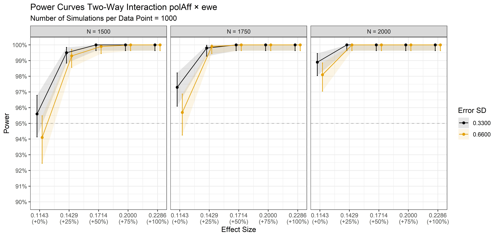
```

Power curves for the two-way interaction polAff × ewe. Points represent simulated power surrounded by a 95%-CI based on 1000 simulations with α = 0.05. Note that, in contrast to @suppfig-powC-mainEffect, the x-axsis represents different effect sizes, starting from the defined SESOI, while the panels represent different sample sizes. Note that estimates are displayed with a slight shift along the x-axis to reduce overlap. Since we only consider effect sizes equal to or greater than the SESOI to be of relevance, power curves were only examined for positive effect sizes, which is why only positive values are shown.
:::

### Three-Way Interaction Effect

As argued in the Registered Report, we hypothesize:

**(H~3~)**: *The two-way interaction effect of extreme weather exposure and political affiliation is greater for individuals who more strongly attribute extreme weather events to climate change. In other words, there is a positive three-way interaction effect of political affiliation, exposure to extreme weather events, and their attribution to climate change on ΔDuration.*

```{r}
#| label: trueEffects_3wayInt
#| echo: true

# Smallest Effect Size Of Interest (SESOI)
SESOI <- 0.4/3.5

# Betas
beta_p <- SESOI
beta_e <- 0
beta_s <- 0
beta_p_e_inx <- SESOI
beta_p_s_inx <- 0
beta_e_s_inx <- 0
beta_p_e_s_inx <- SESOI

# Predicted "true" effects
polAff_ewe_subjAttr_trueEffects <- expand_grid(
  polAff = factor(c("rep", "dem"), levels = c("rep", "dem")),
  ewe = factor(c(FALSE, TRUE), levels = c(FALSE, TRUE)),
  subjAttr = factor(c("-SD", "M", "+SD"), levels = c("-SD", "M", "+SD"))
) %>% 
  add_contrast("polAff", contrast = "anova", colnames = "X_p") %>% 
  add_contrast("ewe", contrast = "anova", colnames = "X_e") %>% 
  add_contrast("subjAttr", contrast = "anova", colnames = c("X_s_1", "X_s_2")) %>% 
  mutate(
    trueDeltaDuration =
      0 +                                      # intercept
      X_p * beta_p +                           # main effect polAff
      X_e * beta_e +                           # main effect ewe
      X_s_1 * beta_s +                         # main effect subjAttr, dummy variable for M vs. -SD
      X_s_2 * (2 * beta_s) +                   # main effect subjAttr, dummy variable for +SD vs. -SD
      X_p * X_e * beta_p_e_inx +               # 2-way interaction polAff * ewe
      X_p * X_s_1 * beta_p_s_inx +             # 2-way interaction polAff * subjAttr, dummy variable for M vs. -SD
      X_p * X_s_2 * (2 * beta_p_s_inx) +       # 2-way interaction polAff * subjAttr, dummy variable for +SD vs. -SD
      X_e * X_s_1 * beta_e_s_inx +             # 2-way interaction ewe * subjAttr, dummy variable for M vs. -SD
      X_e * X_s_2 * (2 * beta_e_s_inx) +       # 2-way interaction ewe * subjAttr, dummy variable for +SD vs. -SD
      X_p * X_e * X_s_1 * beta_p_e_s_inx +     # 3-way interaction polAff*ewe*subjAttr, dummy variable for M vs -SD
      X_p * X_e * X_s_2 * (2 * beta_p_e_s_inx) # 3-way interaction polAff*ewe*subjAttr, dummy variable for +SD vs. -SD
  )
```

#### SESOI for Three-way Interaction

In the sections above, we derived the SESOI used for the main effect sample-size determination analysis and for the two-way interaction effect-size sensitivity analysis for the binary variables `polAff` (dem vs. rep) and `ewe` (TRUE vs. FALSE). `subjAttr`, however, is a continuous variable that ranges from 1 to 5. Fortunately, in finding a theoretically sound SESOI for the three-way interaction, the same considerations apply as for the main effect and two-way interaction before. We just need to translate these considerations into the continuous metric of subjAttr.

We start by noticing that the complete fixed three-way interaction polAff × ewe × subjAttr is modeled as:

$$
\begin{split}
\Delta Duration = \beta_{0} + \\
\beta_{1} \cdot polAff + \beta_{2} \cdot ewe + \beta_{3} \cdot subjAttr + \\
\beta_{4} \cdot (polAff \times ewe) + \beta_{5} \cdot (polAff \times subjAttr) + \beta_{6} \cdot (ewe \times subjAttr) + \\
\beta_{7} \cdot (polAff \times ewe \times subjAttr)
\end{split}
$$

By rearranging terms, one can show that the two-way interaction polAff × ewe is given by:

$$
Two{-}way\ Interaction_{polAff \times ewe} = \beta_{4} + \beta_{7} \cdot subjAttr
$$

Now, let's calculate this two-way interaction for two individuals who differ in their level of subjective attribution of extreme weather events to climate change. First, an individual who has an average score on subjAttr will show the following two-way interaction effect, with $\mu_{subjAttr}$ being the sample average of the variable subjAttr:

$$
Effect_{Avg} = \beta_{4} + \beta_{7} \cdot \mu_{subjAttr}
$$

Second, we define an individual with a low score on subjAttr as one that shows a subjective attribution of one SD bellow the average. This individual will show the following two-way interaction effect, with $\sigma_{subjAttr}$ being the SD of subjAttr:

$$
Effect_{Low} = \beta_{4} + \beta_{7} \cdot (\mu_{subjAttr} - \sigma_{subjAttr})
$$

The difference in the two-way interaction effect polAff × ewe between these two individuals is given by:

$$
\begin{split}
Effect_{Avg} - Effect_{Low} = \\
\beta_{4} + \beta_{7} \cdot \mu_{subjAttr} - (\beta_{4} + \beta_{7} \cdot (\mu_{subjAttr} - \sigma_{subjAttr})) = \\
\beta_{7} \cdot [\mu_{subjAttr} - (\mu_{subjAttr} - \sigma_{subjAttr})] = \\
\beta_{7} \cdot \sigma_{subjAttr}
\end{split}
$$

As outlined above in Section @sec-SESOI_2wayInt, we assume that the SESOI for the two-way interaction polAff × ewe is 0.1143 for an average individual (with respect to subjAttr). If the same two-way interaction polAff × ewe shrinks to zero for an individual low in subjAttr, we would consider this interaction effect difference as theoretically relevant (see @suppfig-trueEffects_3wayInt). These assumptions translate to:

$$
Effect_{Avg} - Effect_{Low} = 0.1143 = \beta_{7} \cdot \sigma_{subjAttr}
$$

Division by $\sigma_{subjAttr}$ gives us the SESOI for the three-way interaction in the suitable metric of subjAttr:

$$
SESOI_{polAff \times ewe \times subjAttr} = \frac{0.1143}{\sigma_{subjAttr}}
$$

We will assess subjective attribution of extreme weather events to climate change using the same questions, response options, and aggregation as @ogunbode_attribution_2019. These authors reported $\mu_{subjAttr}$ = 3.67 and $\sigma_{subjAttr}$ = 0.85, resulting in:

$$
SESOI_{polAff \times ewe \times subjAttr} = \frac{0.1143}{0.85} = 0.1345
$$

```{r}
#| label: suppfig-trueEffects_3wayInt
#| echo: false

p.3wayInt.trueEffects <- polAff_ewe_subjAttr_trueEffects %>% 
  filter(subjAttr != "+SD") %>%
  ggplot(aes(x = ewe, y = trueDeltaDuration, fill = polAff)) +
  geom_bar(
    stat = "identity",
    color = "black",
    position = position_dodge(width = .9)
  ) +
  scale_fill_manual(values = c("#E81B23", "#0047AB")) +
  coord_cartesian(ylim = c(-.25, .25)) +
  labs(title = "Visualisation for the SESOI of polAff × ewe × subjAttr") +
  theme_bw() +
  facet_wrap(~subjAttr, labeller = label_both)

jpeg(
  file = "../images/pa_sesoiTrueEff3wayInt.jpeg",
  width = 9.1, height = 6.3, units = "in", res = 600
)
print(p.3wayInt.trueEffects)
invisible(dev.off())
```

::: {#suppfig-trueEffects_3wayInt}
```{r}
#| echo: false
#| include: true

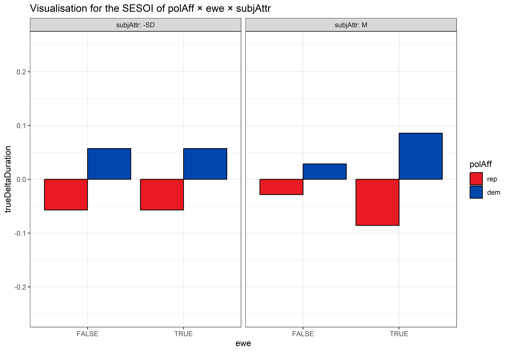
```

Assumed ΔDuration values for individuals scoring low (-SD) and average (M) on subjAttr. While individuals scoring average on subjAttr show a two-way interaction effect of polAff × ewe of 0.1143, this effect shrinks to zero for individuals scoring low on subjAttr. These individuals only show the predicted main effect of polAff (whis is 0.1143).
:::

#### Data Simulation Function

We finally define a function that simulates data for the three-way interaction effect of political affiliation with extreme weather exposure and attribution of extreme weather events to climate change on ΔDuration: `FUN_sim_3wayInt`. The function will simulate data according to the following model, expressed in lme4-lingo:

`deltaDuration ~ polAff * ewe * subjAttr + (1|subj) + (1|trial)`

The function `FUN_sim_3wayInt` takes, among others, the following important arguments (in addition to the arguments discussed for `FUN_sim_2wayInt`):

-   `s_mean`: **Sample mean of subjective attribution**. Based on results reported by @ogunbode_attribution_2019, we set this value to 3.67.

-   `s_sd`: **Sample SD of subjective attribution**. Based on results reported by @ogunbode_attribution_2019, we set this value to 0.85.

-   `beta_s`: **Fixed main effect of subjective attribution**. As we are interested in the moderating role of subjective attribution of extreme weather events to climate change, we set this main effect to zero.

-   `beta_p_s_inx` **Fixed two-way interaction effect of political affiliation and subjective attribution**. In order to accurately model a three-way interaction, one needs to include all two-way interactions in statistical models. Therefore, we include this two-way interaction, but we assume it to be zero.

-   `beta_e_s_inx` **Fixed two-way interaction effect of extreme weather exposure and subjective attribution**. As before, we include this interaction for accurately modelling the three-way interaction of interest, but we assume this two-way interaction to be zero.

-   `beta_p_e_s_inx` **Fixed three-way interaction effect of political affiliation, extreme weather exposure, and subjective attribution**. We set this initial value to the SESOI derived above, i.e. 0.1345. We investigate how changing this effect size impacts statistical power, as we are conducting effect-size sensitivity analyses for interaction effects.

The function is defined below:

```{r}
#| label: defineFUN_sim_3wayInt
#| code-fold: show

# Define data simulation function
FUN_sim_3wayInt <- function(
  n_subj         =                1000, # number of subjects
  n_subj_prop_p  =           c(.5, .5), # proportion of republican and democrat subjects
  n_subj_prop_e  =           c(.5, .5), # proportion of subjects without and with extreme weather exposure
  n_subj_prop_s  =           c(.5, .5), # proportion of subjects with low and high subjective attribution of EWE to CC
  n_trial        =                  25, # number of trials
  s_mean         =                3.67, # mean of subjAttr, see Ogunbode et al. (2019)
  s_sd           =                0.85, # sd of subjAttr, see Ogunbode et al. (2019)
  beta_0         =                   0, # intercept (grand mean) for deltaDuration
  beta_p         =             0.4/3.5, # main effect of political affiliation (polAff)
  beta_e         =                   0, # main effect of extreme weather exposure (ewe)
  beta_s         =                   0, # main effect of subjective attribution of ewe to climate change (subjAttr)
  beta_p_e_inx   =             0.4/3.5, # two-way interaction effect of polAff and ewe
  beta_p_s_inx   =                   0, # two-way interaction effect of polAff and subjAttr
  beta_e_s_inx   =                   0, # two-way interaction effect of ewe and subjAttr
  beta_p_e_s_inx =      (0.4/3.5)/0.85, # three-way interaction effect of polAff, ewe, and subjAttr
  subj_0         =                 .29, # by-subject random intercept sd for dt carbon
  trial_0        =                 .04, # by-trial random intercept sd
  sigma          =         1*(.29+.04), # residual (error) sd
  
  truncNums      =                TRUE, # should impossible numbers be truncuated?
  setSeed        =                NULL  # seed number to achieve reproducible results. Set to NULL for simulations!
) {
  
  # Set seed to achieve reproducible results for demonstration purposes
  set.seed(setSeed)
  
  # Simulate data for dwell time on carbon information
  dataSim <- 
    # add random factor subject
    add_random(subj = n_subj) %>% 
    # add random factor trial
    add_random(trial = n_trial) %>% 
    # add between-subject factor political affiliation (with anova contrast)
    add_between("subj", polAff = c("rep", "dem"), .prob = n_subj_prop_p*n_subj, .shuffle = TRUE) %>% 
    add_contrast("polAff", colnames = "X_p", contrast = "anova") %>% 
    # add between-subject factor extreme weather exposure (with anova contrast)
    add_between("subj", ewe = c(FALSE, TRUE), .prob = n_subj_prop_e*n_subj, .shuffle = TRUE) %>% 
    add_contrast("ewe", colnames = "X_e", contrast = "anova") %>% 
    # add between-subject variable subjective attribution of EWE to climate change
    mutate(
      subjAttr = rep(rnorm(n = n_subj, mean = s_mean, sd = s_sd), each = n_trial),
      subjAttr_c = scale(subjAttr, center = TRUE, scale = FALSE)[,1]
    ) %>% 
    # add by-subject random intercept
    add_ranef("subj", S_0 = subj_0) %>% 
    # add by-trial random intercept
    add_ranef("trial", T_0 = trial_0) %>% 
    # add error term
    add_ranef(e_st = sigma) %>% 
    # add response values
    mutate(
      # add together fixed and random effects for each effect
      B_0 = beta_0 + S_0 + T_0,
      B_p = beta_p,
      B_e = beta_e,
      B_s = beta_s,
      B_p_e_inx = beta_p_e_inx,
      B_p_s_inx = beta_p_s_inx,
      B_e_s_inx = beta_e_s_inx,
      B_p_e_s_inx = beta_p_e_s_inx,
      # calculate dv by adding each effect term multiplied by the relevant
      # effect-coded factors and adding the error term
      deltaDuration = 
        B_0 + e_st +
        (X_p * B_p) +
        (X_e * B_e) +
        (subjAttr_c * B_s) +
        (X_p * X_e * B_p_e_inx) +
        (X_p * subjAttr_c * B_p_s_inx) +
        (X_e * subjAttr_c * B_e_s_inx) +
        (X_p * X_e * subjAttr_c * B_p_e_s_inx)
    )
  
  # Unset seed
  set.seed(NULL)
  
  # Truncuate impossible deltaDurations
  if(truncNums) {
    dataSim <- dataSim %>% 
      mutate(deltaDuration = if_else(deltaDuration < -1, -1,
        if_else(deltaDuration > 1, 1, deltaDuration)))
  }
  
  # Run a linear mixed effects model and check summary
  mod <- lmer(
    deltaDuration ~ polAff*ewe*subjAttr_c + (1 | subj) + (1 | trial),
    data = dataSim
  )
  mod.sum <- summary(mod)

  # Get results in tidy format
  mod.broom <- broom.mixed::tidy(mod)

  return(list(
    dataSim = dataSim,
    modelLmer = mod,
    modelResults = mod.broom
  ))
  
}
```

We call the function once and extract the results of this single simulation:

```{r}
#| label: demo_FUN_sim_3wayInt

# Note to myself: Consider setting beta_p = 0.4/3.5, beta_p_e_inx = 0.4/3.5,
# and beta_p_e_s_inx to 2 * 0.4/3.5/(2*.85).
# This way, the interaction effect polAff:ewe is 0.4/3.5 for individuals
# with an average subjAttr (subjAttr_c = 0). For individuals with
# subjAttr = mean - SD, polAff:ewe is 0. For individuals with subjAttr = mean + SD,
# polAff:ewe is  2 * 0.4/3.5.

out <- FUN_sim_3wayInt(
  n_subj         =                1000, # number of subjects
  n_subj_prop_p  =           c(.5, .5), # proportion of republican and democrat subjects
  n_subj_prop_e  =           c(.5, .5), # proportion of subjects without and with extreme weather exposure
  n_subj_prop_s  =           c(.5, .5), # proportion of subjects with low and high subjective attribution of EWE to CC
  n_trial        =                  25, # number of trials
  s_mean         =                3.67, # mean of subjAttr, see Ogunbode et al. (2019)
  s_sd           =                0.85, # sd of subjAttr, see Ogunbode et al. (2019)
  beta_0         =                   0, # intercept (grand mean) for deltaDuration
  beta_p         =             0.4/3.5, # main effect of political affiliation (polAff)
  beta_e         =                   0, # main effect of extreme weather exposure (ewe)
  beta_s         =                   0, # main effect of subjective attribution of ewe to climate change (subjAttr)
  beta_p_e_inx   =             0.4/3.5, # two-way interaction effect of polAff and ewe
  beta_p_s_inx   =                   0, # two-way interaction effect of polAff and subjAttr
  beta_e_s_inx   =                   0, # two-way interaction effect of ewe and subjAttr
  beta_p_e_s_inx =      (0.4/3.5)/0.85, # three-way interaction effect of polAff, ewe, and subjAttr
  subj_0         =                 .29, # by-subject random intercept sd for dt carbon
  trial_0        =                 .04, # by-trial random intercept sd
  sigma          =         1*(.29+.04), # residual (error) sd
  
  truncNums      =                TRUE, # should impossible numbers be truncuated?
  setSeed        =                 123  # seed number to achieve reproducible results. Set to NULL for simulations!
)

# Get results table
resultsTable <- out$modelResults %>% 
  select(-c(std.error, statistic, df)) %>% 
  mutate(across(where(is_double), ~ round(.x, 4))) %>% 
  knitr::kable()
formulaUsedForFit <- paste(as.character(formula(out$modelLmer))[c(2,1,3)], collapse = " ")

# Create predictions plot

# refit model to dispaly subjAttr levels in original metric (not mean centered)
m <- lmer(
  deltaDuration ~ polAff*ewe*subjAttr + (1 | subj) + (1 | trial),
  data = out$dataSim
)
# define spotlights for spotlight analysis
spotlights <- c(3.67 - 0.85, 3.67, 3.67 + 0.85)

# create plot showing predictions
p.demo.3wayInt.pred <- predict_response(m, terms = c("ewe", "polAff", "subjAttr[spotlights]"))
p.demo.3wayInt <- p.demo.3wayInt.pred %>% 
  plot(colors = c("#E81B23", "#0047AB")) +
  coord_cartesian(ylim = c(-.25, .25)) +
  theme_bw()

jpeg(
  file = "../images/pa_demo3wayInt.jpeg",
  width = 9.1, height = 6.3, units = "in", res = 600
)
print(p.demo.3wayInt)
invisible(dev.off())
```

@suppfig-demoFUNSim_3wayInt visualizes predictions based on this single simulation and @supptbl-demoFUNSim_3wayInt summarizes the statistical results of fitting the actual model used in data generation to the simulated data.

::: {#suppfig-demoFUNSim_3wayInt}
```{r}
#| echo: false
#| include: true

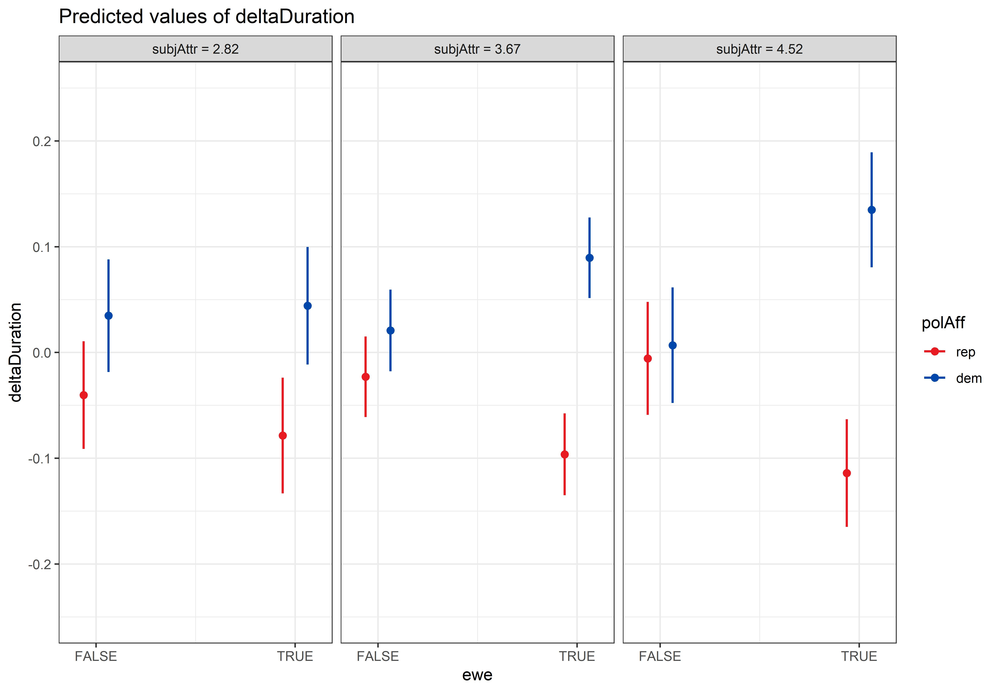
```

Visual representation of results of one simulation created using `FUN_sim_3wayInt`. Points indicate the predicted means surrounded by 95% Confidence Intervals. Panels indicate predictions for different values of subjAttr (Mean - SD, Mean, and Mean + SD).
:::

::: {#supptbl-demoFUNSim_3wayInt}
```{r}
#| label: supptbl-demoFUNSim_3wayInt
#| echo: false

resultsTable
```

Statistical results of one simulation created using `FUN_sim_3wayInt`. Data was fit using `r formulaUsedForFit`. Note that subjAttr is mean centered to ease interpretation of lower-level interactions and main effects.
:::

#### Power Simulation

In the following code, the simulations are calculated. We do not recommend executing this code junk as it takes several hours to run.

```{r}
#| label: doSims_3wayInt
#| eval: false

FUN_sim_3wayInt_pwr <- function(sim, ...){
  out <- FUN_sim_3wayInt(...)
  modelResults <- out$modelResults %>% 
    mutate(sim = sim) %>% 
    relocate(sim)
  return(modelResults)
}

# How many simulations should be run?
n_sims <- 1000

# What are the breaks for number of subjects we would like to calculate power for?
breaks_subj <- c(900, 950, 1000)

# What are the breaks for SESOI?
breaks_sesoi <- (0.4/3.5)/0.85 * seq(1, 2, .25)

# What are the breaks for different error SDs?
breaks_sigma <- c((.29+.04), 2*(.29+.04))

res_3wayInt <- tibble()
for (s in seq_along(breaks_sigma)) {
  
  res_sesoi <- tibble()
  for (sesoi in seq_along(breaks_sesoi)) {
    
    res_nSubj <- tibble()
    for (nSubj in seq_along(breaks_subj)) {
      
      # Give feedback regarding which model is simulated
      cat(paste0(
        "Simulation:\n",
        "  sigma = ", round(breaks_sigma[s], 4), "\n",
        "  sesoi = ", round(breaks_sesoi[sesoi], 4), "\n",
        "  nSubject = ", breaks_subj[nSubj], "\n"
      ))
      
      # Start timer
      cat(paste0("Start date time: ", lubridate::now(), "\n"))
      tic()
      
      # Loop over simulations
      pwr <- map_df(
        1:n_sims, 
        FUN_sim_3wayInt_pwr,
        n_subj = breaks_subj[nSubj],
        beta_p_e_s_inx = breaks_sesoi[sesoi],
        sigma = breaks_sigma[s]
      )
      
      # Stop timer and calculate elapsed time
      elapsed_time <- toc(quiet = TRUE)
      elapsed_seconds <- elapsed_time$toc - elapsed_time$tic
      elapsed_minutes <- elapsed_seconds / 60
      cat(paste0("End date time: ", lubridate::now(), "\n"))
      cat("Elapsed time: ", elapsed_minutes, " minutes\n\n")
      
      # Add number of subjects to pwr
      pwr <- pwr %>% 
        mutate(
          nSubjects = breaks_subj[nSubj],
          sesoi = breaks_sesoi[sesoi],
          sigma = breaks_sigma[s]
        )
      
      # Add results to the results table
      res_nSubj <- res_nSubj %>%
        rbind(pwr)
    }
    
    # Add results to the results table
    res_sesoi <- res_sesoi %>% 
      rbind(res_nSubj)
  }
  
  # Add results to the results table
  res_3wayInt <- res_3wayInt %>% 
    rbind(res_sesoi)
  
}

res_3wayInt.summary <- res_3wayInt %>% 
  filter(term == "polAff.dem-rep:ewe.TRUE-FALSE:subjAttr_c") %>% 
  group_by(sigma, sesoi, nSubjects) %>% 
  summarise(
    power = mean(p.value < 0.05),
    ci.lower = binom.confint(power*n_sims, n_sims, methods = "exact")$lower,
    ci.upper = binom.confint(power*n_sims, n_sims, methods = "exact")$upper,
    .groups = 'drop'
  ) %>% 
  mutate(
    sigma_fact = factor(format(round(sigma, 4), nsmall = 4)),
    sigma_level = match(sigma_fact, levels(sigma_fact)),
    sesoi_fact = factor(format(round(sesoi, 4), nsmall = 4)),
    sesoi_level = match(sesoi_fact, levels(sesoi_fact))
  )

# Save results in a list object
time <- format(Sys.time(), "%Y%m%d_%H%M")
fileName <- paste0("res_3wayInt", "_", time, ".RDS")
saveRDS(
  list(
    res_3wayInt = res_3wayInt,
    res_3wayInt.summary = res_3wayInt.summary
  ),
  file = file.path("../powerSimulationsOutput", fileName)
)
```

We retrieve pre-run results:

```{r}
#| label: loadSims_3wayInt
#| echo: true

# Load power simulation data
resList_3wayInt <- readRDS(file.path("../powerSimulationsOutput", "res_3wayInt_20240814_1612.RDS")) 
resList_3wayInt.summary <- resList_3wayInt$res_3wayInt.summary

# Extract power values for some specific effect sizes at N = 1000
powerValues <- resList_3wayInt.summary %>% 
  filter(sigma_fact == "0.3300") %>% 
  filter(sesoi_fact == "0.1345") %>% 
  filter(nSubjects == 950) %>% 
  mutate(power_str = paste0(round(power*100, 2), "%")) %>% 
  pull(power_str)

# Extract number of simulations
label_nSimulations <- resList_3wayInt$res_3wayInt$sim %>% n_distinct()

# Repeat breaks_sesoi
breaks_sesoi <- (0.4/3.5)/(0.85) * seq(1, 2, .25)
```

@suppfig-checkSims-threeWayInt displays the distribution of estimated fixed effects across all simulations. The figure shows that the estimated fixed effects are close to the true ones provided as input in the data simulation function, validating that simulations worked as expected.

```{r}
#| label: suppfig-checkSims-threeWayInt
#| echo: false
#| suppfig-width: 8.5
#| suppfig-height: 5

# Define some filters 
filter_nSubjects <- 1000
filter_sesoi <- unique(resList_3wayInt$res_3wayInt$sesoi)[1]
filter_sigma <- unique(resList_3wayInt$res_3wayInt$sigma)[1]

# Prepare data for plot
fixedEstimates <- resList_3wayInt$res_3wayInt %>% 
  mutate(
    group = ifelse(is.na(group), "", group),
    group_term = str_remove(str_c(group, term, sep = "_"), "^_")
  ) %>% 
  filter(effect == "fixed") %>% 
  mutate(group_term = factor(group_term, levels = unique(resList_3wayInt$res_3wayInt$term)[1:8])) %>% 
  filter(nSubjects == filter_nSubjects) %>% 
  filter(sesoi == filter_sesoi) %>% 
  filter(sigma == filter_sigma)
fixedEstimates_medians <- fixedEstimates %>% 
  group_by(group_term) %>% 
  summarise(
    median = median(estimate, na.rm = TRUE),
    median_rounded = format(round(median, 4), nsmall = 4, scientific = FALSE),
    .groups = 'drop'
  )

# Create plot
p.checkSims.3wayInt.cont <- fixedEstimates %>% 
  ggplot(aes(x = estimate, y = group_term)) +
  ggdist::stat_halfeye() +
  ggrepel::geom_label_repel(
    data = fixedEstimates_medians,
    mapping = aes(x = median, y = group_term, label = median_rounded),
    box.padding = .5
  ) +
  labs(
    title = "Distribution of Estimated Fixed Effects",
    subtitle = paste0(
      "SESOI = ", round(filter_sesoi, 4), ", ",
      "σ = ", round(filter_sigma, 4), ", ",
      "N = ", filter_nSubjects, ", ",
      "Number of Simulations = ", label_nSimulations
    ),
    x = "Estimate",
    y = "Term"
  ) +
  theme_bw()

jpeg(
  file = "../images/pa_checkSims3wayInt.jpeg",
  width = 9.1, height = 6.5, units = "in", res = 600
)
print(p.checkSims.3wayInt.cont)
invisible(dev.off())
```

::: {#suppfig-checkSims-threeWayInt}
```{r}
#| echo: false
#| include: true

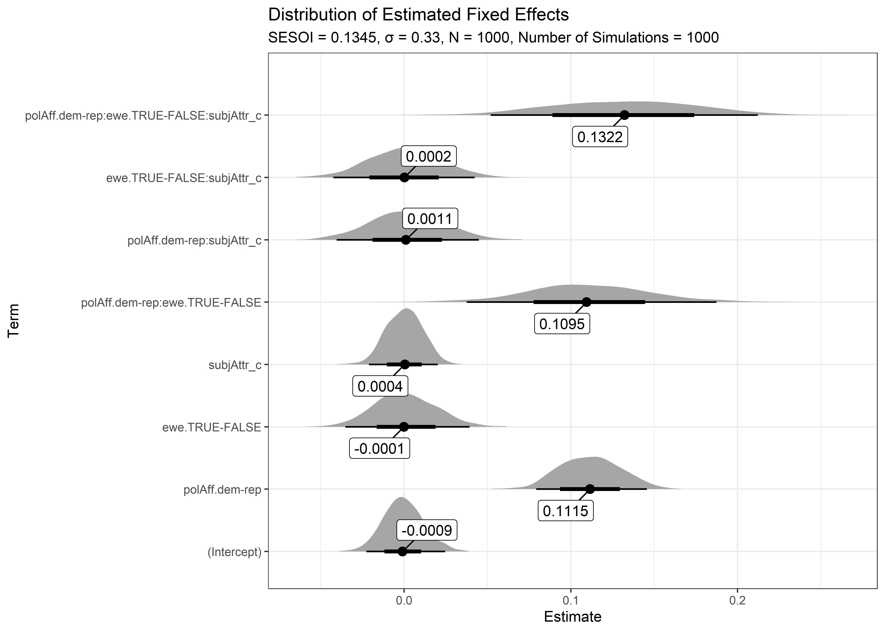
```

Distribution of estimated fixed effects resulting from `r label_nSimulations` simulations for the model `r formulaUsedForFit`. Shaded area represent densities, annotated points indicate medians, and thick and thin lines represent 66% and 95% quantiles.
:::

@suppfig-powC-threeWayInt shows results of our effect-size sensitivity analyses. We plot statistical power (y-axis) for different effect sizes (x-axis), taking into account different assumptions for the error SD (color) and sample size (panel). Regarding the latter, we report results not only for the full sample size we aim for (N = 1000), but also for sample sizes taking into account different participant exclusion-rates due to exclusion criteria defined in the Registered Report.

```{r}
#| label: suppfig-powC-threeWayInt
#| echo: false

# Create data for plot
dataForPlot <- resList_3wayInt.summary %>% 
  mutate(
    nSubjects_fact = factor(nSubjects),
    nSubjects_level = match(nSubjects_fact, levels(nSubjects_fact)),
    nSubjects_level = as.numeric(scale(nSubjects_level, scale = FALSE)),
    sigma_level = match(sigma_fact, levels(sigma_fact)),
    sigma_level = as.numeric(scale(sigma_level, scale = FALSE)),
    sesoi_shifted = sesoi + sigma_level*0.005
  )
label_nSimulations <- resList_3wayInt$res_3wayInt$sim %>% n_distinct()

# Create plot
powC.3wayInt.cont <- dataForPlot %>% 
  mutate(
    nSubjects_labels = paste0("N = ", nSubjects),
    nSubjects_labels = factor(nSubjects_labels, levels = paste0("N = ", seq(900, 1000, 50)))
  ) %>% 
  ggplot(aes(
    x = sesoi_shifted, y = power,
    ymin = ci.lower, ymax = ci.upper,
    color = sigma_fact, fill = sigma_fact
  )) +
  geom_hline(yintercept = .95, color = "grey70", linetype = "dashed") +
  geom_ribbon(alpha = .1, color = NA) +
  geom_errorbar(width = .001) +
  geom_line() +
  geom_point() +
  scale_x_continuous(
    breaks = breaks_sesoi,
    labels = paste0(
      format(round(breaks_sesoi, 4), nsmall = 4), "\n",
      "(+", paste0(seq(0, 2, .5)*100, "%"), ")"
    )
  ) +
  scale_y_continuous(
    limits = c(.7, 1),
    breaks = seq(0, 1, .05),
    labels = scales::label_percent()
  ) +
  ggthemes::scale_color_colorblind(name = "Error SD") +
  ggthemes::scale_fill_colorblind(name = "Error SD") +
  labs(
    title = "Power Curves Three-Way Interaction polAff × ewe × subjAttr",
    subtitle = paste0("N Simulations per Data Point = ", label_nSimulations),
    x = "SESOI",
    y = "Power",
    color = waiver(),
    fill = waiver()
  ) +
  theme_bw() +
  facet_wrap(~nSubjects_labels)

jpeg(
  file = "../images/pa_powC3wayInt.jpeg",
  width = 10.5, height = 5, units = "in", res = 600
)
print(powC.3wayInt.cont)
invisible(dev.off())
```

::: {#suppfig-powC-threeWayInt}
```{r}
#| echo: false
#| include: true

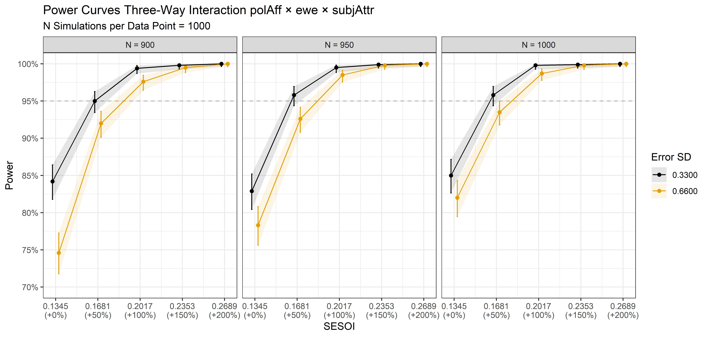
```

Power curves for the three-way interaction polAff × ewe × subjAttr. Points represent simulated power surrounded by a 95%-CI based on 1000 simulations with α = 0.05. Note that, in contrast to @suppfig-powC-mainEffect, the x-axsis represents different effect sizes, starting from the defined SESOI, while the panels represent different sample sizes, taking into account participant exclusion-rates of 10% (N = 900), 5% (N = 950), and 0% (N = 1000). Note that estimates are displayed with a slight shift along the x-axis to reduce overlap. Since we only consider effect sizes equal to or greater than the SESOI to be of relevance, power curves were only examined for positive effect sizes, which is why only positive values are shown.
:::

```{r}
#| label: interpolatePower_threeWayInt

# Get power values of interest
chosenN <- 950
chosenSigma <- c("0.3300", "0.6600")
chosenSESOI <- c("0.1681", "0.2017")
powerValues <- resList_3wayInt.summary %>% 
  filter(sigma_fact %in% chosenSigma) %>% 
  filter(sesoi_fact %in% chosenSESOI) %>% 
  filter(nSubjects %in% chosenN)

# Get lower CI for power values for more liberal and more conservative sigma assumptions
powerValues_sigmaLib <- powerValues %>% 
  filter(sigma_fact == "0.3300")
powerValues_sigmaCons <- powerValues %>% 
  filter(sigma_fact == "0.6600")

# Interpolate the effect sizes at which we achieve 95% power
eff_sigmaLib <- approx(powerValues_sigmaLib$ci.lower, powerValues_sigmaLib$sesoi, xout = 0.95)$y
eff_sigmaCons <- approx(powerValues_sigmaCons$ci.lower, powerValues_sigmaCons$sesoi, xout = 0.95)$y
# Round results for display in text
eff_sigmaLib_txt_3way <- format(round(eff_sigmaLib, 4), nsmall = 4)
eff_sigmaCons_txt_3way <- format(round(eff_sigmaCons, 4), nsmall = 4)
```

To assess the smallest effect size that can be detected with 95% statistical power, we inspect the lower bounds of the 95%-CI power estimates in @suppfig-powC-threeWayInt. Specifically, we focus on the power simulation results for N = `r chosenN`, which takes into account a participant exclusion rate of 5%. There, we interpolate between the two point estimates that lie just below and above the 95% power line, i.e., between the power estimates for effect sizes `r chosenSESOI[1]` and `r chosenSESOI[2]`. Assuming an error SD of `r chosenSigma[1]`, we achieve 95% statistical power to detect a three-way interaction effect of at least `r eff_sigmaLib_txt_3way`. For a more conservative error SD of `r chosenSigma[2]`, this smallest detectable effect size is only marginally higher (`r eff_sigmaCons_txt_3way`).

##### Increased Sample Size

We additionally conduct an effect-size sensitivity analysis for increased sample sizes.

```{r}
#| label: doSims_3wayInt_increasedN
#| eval: false

FUN_sim_3wayInt_pwr <- function(sim, ...){
  out <- FUN_sim_3wayInt(...)
  modelResults <- out$modelResults %>% 
    mutate(sim = sim) %>% 
    relocate(sim)
  return(modelResults)
}

# How many simulations should be run?
n_sims <- 1000

# What are the breaks for number of subjects we would like to calculate power for?
breaks_subj <- c(1500, 1750, 2000)

# What are the breaks for SESOI?
breaks_sesoi <- (0.4/3.5)/0.85 * seq(1, 2, .25)

# What are the breaks for different error SDs?
breaks_sigma <- c((.29+.04), 2*(.29+.04))

res_3wayInt <- tibble()
for (s in seq_along(breaks_sigma)) {
  
  res_sesoi <- tibble()
  for (sesoi in seq_along(breaks_sesoi)) {
    
    res_nSubj <- tibble()
    for (nSubj in seq_along(breaks_subj)) {
      
      # Give feedback regarding which model is simulated
      cat(paste0(
        "Simulation:\n",
        "  sigma = ", round(breaks_sigma[s], 4), "\n",
        "  sesoi = ", round(breaks_sesoi[sesoi], 4), "\n",
        "  nSubject = ", breaks_subj[nSubj], "\n"
      ))
      
      # Start timer
      cat(paste0("Start date time: ", lubridate::now(), "\n"))
      tic()
      
      # Loop over simulations
      pwr <- map_df(
        1:n_sims, 
        FUN_sim_3wayInt_pwr,
        n_subj = breaks_subj[nSubj],
        beta_p_e_s_inx = breaks_sesoi[sesoi],
        sigma = breaks_sigma[s]
      )
      
      # Stop timer and calculate elapsed time
      elapsed_time <- toc(quiet = TRUE)
      elapsed_seconds <- elapsed_time$toc - elapsed_time$tic
      elapsed_minutes <- elapsed_seconds / 60
      cat(paste0("End date time: ", lubridate::now(), "\n"))
      cat("Elapsed time: ", elapsed_minutes, " minutes\n\n")
      
      # Add number of subjects to pwr
      pwr <- pwr %>% 
        mutate(
          nSubjects = breaks_subj[nSubj],
          sesoi = breaks_sesoi[sesoi],
          sigma = breaks_sigma[s]
        )
      
      # Add results to the results table
      res_nSubj <- res_nSubj %>%
        rbind(pwr)
    }
    
    # Add results to the results table
    res_sesoi <- res_sesoi %>% 
      rbind(res_nSubj)
  }
  
  # Add results to the results table
  res_3wayInt <- res_3wayInt %>% 
    rbind(res_sesoi)
  
}

res_3wayInt.summary <- res_3wayInt %>% 
  filter(term == "polAffX_p:eweX_e:subjAttr_c") %>% 
  group_by(sigma, sesoi, nSubjects) %>% 
  summarise(
    power = mean(p.value < 0.05),
    ci.lower = binom.confint(power*n_sims, n_sims, methods = "exact")$lower,
    ci.upper = binom.confint(power*n_sims, n_sims, methods = "exact")$upper,
    .groups = 'drop'
  ) %>% 
  mutate(
    sigma_fact = factor(format(round(sigma, 4), nsmall = 4)),
    sigma_level = match(sigma_fact, levels(sigma_fact)),
    sesoi_fact = factor(format(round(sesoi, 4), nsmall = 4)),
    sesoi_level = match(sesoi_fact, levels(sesoi_fact))
  )

# Save results in a list object
time <- format(Sys.time(), "%Y%m%d_%H%M")
fileName <- paste0("res_3wayInt_increasedN", "_", time, ".RDS")
saveRDS(
  list(
    res_3wayInt = res_3wayInt,
    res_3wayInt.summary = res_3wayInt.summary
  ),
  file = file.path("../powerSimulationsOutput", fileName)
)
```

```{r}
#| label: loadSims_3wayInt_increasedN
#| echo: true

# Load power simulation data
resList_3wayInt <- readRDS(file.path("../powerSimulationsOutput", "res_3wayInt_increasedN_20250308_1649.RDS"))
resList_3wayInt.summary <- resList_3wayInt$res_3wayInt.summary

# Extract power values for some specific effect sizes at N = 1000
powerValues <- resList_3wayInt.summary %>% 
  filter(sigma_fact == "0.3300") %>% 
  filter(sesoi_fact == "0.1345") %>% 
  filter(nSubjects == 950) %>% 
  mutate(power_str = paste0(round(power*100, 2), "%")) %>% 
  pull(power_str)

# Extract number of simulations
label_nSimulations <- resList_3wayInt$res_3wayInt$sim %>% n_distinct()

# Repeat breaks_sesoi
breaks_sesoi <- (0.4/3.5)/(0.85) * seq(1, 2, .25)
```

```{r}
#| label: suppfig-powC-threeWayInt-increasedN
#| echo: false

# Create data for plot
dataForPlot <- resList_3wayInt.summary %>% 
  mutate(
    nSubjects_fact = factor(nSubjects),
    nSubjects_level = match(nSubjects_fact, levels(nSubjects_fact)),
    nSubjects_level = as.numeric(scale(nSubjects_level, scale = FALSE)),
    sigma_level = match(sigma_fact, levels(sigma_fact)),
    sigma_level = as.numeric(scale(sigma_level, scale = FALSE)),
    sesoi_shifted = sesoi + sigma_level*0.005
  )
label_nSimulations <- resList_3wayInt$res_3wayInt$sim %>% n_distinct()

# Create plot
powC.3wayInt.cont <- dataForPlot %>% 
  mutate(
    nSubjects_labels = paste0("N = ", nSubjects),
    nSubjects_labels = factor(nSubjects_labels, levels = paste0("N = ", seq(1500, 2000, 250)))
  ) %>% 
  ggplot(aes(
    x = sesoi_shifted, y = power,
    ymin = ci.lower, ymax = ci.upper,
    color = sigma_fact, fill = sigma_fact
  )) +
  geom_hline(yintercept = .95, color = "grey70", linetype = "dashed") +
  geom_ribbon(alpha = .1, color = NA) +
  geom_errorbar(width = .001) +
  geom_line() +
  geom_point() +
  scale_x_continuous(
    breaks = breaks_sesoi,
    labels = paste0(
      format(round(breaks_sesoi, 4), nsmall = 4), "\n",
      "(+", paste0(seq(0, 2, .5)*100, "%"), ")"
    )
  ) +
  scale_y_continuous(
    limits = c(.9, 1),
    breaks = seq(0, 1, .01),
    labels = scales::label_percent()
  ) +
  ggthemes::scale_color_colorblind(name = "Error SD") +
  ggthemes::scale_fill_colorblind(name = "Error SD") +
  labs(
    title = "Power Curves Three-Way Interaction polAff × ewe × subjAttr",
    subtitle = paste0("N Simulations per Data Point = ", label_nSimulations),
    x = "SESOI",
    y = "Power",
    color = waiver(),
    fill = waiver()
  ) +
  theme_bw() +
  facet_wrap(~nSubjects_labels)

jpeg(
  file = "../images/pa_powC3wayInt_increasedN.jpeg",
  width = 10.5, height = 5, units = "in", res = 600
)
print(powC.3wayInt.cont)
invisible(dev.off())
```

::: {#suppfig-powC-threeWayInt-increasedN}
```{r}
#| echo: false
#| include: true

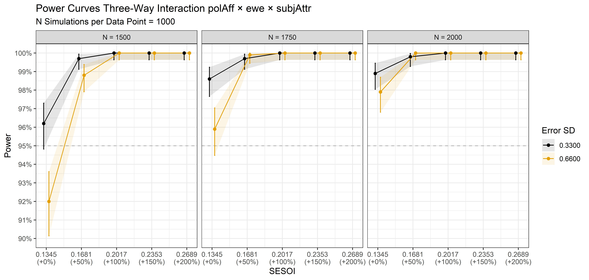
```

Power curves for the three-way interaction polAff × ewe × subjAttr. Points represent simulated power surrounded by a 95%-CI based on 1000 simulations with α = 0.05. Note that, in contrast to @suppfig-powC-mainEffect, the x-axsis represents different effect sizes, starting from the defined SESOI, while the panels represent different sample sizes. Note that estimates are displayed with a slight shift along the x-axis to reduce overlap. Since we only consider effect sizes equal to or greater than the SESOI to be of relevance, power curves were only examined for positive effect sizes, which is why only positive values are shown.
:::

### Conclusion

Using power simulations with mixed-effects models for sample-size determination and effect-size sensitivity analyses, we show that with a final sample size of N = 950:

1.  We will achieve $\ge$ 95% statistical power to detect a main effect of political affiliation.

2.  We will be able to detect a two-way interaction effect of political affiliation with extreme weather exposure of at least `r eff_sigmaCons_txt` with $\ge$ 95% statistical power.

3.  We will be able to detect a three-way interaction effect of political affiliation with extreme weather exposure and subjective attribution of extreme weather events to climate change of at least `r eff_sigmaCons_txt_3way` with $\ge$ 95% statistical power.

By increasing the planned sample size to N = 2'000, we will be able to detect all of the defined smallest effect sizes of interest of the hypothesized main effect and the two- and three-way interaction effects with a statistical power of at least 95%.



## Sample Characteristics

Data were collected between August and September 2025. The sample (*N* = 2,000) was quota-matched to the U.S. population on political affiliation, age, gender, and region, with a deviation tolerance of \<5%. @supptbl-sampleCharacteristics reports the final distribution of respondents (absolute and relative frequencies) across all quota criteria. After applying all exclusion criteria, the final analytic sample consisted of *n* = 1,451 respondents. @supptbl-sampleCharacteristics_demo summarizes the sociodemographic characteristics of this final sample.

```{r}
#| label: Create helper function for table layout

style_flextable <- function(ft, left_cols, right_cols, merge_col = NULL, italic_header = NULL) {
  ft <- ft %>%
    align(j = left_cols, align = "left", part = "all") %>%
    align(j = right_cols, align = "right", part = "all") %>%
    theme_booktabs() %>%
    autofit() %>%
    font(fontname = "Times New Roman", part = "all") %>%
    fontsize(size = 10, part = "all") %>%
    bold(part = "header") %>%
    padding(padding = 4, part = "all")
  
  if (!is.null(merge_col)) {
    ft <- ft %>%
      merge_v(j = merge_col) %>%
      valign(j = merge_col, valign = "top")
  }
  
  if (!is.null(italic_header)) {
    ft <- ft %>%
      italic(i = 1, j = italic_header, part = "header")
  }
  
  ft
}
```

```{r}
#| label: Create quota sampleCharacteristic tables

# Format numeric columns
format_sample_table <- function(df) {
  df %>%
    mutate(
      N = formatC(N, format = "d", big.mark = "'"),
      `Target (%)` = formatC(`Target (%)`, format = "f", digits = 1),
      `Observed (%)` = formatC(`Observed (%)`, format = "f", digits = 1),
      `Difference (pp)` = formatC(`Difference (pp)`, format = "f", digits = 2)
    )
}

# Create demographics table
ft_demographics <- data_sampleCharacteristics_demographics %>%
  format_sample_table() %>%
  flextable() %>%
  set_header_labels(
    Age = "Age",
    Gender = "Gender",
    N = "N",
    `Target (%)` = "Target (%)",
    `Observed (%)` = "Observed (%)",
    `Difference (pp)` = "Difference (pp)"
  ) %>%
  style_flextable(
    left_cols = c("Age", "Gender"),
    right_cols = c("N", "Target (%)", "Observed (%)", "Difference (pp)"),
    merge_col = "Age",
    italic_header = "N"
  ) 

# Create party table
ft_party <- data_sampleCharacteristics_party %>%
  format_sample_table() %>%
  flextable() %>%
  set_header_labels(
    Party = "Party",
    N = "N",
    `Target (%)` = "Target (%)",
    `Observed (%)` = "Observed (%)",
    `Difference (pp)` = "Difference (pp)"
  ) %>%
  style_flextable(
    left_cols = "Party",
    right_cols = c("N", "Target (%)", "Observed (%)", "Difference (pp)"),
    italic_header = "N"
  )

# Create regions table
ft_region <- data_sampleCharacteristics_region %>%
  format_sample_table() %>%
  flextable() %>%
  set_header_labels(
    Region = "Region",
    N = "N",
    `Target (%)` = "Target (%)",
    `Observed (%)` = "Observed (%)",
    `Difference (pp)` = "Difference (pp)"
  ) %>%
  style_flextable(
    left_cols = "Region",
    right_cols = c("N", "Target (%)", "Observed (%)", "Difference (pp)"),
    italic_header = "N"
  )
```

::: {#supptbl-sampleCharacteristics}
<p style="text-align: left;">

<strong>A</strong>

</p>

```{r}
#| echo: false
#| results: "asis"

ft_demographics
```

<p style="text-align: left;">

<strong>B</strong>

</p>

```{r}
#| echo: false
#| results: "asis"

ft_region
```

<p style="text-align: left;">

<strong>C</strong>

</p>

```{r}
#| echo: false
#| results: "asis"

ft_party
```

Panel A reports sample characteristics by age and gender. Panel B reports regional distribution. Panel C reports political affiliation. Target and observed proportions are expressed in percent; differences are expressed in percentage points (*N* = 2,000).
:::

```{r}
#| label: Create categorical and age table

# One row per subject
df_demo <- data_reduced$dFull_withEpisodes[[1]] %>%
  distinct(subject, .keep_all = TRUE)

# Create categorical table
vars_cat <- c("gender", "education", "income", "racethn", "ruralUrb")

category_levels <- list(
  income = c(
    "Under $30,000", "$30,000 - $49,999", "$50,000 - $74,999",
    "$75,000 - $99,999", "$100,000 - $149,999", "More than $150,000"
  ),
  education = c(
    "Did not complete high school / GED", "High school diploma / GED",
    "Some college", "Associates degree",
    "Bachelor's degree", "Master's degree or higher"
  ),
  gender = c("Male", "Female"),
  ruralUrb = c(
    "Rural town or small city",
    "Suburb, outskirt of a big city",
    "Urban, a big city"
  ),
  racethn = c(
    "African", "Asian", "European",
    "Hispanic or Latinx", "More than one", "Other"
  )
)

variable_labels <- c(
  gender = "Gender",
  education = "Education",
  income = "Income",
  racethn = "Race/Ethnicity",
  ruralUrb = "Residential area"
)

cat_table <- bind_rows(
  lapply(vars_cat, function(v) {
    df_demo %>%
      transmute(
        Variable = v,
        Kategorie = coalesce(as.character(.data[[v]]), "NA")
      ) %>%
      mutate(
        Kategorie = recode(
          Kategorie,
          "Hispanic" = "Hispanic or Latinx",
          "moreThanOne" = "More than one"
        ),
        Kategorie = factor(Kategorie, levels = category_levels[[v]])
      ) %>%
      count(Variable, Kategorie, name = "n") %>%
      mutate(Prozent = round(100 * n / sum(n), 2))
  })
) %>%
  arrange(factor(Variable, levels = vars_cat), Kategorie) %>%
  mutate(Variable = recode(Variable, !!!variable_labels))

ft_cat <- cat_table %>%
  mutate(
    n = formatC(n, format = "d", big.mark = "'"),
    Prozent = formatC(Prozent, format = "f", digits = 2)
  ) %>%
  flextable() %>%
  set_header_labels(
    Variable = "Variable",
    Kategorie = "Category",
    n = "n",
    Prozent = "%"
  ) %>%
  style_flextable(
    left_cols = c("Variable", "Kategorie"),
    right_cols = c("n", "Prozent"),
    merge_col = "Variable",
    italic_header = "n"
  )

# Create age table
age_table <- df_demo %>%
  summarise(
    Variable = "Age",
    M = mean(age, na.rm = TRUE),
    SD = sd(age, na.rm = TRUE),
    Min = min(age, na.rm = TRUE),
    Max = max(age, na.rm = TRUE)
  )

ft_age <- age_table %>%
  mutate(
    across(c(M, SD, Min, Max), ~ formatC(.x, format = "f", digits = 2))
  ) %>%
  flextable() %>%
  set_header_labels(
    Variable = "Variable",
    M = "M",
    SD = "SD",
    Min = "Min",
    Max = "Max"
  ) %>%
  style_flextable(
    left_cols = "Variable",
    right_cols = c("M", "SD", "Min", "Max"),
    italic_header = c("M", "SD")
  )
```

::: {#supptbl-sampleCharacteristics_demo}
<p style="text-align: left;">

<strong>A</strong>

</p>

```{r}
#| echo: false
#| results: "asis"

ft_cat
```

<p style="text-align: left;">

<strong>B</strong>

</p>

```{r}
#| echo: false
#| results: "asis"

ft_age
```

Panel A displays frequencies of categorical demographic variables, whereas Panel B reports descriptive statistics for age (*N* = 1,451).
:::



:::: {.content-visible when-format="html"}
::: {.callout-note collapse="true" appearance="simple"}
### Expand for Session Info

```{r}
#| label: addSessionInfo
#| echo: false

if (knitr::is_html_output()) {
  txt <- capture.output(print(sessioninfo::session_info(pkgs = "attached")))
  
  txt <- txt[!grepl("^\\s*\\[[0-9]+\\]\\s+[A-Za-z]:[/\\\\]", txt)]
  txt <- txt[!grepl("^\\s*pandoc\\s+", txt)]
  txt <- txt[!grepl("^\\s*quarto\\s+", txt)]

  knitr::asis_output(
    paste0(
      "<pre style=\"background-color:#f8f8f8; padding:1em; border-radius:6px; ",
      "overflow-x:auto; font-size:0.95em;\">",
      htmltools::htmlEscape(paste(txt, collapse = "\n")),
      "</pre>"
    )
  )
}
```
:::
::::



::: {.content-visible when-format="pdf"}
# References {.unlisted}
:::
