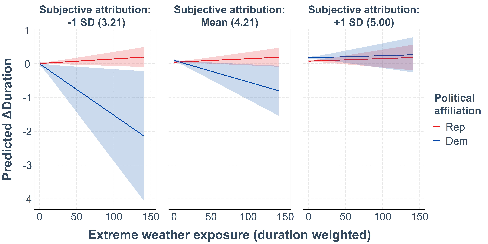
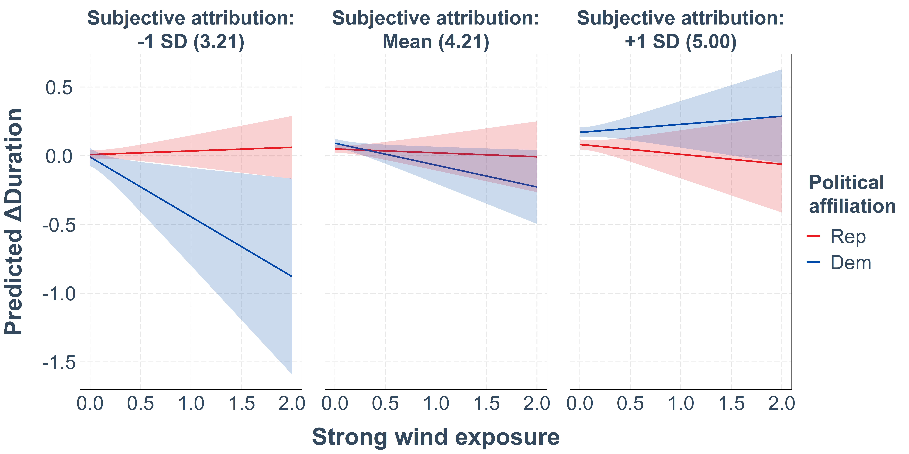
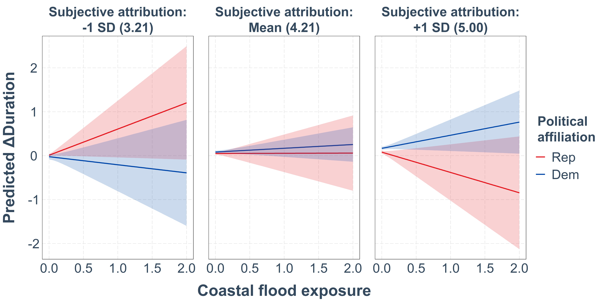

```{r}
#| label: setup
#| include: false
#| cache: false

## ---- Package management -----------------------------------------------------

# install librarian if needed
if (!requireNamespace("librarian", quietly = TRUE)) {
  install.packages("librarian")
}

# load required packages
librarian::shelf(
  tidyverse,
  easystats,
  mirai,
  sjPlot,
  here,
  parallel,
  tictoc,
  emmeans,
  interactions,
  jtools,
  usmap,
  fs,
  ggpubr,
  ggdist,
  ggrepel,
  faux,
  lme4,
  lmerTest,
  ggeffects,
  binom,
  ggthemes,
  sessioninfo,
  knitr,
  kableExtra,
  readxl,
  apa7,
  cowplot,
  viridisLite,
  flextable,
  sf
)

## ---- Source project functions -----------------------------------------------

myFunctions <- c(
  "f_lmer",
  "f_glmer",
  "f_plot_M1",
  "find_merMod",
  "FUNStormEventsData_filterData_day",
  "FUNStormEventsData_filterData"
)

for (f in myFunctions) {
  source(
    here::here("functions", paste0(f, ".R"))
  )
}

# Prepare state boundaries
poly_states <- plot_usmap(
  regions = "states",
  exclude = c("AK", "HI")
)$data

# SESOI
sesoi <- 0.1143
sesoi_H3 <- 0.1345

# Map for the US plots (use the 2021 map so that the counties in CT match those in the data)
myYearPlot <- 2021
```

```{r}
#| label: import final preprocessed data
#| results: 'hide'

# Read in preprocessed data
finaldata <- readRDS(
  here::here(
    "data",
    "20260702_out_05_prep_dataForAnalysis.RDS"
  )
)

# Read in EWE data
data_details_fips <- readRDS(
  here::here(
    "data",
    "20260216_data_details_fips.RDS"
  )
)
```

```{r}
#| label: Create and prepare smaller dataframe
#| results: 'hide'

# Create reduced dataframe
data_reduced <- finaldata |>
  dplyr::filter(
    applyExclusionCriteria == TRUE,
    filterDaysSinceEvent == 30
  ) |>
  dplyr::select(
    applyExclusionCriteria,
    filterDaysSinceEvent,
    dFull_withEpisodes
  ) |>
  mutate(
    dFull_withEpisodes = map(
      dFull_withEpisodes,
      ~ .x |>
        rename(racethn = racethn_simple) |>
        mutate(
          across(
            .cols = c(income, education, racethn),
            .fns = factor
          ),
          
          # Recode certificate effectiveness to numeric
          certificatesEff_num = recode(
            certificatesEff,
            "Strongly disagree" = 1,
            "Somewhat disagree" = 2,
            "Neither agree nor disagree" = 3,
            "Somewhat agree" = 4,
            "Strongly agree" = 5,
            .default = NA_real_
          ),

          # Create recency_index
          recency_index = ifelse(
            is.na(daysSinceMostRecentEpisode),
            0,
            1 / (daysSinceMostRecentEpisode + 1)
          ),

          # Scale problematic continuous predictors
          countyIncome = as.numeric(scale(countyIncome)),
          countyPvi = as.numeric(scale(countyPvi)),
          sum_damage = as.numeric(scale(sum_damage)),
          sum_injuries = as.numeric(scale(sum_injuries)),
          sum_deaths = as.numeric(scale(sum_deaths)),
          abnormality_final = as.numeric(scale(abnormality_final)),
          population_density_peopPerSqKilometer =
            as.numeric(scale(population_density_peopPerSqKilometer))
        ) |>
        (\(df) {
          myVars <- c("income", "education", "racethn")

          for (myVar in myVars) {
            contrasts(df[[myVar]]) <- contr.sum(nlevels(df[[myVar]]))
            colnames(contrasts(df[[myVar]])) <-
              levels(df[[myVar]])[1:(nlevels(df[[myVar]]) - 1)]
          }

          df
        })()
    )
  )

# Create dataframe for full sample
data_full <- finaldata |>
  dplyr::filter(
    applyExclusionCriteria == FALSE,
    filterDaysSinceEvent == 30
  ) |>
  dplyr::select(
    applyExclusionCriteria,
    filterDaysSinceEvent,
    dFull_withEpisodes
  )

# Create dataframe (with all 1999 participants)
data <- finaldata |>
  dplyr::filter(
    applyExclusionCriteria == FALSE,
    filterDaysSinceEvent == 30
  ) |>
  dplyr::select(
    applyExclusionCriteria,
    filterDaysSinceEvent,
    dFull_withEpisodes
  )
```

# Results

## Political-Affiliation-Hypothesis (H~1~ and H~S1~)

### Effect of Political Affiliation on ΔDuration (H~1~)

We examined whether Democrats display more attention to carbon information (i.e., higher ΔDuration values) compared to Republicans. To this end, we used mixed-effects models with random intercepts for participants and trials. Model 1 included political affiliation only. Model 2 additionally controlled for task characteristics (attribute differences, trial position, and trial layout). Model 3 further included participant-level controls (gender, age, education, income, ethnicity, and area of residence).

Consistent with our hypothesis, political affiliation significantly predicted ΔDuration values in Model 1 (*b* = 0.08, *p* \< .001), Model 2 (*b* = 0.08, *p* \< .001), and Model 3 (*b* = 0.07, *p* \< .001), indicating that Democrats exhibited higher ΔDuration values than Republicans across specifications.

Among the task-related control variables in Model 2, trial position showed a small but significant effect (*b* \< 0.01, *p* \< .001), indicating that as participants progressed through the task they increasingly allocated visual attention to the carbon emission attribute relative to the financial attribute. Furthermore, the position of the carbon attribute was significantly associated with ΔDuration (*b* = −0.05, *p* = .022), indicating that when the carbon attribute appeared in the top row, participants allocated relatively less visual attention to carbon emissions compared to the financial attribute. In Model 3, ΔDuration was significantly associated with gender (male: *b* = −0.05, *p* = .010), age (*b* \< 0.01, *p* \< .001) and race/ethnicity, with Asian participants showing higher values relative to the overall mean (*b* = 0.10, *p* = .043). The negative coefficient for gender indicates that male participants allocated relatively less visual attention to carbon emissions compared to the financial attribute, whereas older participants devoted relatively more attention to carbon emissions. All regression results are reported in @supptbl-M1Duration.

To assess the robustness of the results, we re-estimated Model 1 using the full sample (i.e., all participants with at least one valid ΔDuration observation across trials; *N* = 1,936; participants without valid observations had either no box openings or only openings shorter than 200 msec). The effect of political affiliation remained statistically significant (*b* = 0.06, *p* \< .001; see @supptbl-M1Duration_full).

```{r}
#| label: Define analysis grid and Fit models H1
#| results: 'hide'

# Define fixed and random effects
M1_grid <- tibble(
  model = c(
    "M1.1",
    "M1.2",
    "M1.3"
  ),
  fixedEffects = c(
    "polAff_bin_str",
    "polAff_bin_str + carbon_prcnt + bonus_prcnt + trialNum + CB_carbonUp + CB_selfishLeft",
    "polAff_bin_str + gender + age + education + income + racethn + ruralUrb"
  ),
  randomEffects = c(
    "(1 | subject) + (1 | trialNum_fixed)",
    "(1 | subject) + (1 | trialNum_fixed)",
    "(1 | subject) + (1 | trialNum_fixed)"
  )
)

# Add criterion column
M1_grid <- expand_grid(
  M1_grid,
  tibble(criterion = c("deltaDuration", "choice"))
) |>
  relocate(criterion, .before = "fixedEffects")

# Cross with preprocessing options
M1_grid <- expand_grid(
  M1_grid,
  data_reduced
)

# Fit models M1
m1_path <- here::here("results", "M1_fit_20260304.rds")

if (file.exists(m1_path)) {

  M1_fit <- readRDS(m1_path)

} else {

  n_cores <- max(1, parallel::detectCores() - 1)
  mirai::daemons(n_cores)
  tic()

  M1_fit <- M1_grid |>
    mutate(
      quietly_safely = pmap(
        .l = list(
          myData = dFull_withEpisodes,
          myCriterion = criterion,
          myFixedEffects = fixedEffects,
          myRandomEffects = randomEffects
        ),
        .f = in_parallel(
          function(myData, myCriterion, myFixedEffects, myRandomEffects) {

            worker <- function(myData, myCriterion, myFixedEffects, myRandomEffects) {
              if (myCriterion == "choice") {
                f_glmer(myData, myCriterion, myFixedEffects, myRandomEffects)
              } else {
                f_lmer(myData, myCriterion, myFixedEffects, myRandomEffects)
              }
            }

            purrr::quietly(purrr::safely(worker))(
              myData, myCriterion, myFixedEffects, myRandomEffects
            )
          },
          f_glmer = f_glmer,
          f_lmer = f_lmer
        )
      )
    ) |>
    mutate(
      fit = map(quietly_safely, \(x) x$result$result),
      error = map(quietly_safely, \(x) x$result$error),
      warnings = map(quietly_safely, \(x) x$warnings),
      messages = map(quietly_safely, \(x) x$messages)
    ) |>
    dplyr::select(-quietly_safely)

  toc()
  mirai::daemons(0)

  saveRDS(M1_fit, m1_path)
}

stopifnot(is.data.frame(M1_fit))
```

```{r}
#| label: Create Tbl M1 Main Model

M1_deltaDuration <- M1_fit |>
  dplyr::filter(criterion == "deltaDuration")

tbl_M1_duration <- sjPlot::tab_model(
  pull(M1_deltaDuration, "fit"),
  dv.labels = M1_deltaDuration$model
)
```

::: {#supptbl-M1Duration}
```{r}
#| echo: false
#| results: "asis"

tbl_M1_duration
```

Mixed-effects models predicting ΔDuration (*deltaDuration*, relative dwell time spent on carbon information compared to bonus information). Random intercepts were included for participants (*subject*) and trials (*trialNum_fixed*) (*N* = 1451). Model M1.1 included political affiliation (*polAff_bin_str*, subject-level binary variable with 0 = Republican and 1 = Democrat). Model M1.2 additionally controlled for the task characteristics: attribute differences (*carbon_prcnt* and *bonus_prcnt*), trial position (*trialNum*), and trial layout (*CB_carbonUp* and *CB_selfishLeft*). Model M1.3 further included participant-level covariates: *gender*, *age*, *education*, *income*, race/ethnicity (*racethn*), and area of residence (*ruralUrb*). The covariates *education*, *income*, and *racethn* were effect-coded using sum-to-zero contrasts, such that coefficients represent deviations from the overall mean. For each variable, one category is not displayed and can be derived as the negative sum of the reported coefficients. The omitted categories were *Some college* (*education*), *Under \$30,000* (*income*), and *Other* (*racethn*). In contrast, *ruralUrb* was dummy-coded, with *Rural town or small city* as the reference category. Estimates represent unstandardized beta coefficients. Confidence intervals are 95%. Statistically significant effects (*p* \< .05) are shown in bold.
:::

```{r}
#| label: Refit M1.1 deltaDuration with full sample
#| results: 'hide'

# Define analysis grid
M1_1_full_grid <- tibble(
  model = "M1.1",
  criterion = "deltaDuration",
  fixedEffects = "polAff_bin_str",
  randomEffects = "(1 | subject) + (1 | trialNum_fixed)"
) |>
  expand_grid(data_full)

# Fit model
m1_1_full_path <- here::here("results", "M1_1_deltaDuration_full_fit_20260306.rds")

if (file.exists(m1_1_full_path)) {

  M1_1_full_fit <- readRDS(m1_1_full_path)

} else {

  n_cores <- max(1, parallel::detectCores() - 1)
  mirai::daemons(n_cores)
  tic()

  M1_1_full_fit <- M1_1_full_grid |>
    mutate(
      quietly_safely = pmap(
        .l = list(
          myData = dFull_withEpisodes,
          myCriterion = criterion,
          myFixedEffects = fixedEffects,
          myRandomEffects = randomEffects
        ),
        .f = in_parallel(
          function(myData, myCriterion, myFixedEffects, myRandomEffects) {

            worker <- function(myData, myCriterion, myFixedEffects, myRandomEffects) {
              f_lmer(myData, myCriterion, myFixedEffects, myRandomEffects)
            }

            purrr::quietly(purrr::safely(worker))(
              myData, myCriterion, myFixedEffects, myRandomEffects
            )
          },
          f_lmer = f_lmer
        )
      )
    ) |>
    mutate(
      fit = map(quietly_safely, \(x) x$result$result),
      error = map(quietly_safely, \(x) x$result$error),
      warnings = map(quietly_safely, \(x) x$warnings),
      messages = map(quietly_safely, \(x) x$messages)
    ) |>
    dplyr::select(-quietly_safely)

  toc()
  mirai::daemons(0)

  saveRDS(M1_1_full_fit, m1_1_full_path)
}

stopifnot(is.data.frame(M1_1_full_fit))

M1_1_full_deltaDuration <- M1_1_full_fit

# Create table
tbl_M1_duration_full <- sjPlot::tab_model(
  pull(M1_1_full_deltaDuration, "fit"),
  dv.labels = "M1.1"
  )
```

::: {#supptbl-M1Duration_full}
```{r}
#| echo: false
#| results: "asis"

tbl_M1_duration_full
```

Mixed-effects model predicting ΔDuration (*deltaDuration*, relative dwell time spent on carbon information compared to bonus information) estimated on the full sample (*N* = 1,936), i.e., all participants with at least one valid ΔDuration observation across trials (participants without valid observations had either no box openings or only openings shorter than 200 msec). The fixed effect was political affiliation (*polAff_bin_str*, subject-level binary variable with 0 = Republican and 1 = Democrat). Random intercepts were included for participants (*subject*) and trials (*trialNum_fixed*). Estimates represent unstandardized beta coefficients. Confidence intervals are 95%. Statistically significant effects (*p* \< .05) are shown in bold.
:::

#### Interactions Between Political Affiliation and Control Variables on ΔDuration

We additionally tested whether control variables with significant main effects moderate the relationship between political affiliation and ΔDuration (see @supptbl-M1ControlVariables).

The interaction between political affiliation and trial position was statistically significant (*b* \< 0.01, *p* = .008), indicating that the difference in attention allocated to carbon information (ΔDuration) between Democrats and Republicans increased as participants progressed through the task. As illustrated in @suppfig-ProbingTrialNum, the effect of political affiliation on ΔDuration remained significant across all trials but became stronger at later stages of the task. The effect of political affiliation on ΔDuration was also significantly moderated by age (*b* \< 0.01, *p* = .011). As shown in @suppfig-ProbingAge, the effect of political affiliation on ΔDuration increases with age and becomes statistically significant at approximately 38 years of age (≈0.5 *SD* below the sample mean), indicating that partisan differences in attention allocation are more pronounced among older individuals. The effect of political affiliation on ΔDuration was also significantly moderated by race/ethnicity for participants identifying as Asian (*b* = 0.25, *p* = .012), suggesting that partisan differences in attention allocation in this subgroup differed from the average effect across all racial/ethnic groups. In contrast, the interaction between political affiliation and carbon attribute placement as well as gender was not statistically significant.

```{r}
#| label: Define interaction grid and fit interaction models (for control variables)
#| results: "hide"

# Define analysis grid
M1_int_grid <- tibble(
  model = c("M1_trialNum", "M1_CB_carbonUp", "M1_gender", "M1_age", "M1_racethn"),
  criterion = "deltaDuration",
  fixedEffects = c(
    # trialNum interaction
    "polAff_bin_str * trialNum + CB_carbonUp + gender + age + racethn",
    # CB_carbonUp interaction
    "polAff_bin_str * CB_carbonUp + trialNum + gender+ age + racethn",
   # gender interaction
    "polAff_bin_str * gender + trialNum + CB_carbonUp + age + racethn",
   # age interaction
    "polAff_bin_str * age + trialNum + CB_carbonUp + gender + racethn",
   # racethn interaction
    "polAff_bin_str * racethn + trialNum + CB_carbonUp + gender + age"
  ),
  randomEffects = c(
    "(1 | subject) + (1 | trialNum_fixed)",
    "(1 | subject) + (1 | trialNum_fixed)",
    "(1 | subject) + (1 | trialNum_fixed)",
    "(1 | subject) + (1 | trialNum_fixed)",
    "(1 | subject) + (1 | trialNum_fixed)"
  )
) |>
  expand_grid(data_reduced)

# Fit M1 interaction models (for control variables)
m1_int_path <- here::here("results", "M1_int_fit_20260304.rds")

if (file.exists(m1_int_path)) {

  M1_int_fit <- readRDS(m1_int_path)

} else {

  n_cores <- max(1, parallel::detectCores() - 1)
  mirai::daemons(n_cores)
  tic()

  M1_int_fit <- M1_int_grid |>
    mutate(
      quietly_safely = pmap(
        .l = list(
          myData = dFull_withEpisodes,
          myFixedEffects = fixedEffects,
          myRandomEffects = randomEffects
        ),
        .f = in_parallel(
          function(myData, myFixedEffects, myRandomEffects) {

            worker <- function(myData, myFixedEffects, myRandomEffects) {
              f_lmer(
                myData = myData,
                myCriterion = "deltaDuration",
                myFixedEffects = myFixedEffects,
                myRandomEffects = myRandomEffects
              )
            }

            purrr::quietly(purrr::safely(worker))(
              myData, myFixedEffects, myRandomEffects
            )
          },
          f_lmer = f_lmer
        )
      )
    ) |>
    mutate(
      fit = map(quietly_safely, \(x) x$result$result),
      error = map(quietly_safely, \(x) x$result$error),
      warnings = map(quietly_safely, \(x) x$warnings),
      messages = map(quietly_safely, \(x) x$messages)
    ) |>
    select(-quietly_safely)

  toc()
  mirai::daemons(0)

  saveRDS(M1_int_fit, m1_int_path)
}

stopifnot(is.data.frame(M1_int_fit))
```

```{r}
#| label: Create Tbl Interactions with control variables

# Create tables
fits <- dplyr::pull(M1_int_fit, "fit")
labs <- M1_int_fit$model

tbl_M1_duration_int_1 <- sjPlot::tab_model(
  fits[1:2],
  dv.labels = labs[1:2]
)

tbl_M1_duration_int_2 <- sjPlot::tab_model(
  fits[3:4],
  dv.labels = labs[3:4]
)

tbl_M1_duration_int_3 <- sjPlot::tab_model(
  fits[5],
  dv.labels = labs[5]
)
```

::: {#supptbl-M1ControlVariables}
```{r}
#| echo: false
#| results: "asis"

tbl_M1_duration_int_1
```

```{r}
#| echo: false
#| results: "asis"
tbl_M1_duration_int_2
```

```{r}
#| echo: false
#| results: "asis"
tbl_M1_duration_int_3
```

Mixed-effects model predicting ΔDuration (*deltaDuration*, relative dwell time spent on carbon information compared to bonus information). The models include interactions between political affiliation (*polAff_bin_str*) and control variables that showed significant main effects in M1.2–M1.3: *trialNum*, *CB_carbonUP*, *gender* and *age*. Random intercepts were included for participants (*subject*) and trials (*trialNum_fixed*) (*N* = 1451). Estimates represent unstandardized beta coefficients. Confidence intervals are 95%. Statistically significant effects (*p* \< .05) are shown in bold.
:::

```{r}
#| label: fig-probingTrialNum
#| results: "hide"

m_probe_trial <- M1_int_fit |>
  dplyr::filter(model == "M1_trialNum", criterion == "deltaDuration") |>
  dplyr::pull(fit, 1) |>
  find_merMod()

jn_trial <- interactions::johnson_neyman(
  m_probe_trial,
  pred = "polAff_bin_strDem",
  modx = "trialNum",
  alpha = .05
)

plot_trial <- jn_trial$plot +
    ggplot2::labs(
    title = NULL,
    x = "Trial Position",
    y = "Slope of Political Affiliation on ΔDuration"
  ) + 
  ggplot2::scale_x_continuous(breaks = seq(0, 30, 5)) +
  ggplot2::scale_y_continuous(breaks = seq(-0.2, 0.3, 0.05)) + 
    ggplot2::theme(
    axis.title.x = element_text(size = 30, margin = margin(t = 20)),
    axis.title.y = element_text(size = 30, margin = margin(r = 20)),
    axis.text = element_text(size = 25),
    legend.text = element_text(size = 25)
  )

# Save plot
jpeg(
  file = "../images/johnson_neyman_trialNum.jpeg",
  width = 16, height = 12, units = "in", res = 600
)

print(plot_trial)

dev.off()
```

::: {#suppfig-ProbingTrialNum}
```{r}
#| echo: false
#| include: true

knitr::include_graphics("../images/johnson_neyman_trialNum.jpeg")
```

Johnson–Neyman plot probing the interaction between political affiliation and trial position on ΔDuration. The line represents the conditional effect of political affiliation on ΔDuration across values of trial position. Shaded areas indicate regions where the effect is statistically significant (*p* \< .05; blue) or non-significant (red). The dashed vertical line marks the Johnson–Neyman significance threshold. The black horizontal bar represents the observed range of the moderator.
:::

```{r}
#| label: fig-probingAge
#| results: "hide"

m_probe_age <- M1_int_fit |>
  dplyr::filter(model == "M1_age", criterion == "deltaDuration") |>
  dplyr::pull(fit, 1) |>
  find_merMod()

mf_age <- model.frame(m_probe_age)

myMean_age <- mean(mf_age$age, na.rm = TRUE)
mySD_age   <- sd(mf_age$age, na.rm = TRUE)

obsMin_age <- min(mf_age$age, na.rm = TRUE)
obsMax_age <- max(mf_age$age, na.rm = TRUE)

myLow_age  <- max(obsMin_age, myMean_age - mySD_age)
myHigh_age <- min(obsMax_age, myMean_age + mySD_age)

b_age <- lme4::fixef(m_probe_age)

y_low_age  <- b_age["polAff_bin_strDem"] +
  b_age["polAff_bin_strDem:age"] * myLow_age

y_mean_age <- b_age["polAff_bin_strDem"] +
  b_age["polAff_bin_strDem:age"] * myMean_age

y_high_age <- b_age["polAff_bin_strDem"] +
  b_age["polAff_bin_strDem:age"] * myHigh_age

mark_df_age <- tibble::tibble(
  x = c(myLow_age, myMean_age, myHigh_age),
  y = c(y_low_age, y_mean_age, y_high_age),
  label = c("-1 SD", "Mean", "+1 SD")
)

jn_age <- interactions::johnson_neyman(
  m_probe_age,
  pred = "polAff_bin_strDem",
  modx = "age",
  alpha = .05
)

plot_age <- jn_age$plot +
  ggplot2::geom_point(
    data = mark_df_age,
    aes(x = x, y = y),
    size = 5
  ) +
  ggplot2::geom_text(
    data = mark_df_age,
    aes(x = x, y = y, label = label),
    nudge_y = c(0.03, 0.03, 0.03),
    size = 8
  ) +
  ggplot2::labs(
    title = NULL,
    x = "Age",
    y = "Slope of Political Affiliation on ΔDuration"
  ) + 
  ggplot2::scale_x_continuous(breaks = seq(0, 100, 20)) +
  ggplot2::scale_y_continuous(breaks = seq(-0.2, 0.3, 0.1)) + 
    ggplot2::theme(
    axis.title.x = element_text(size = 30, margin = margin(t = 20)),
    axis.title.y = element_text(size = 30, margin = margin(r = 20)),
    axis.text = element_text(size = 25),
    legend.text = element_text(size = 25)
  )

# Save plot
jpeg(
  file = "../images/johnson_neyman_age.jpeg",
  width = 16, height = 12, units = "in", res = 600
)

print(plot_age)

dev.off()
```

::: {#suppfig-ProbingAge}
```{r}
#| echo: false
#| include: true

knitr::include_graphics("../images/johnson_neyman_age.jpeg")
```

Johnson–Neyman plot probing the interaction between political affiliation and age on ΔDuration. The line represents the conditional effect of political affiliation on ΔDuration across values of age. Shaded areas indicate regions where the effect is statistically significant (*p* \< .05; blue) or non-significant (red). The dashed vertical line marks the Johnson–Neyman significance threshold. Points indicate the conditional effects at −1 *SD*, the mean, and +1 *SD* of age. The black horizontal bar represents the observed range of the moderator.
:::

### Effect of Political Affiliation on Choice (H~S1~)

We tested the hypothesis that Democrats have a higher probability of making pro-climate choices than Republicans (H~S1~). To this end, we estimated mixed-effects logistic regression models with the decision outcome as the dependent variable and random intercepts for participants and trials, using the same three model specifications as in the ΔDuration analysis. All regression results are reported in @supptbl-M1Choice.

Consistent with our hypothesis, political affiliation significantly predicted pro-climate choices across all model specifications. In Model 1, Democrats were significantly more likely than Republicans to choose the pro-climate option (*OR* = 2.06, *p* \< .001). The predicted probability of selecting the pro-climate option was 65.9% for Democrats, compared with 48.3% for Republicans. This effect remained unchanged after controlling task characteristics in Model 2 (*OR* = 2.05, *p* \< .001) and after additionally including participant level controls in Model 3 (*OR* = 2.03, *p* \< .001). Among the task-related control variables (Model 2), the percentage difference in carbon emissions was positively associated with pro climate choices (*OR* = 1.01, *p* \< .001), indicating that larger emission differences increased the likelihood of choosing the pro-climate option. Furthermore, larger bonus differences were associated with a lower probability of selecting the pro-climate option (*OR* = 0.99, *p* \< .001). Consistent with the analysis on attention allocation, older participants were slightly more likely to select the pro-climate option (*OR* = 1.01, *p* = .007). Additionally, participants identifying as African were less likely to select the pro-climate option relative to the overall mean (*OR* = 0.24, *p* \< .001).

```{r}
#| label: Create tbl M1 choice

# Create table
M1.2_choice <- M1_fit |>
  dplyr::filter(criterion == "choice")

tbl_M1_choice <- sjPlot::tab_model(
  pull(M1.2_choice, "fit"),
  dv.labels = M1.2_choice$model
)
```

::: {#supptbl-M1Choice}
```{r}
#| echo: false
#| results: "asis"

tbl_M1_choice
```

Mixed-effects logistic regression models *choice* (actual decision in the Carbon Emission Task, trial-level variable with 0 = pro-self and 1 = pro-climate). Random intercepts were included for participants (*subject*) and trials (*trialNum_fixed*) (*N* = 1451). Model M1.1 included political affiliation (*polAff_bin_str*, subject-level binary variable with 0 = Republican and 1 = Democrat). Model M1.2 additionally controlled for the task characteristics: attribute differences (*carbon_prcnt* and *bonus_prcnt*), trial position (*trialNum*), and trial layout (*CB_carbonUp* and *CB_selfishLeft*). Model M1.3 further included participant-level covariates: *gender*, *age*, *education*, *income*, race/ethnicity (*racethn*), and area of residence (*ruralUrb*). The covariates *education*, *income*, and *racethn* were effect-coded using sum-to-zero contrasts, such that coefficients represent deviations from the overall mean. For each variable, one category is not displayed and can be derived as the negative sum of the reported coefficients. The omitted categories were *Some college* (*education*), *Under \$30,000* (*income*), and *Other* (*racethn*). In contrast, *ruralUrb* was dummy-coded, with *Rural town or small city* as the reference category. Confidence intervals are 95%. Statistically significant effects (*p* \< .05) are shown in bold.
:::

### Belief in the Effectiveness of Carbon Emission Certificates

Democrats and Republicans did not differ in their beliefs about the effectiveness of carbon emission certificates as an emissions reduction mechanism implemented in the task (*t* = -0.68, *p* = .496).

```{r}
#| label: Difference in certificatesEff by political affiliation

# Create new dataset
ttest_certificatesEff_data <- data_reduced$dFull_withEpisodes[[1]] |>
  distinct(subject, .keep_all = TRUE)

# Descriptive statistics
ttest_certificatesEff_data |>
  group_by(polAff_bin_str) |>
  summarise(
    M = round(mean(certificatesEff_num, na.rm = TRUE), 2),
    SD = round(sd(certificatesEff_num, na.rm = TRUE), 2),
    .groups = "drop"
  ) |>
  rename(polAff = polAff_bin_str) |>
  kable(
    digits = 2,
    align = c("l", "c", "c")
  ) |>
  kable_styling(full_width = FALSE)

# t-test
ttest_certificatesEff <- t.test(certificatesEff_num ~ polAff_bin_str,
             data = ttest_certificatesEff_data)

# Create table for t-test
tibble(
  Test = "Welch's t-test",
  t = round(unname(ttest_certificatesEff$statistic), 2),
  df = round(unname(ttest_certificatesEff$parameter), 2),
  p = ifelse(
    ttest_certificatesEff$p.value < .001,
    "< .001",
    sprintf("%.3f", ttest_certificatesEff$p.value)
  ),
  `95% CI` = paste0(
    "[",
    round(ttest_certificatesEff$conf.int[1], 2),
    ", ",
    round(ttest_certificatesEff$conf.int[2], 2),
    "]"
  )
) |>
  kable(
    align = c("l", "c", "c", "c", "c")
  ) |>
  kable_styling(full_width = FALSE)
```

## Political Affiliation and Extreme Weather Events (H~2~)

Among Republicans, 48.2% of participants lived in counties where at least one episode occurred during the past 30 days (374 of 776), compared with 43.4% among Democrats (293 of 675).

@suppfig-EWELast360Days displays separate county-level maps of the United States for each extreme weather event (EWE) type and for all types combined, indicating whether and how many episodes occurred in each county during the 360 days preceding the midpoint of data collection.

```{r}
#| label: Calculate middleDay of data collection
#| results: 'hide'

# Compute number of unique subjects per day
counts <- data$dFull_withEpisodes[[1]] %>%
  mutate(day = as.Date(recordedDate)) %>%
  group_by(day) %>%
  summarise(n_subjects = n_distinct(subject), .groups = "drop") %>%
  arrange(day) %>%
  mutate(
    cum_subjects = cumsum(n_subjects),
    total_subjects = sum(n_subjects)
  )

# Identify the day when 50% of subjects have been collected
middle_day <- counts %>%
  filter(cum_subjects >= total_subjects / 2) %>%
  slice(1) %>%
  pull(day)
```

```{r}
#| label: callFUNStormEventsData_filterData_day
#| results: 'hide'

# Define variables of interest
myEventTypes <- c(
  "Excessive Heat",
  "Drought",
  "Wildfire",
  "Flash Flood",
  "Coastal Flood",
  "Strong Wind",
  "Hail",
  "Tornado"
)

# Call function
out <- FUNStormEventsData_filterData_day(
  myData = data_details_fips,
  myDate = middle_day,
  myEventTypes = myEventTypes
)
```

```{r}
#| label: Create EWE Plot
#| results: "hide"

# Prepare data for the plots
plot_data_base <- out %>%
  filter(time_window == "last360days") %>%
  mutate(event_type = as.character(event_type))

plot_data_types <- plot_data_base

plot_data_all <- plot_data_base %>%
  group_by(fips) %>%
  summarise(
    nEpisodes = sum(nEpisodes, na.rm = TRUE),
    .groups = "drop"
  ) %>%
  mutate(event_type = "All Event Types")

# Prepare color scale
myMaxEpisodes <- max(
  c(plot_data_all$nEpisodes, plot_data_types$nEpisodes),
  na.rm = TRUE
)

myLegendLevels <- as.character(0:myMaxEpisodes)

plot_data_types <- plot_data_types %>%
  mutate(
    nEpisodes_factor = factor(
      as.character(nEpisodes),
      levels = myLegendLevels
    )
  )

plot_data_all <- plot_data_all %>%
  mutate(
    nEpisodes_factor = factor(
      as.character(nEpisodes),
      levels = myLegendLevels
    )
  )

myColors <- c(
  "0" = "white",
  stats::setNames(
    viridisLite::viridis(myMaxEpisodes),
    as.character(1:myMaxEpisodes)
  )
)

scale_fill_common <- scale_fill_manual(
  name = "Number of Episodes",
  values = myColors,
  limits = myLegendLevels,
  breaks = myLegendLevels,
  labels = myLegendLevels,
  drop = FALSE,
  na.translate = FALSE
)

# Define common theme
theme_map_common <- theme_bw() +
  theme(
    text = element_text(size = 15),
    panel.grid = element_blank(),
    axis.ticks = element_blank(),
    axis.text = element_blank()
  )

# Define function to create maps
make_map <- function(myData, myFacetCols = NULL, myLegend = TRUE, myTextSize = 15) {
  plot_usmap(
    data = myData,
    data_year = myYearPlot,
    values = "nEpisodes_factor",
    regions = "counties",
    exclude = c("AK", "HI"),
    color = "black",
    linewidth = 0.1,
    show.legend = TRUE
  ) +
    geom_sf(
      data = poly_states,
      color = "black",
      fill = NA,
      linewidth = 0.3,
      inherit.aes = FALSE
    ) +
    scale_fill_common +
        guides(
      fill = guide_legend(
        title.position = "top",
        title.hjust = 0.5
      )
    ) +
    facet_wrap(~event_type, ncol = myFacetCols) +
    theme_map_common +
    theme(
      text = element_text(size = myTextSize),
      legend.text = element_text(size = 12),
      legend.title = element_text(size = 15),
      legend.position = if (myLegend) "right" else "none"
    )
}

# Create individual plots
p_all <- make_map(plot_data_all)
p_types <- make_map(plot_data_types, myFacetCols = 4, myLegend = FALSE, myTextSize = 13)

# Combine plots
final_plot <- plot_grid(
  p_all,
  p_types,
  ncol = 1,
  rel_heights = c(1.15, 1.25)
)

# Save plot
jpeg(
  file = "../images/mapEWELast360Days.jpeg",
  width = 16, height = 12, units = "in", res = 600
)

plot(final_plot)
dev.off()
```

::: {#suppfig-EWELast360Days}
```{r}
#| echo: false
#| include: true

knitr::include_graphics("../images/mapEWELast360Days.jpeg")
```

Distribution of EWE mid august 2024 to mid august 2025: Counties are colored by the number of EWE recorded in the past 360 days preceding the midpoint of data collection (≈50% of the sample collected, August 23, 2025). This reference point was chosen because data collection spanned approximately four weeks.
:::

### Extreme Weather Events as a Moderator of the Relationship Between Political Affiliation and ΔDuration (H~2~)

To examine whether exposure to EWEs moderates the relationship between political affiliation and visual attention, we estimated mixed-effects models with ΔDuration as the dependent variable and random intercepts for participants and trials. Model 1 included political affiliation and a binary indicator of whether participants had experienced at least one EWE episode in the last 30 days. Model 2 additionally included their interaction. Model 3 further controlled for trial number, the position of the carbon attribute, gender, age and race / ethnicity. Model 4 instead controlled for county-level indicators related to EWE severity and impacts (e.g., damage, injuries, deaths) as well as broader county characteristics (mean income, PVI, and population density). Model 5 replaced the binary EWE indicator with a continuous, duration-weighted measure of EWE exposure and its interaction with political affiliation. All regression results are displayed in @supptbl-M2Duration.

In Model 1, political affiliation remained a positive and significant predictor of ΔDuration (*b* = 0.08, *p* \< .001). In contrast, experiencing at least one EWE was not significantly associated with greater relative attention to carbon information. Model 2 included the interaction between political affiliation and EWE exposure; however, this interaction was not statistically significant (*b* = -0.05, *p* = .188), providing no support for the hypothesis that prior exposure amplifies partisan differences in visual attention. This null result was robust to the inclusion of control variables (@supptbl-M2Duration, Models 3-4, *b* = -0.07, *p* = .092, *b* = -0.05, *p* = .202), the use of a duration-weighted measure of exposure (@supptbl-M2Duration, Model 5, *b* = -0.00, *p* = .124), and analyses based on the full sample (@supptbl-M2Duration_Full, *b* = -0.05, *p* = .189).

Among the control variables, trial number was positively associated with ΔDuration (*b* = \<0.01, *p* \< .001), whereas higher carbon levels were associated with reduced attention to carbon information (*b* = −0.04, *p* = .031). Male participants (*b* = −0.05, *p* = .013) and participants identifying as Hispanic (*b* = −0.05, *p* = .043) showed lower relative attention to carbon information. In contrast, older participants (*b* = \<0.01, *p* \< .001), as well as participants identifying as Asian showed greater attention (*b* = 0.11, *p* = .020).

We conducted equivalence tests for non-significant effects to assess whether they were statistically smaller than the smallest effect size of interest (SESOI = 0.1143). As illustrated in @suppfig-EquivalenceH2, the confidence intervals of the interaction terms overlapped the region of practical equivalence (ROPE), suggesting that it is undecided whether to accept or reject practical equivalence of the moderating effect of EWE exposure on the relationship between political affiliation and ΔDuration.

```{r}
#| label: Define analysis grid and fit models H2
#| results: 'hide'

# Define fixed and random effects
M2_grid <- tibble(
  model = c(
    "M2.1",
    "M2.2",
    "M2.3",
    "M2.4",
    "M2.5"
  ),
  fixedEffects = c(
    "polAff_bin_str + nEpisodesIsGreaterThanZero",
    "polAff_bin_str * nEpisodesIsGreaterThanZero",
    "polAff_bin_str * nEpisodesIsGreaterThanZero + trialNum + CB_carbonUp + gender + age + racethn",
    "polAff_bin_str * nEpisodesIsGreaterThanZero + abnormality_final + sum_damage + sum_injuries + sum_deaths + recency_index + population_density_peopPerSqKilometer + countyPvi + countyIncome",
    "polAff_bin_str * nEpisodes_durationWeighted"
  ),
  randomEffects = c(
    "(1 | subject) + (1 | trialNum_fixed)",
    "(1 | subject) + (1 | trialNum_fixed)",
    "(1 | subject) + (1 | trialNum_fixed)",
    "(1 | subject) + (1 | trialNum_fixed)",
    "(1 | subject) + (1 | trialNum_fixed)"
  )
)

# Add criterion column
M2_grid <- expand_grid(
  M2_grid,
  tibble(criterion = c("deltaDuration", "choice"))
) |>
  relocate(criterion, .before = "fixedEffects") |>
  mutate(
    fixedEffects = case_when(
      model == "M2.3" & criterion == "choice" ~
        "polAff_bin_str * nEpisodesIsGreaterThanZero + carbon_prcnt + bonus_prcnt + age + racethn",
      TRUE ~ fixedEffects
    )
  )

# Cross with preprocessing options
M2_grid <- expand_grid(
  M2_grid,
  data_reduced
)

# Fit models
m2_path <- here::here("results", "M2_fit_20260304.rds")

if (file.exists(m2_path)) {

  M2_fit <- readRDS(m2_path)

} else {

  n_cores <- max(1, parallel::detectCores() - 1)
  mirai::daemons(n_cores)
  tic()

  M2_fit <- M2_grid |>
  mutate(
    quietly_safely = pmap(
      .l = list(
        myData = dFull_withEpisodes,
        myCriterion = criterion,
        myFixedEffects = fixedEffects,
        myRandomEffects = randomEffects
      ),
      .f = in_parallel(
        function(
          myData,
          myCriterion,
          myFixedEffects,
          myRandomEffects
        ) {
          # inner worker defined here, then wrapped by quietly(safely())
          worker <- function(
            myData,
            myCriterion,
            myFixedEffects,
            myRandomEffects
          ) {
            if (myCriterion == "choice") {
              f_glmer(
                myData = myData,
                myCriterion = myCriterion,
                myFixedEffects = myFixedEffects,
                myRandomEffects = myRandomEffects
              )
            } else if (myCriterion == "deltaDuration") {
              f_lmer(
                myData = myData,
                myCriterion = myCriterion,
                myFixedEffects = myFixedEffects,
                myRandomEffects = myRandomEffects
              )
            }
          }
          # call the wrapped worker so we still capture result/warnings/errors/messages
          purrr::quietly(purrr::safely(worker))(
            myData,
            myCriterion,
            myFixedEffects,
            myRandomEffects
          )
        },
        # we need to pass f_glmer and f_lmer into the worker's environment
        f_glmer = f_glmer,
        f_lmer = f_lmer
      )
    )
  ) |>
  mutate(
    fit = map(quietly_safely, \(x) x$result$result),
    error = map(quietly_safely, \(x) x$result$error),
    warnings = map(quietly_safely, \(x) x$warnings),
    messages = map(quietly_safely, \(x) x$messages)
  ) |>
  select(-quietly_safely)

  toc()
  mirai::daemons(0)

  saveRDS(M2_fit, m2_path)
}

stopifnot(is.data.frame(M2_fit))
```

```{r}
#| label: Create Tbl M2 duration 

# Create tables
M2_deltaDuration <- M2_fit |>
  filter(criterion == "deltaDuration")

fits <- pull(M2_deltaDuration, "fit")
labs <- M2_deltaDuration$model

tbl_M2_duration_1 <- sjPlot::tab_model(
  fits[1:2],
  dv.labels = labs[1:2]
)

tbl_M2_duration_2 <- sjPlot::tab_model(
  fits[3:4],
  dv.labels = labs[3:4]
)

tbl_M2_duration_3 <- sjPlot::tab_model(
  fits[5],
  dv.labels = labs[5]
)
```

::: {#supptbl-M2Duration}
```{r}
#| echo: false
#| results: "asis"

tbl_M2_duration_1
```

```{r}
#| echo: false
#| results: "asis"

tbl_M2_duration_2
```

```{r}
#| echo: false
#| results: "asis"

tbl_M2_duration_3
```

Mixed-effects models predicting ΔDuration (*deltaDuration*, relative dwell time spent on carbon information compared to bonus information). Random intercepts were included for participants (*subject*) and trials (*trialNum_fixed*) (*N* = 1451). Model M2.1 included political affiliation (*polAff_bin_str*, subject-level binary variable with 0 = Republican and 1 = Democrat) and a binary indicator of whether participants had experienced at least one EWE episode in the last 30 days (*nEpisodesIsGreaterThanZeroTRUE*). Model M2.2 additionally included their interaction. Model M2.3 further controlled for trial position (*trialNum*), the position of the carbon attribute (*CB_carbonUp*), *gender*, *age* and race/ethnicity (*racethn*). *racethn* was effect-coded using sum-to-zero contrasts, such that coefficients represent deviations from the overall mean. The category *Other* is not displayed and can be derived as the negative sum of the reported coefficients. Model M2.4 instead controlled for county-level indicators related to EWE severity and impacts, specifically the abnormality score for the number of EWE (*abnormality_final*), the amount of financial damage (*sum_damage*), and the number of injuries (*sum_injuries*) and deaths (*sum_deaths*) associated with each episode. The model further controlled for the temporal proximity of the most recent extreme weather episode (*recency_index*), as well as broader county characteristics: population density (*population_density_peopPerSqKilometer*), median household income (*countyIncome*), and the county-level Partisan Voting Index (*countyPvi*). All county-level variables included as controls in Model M2.4 were z-standardized, except *recency_index*. Model M2.5 replaced the binary EWE indicator with a continuous, duration-weighted measure of EWE exposure (*nEpisodes_durationWeighted*) and its interaction with political affiliation. Estimates represent unstandardized beta coefficients. Confidence intervals are 95%. Statistically significant effects (*p* \< .05) are shown in bold.
:::

```{r}
#| label: Refit M2.2 deltaDuration with full sample
#| results: "hide"

# Define analysis grid
M2_2_full_grid <- tibble(
  model = "M2.2",
  criterion = "deltaDuration",
  fixedEffects = "polAff_bin_str * nEpisodesIsGreaterThanZero",
  randomEffects = "(1 | subject) + (1 | trialNum_fixed)"
) |>
  expand_grid(data_full)

# Fit model
m2_2_full_path <- here::here("results", "M2_2_deltaDuration_full_fit_20260312.rds")

if (file.exists(m2_2_full_path)) {

  M2_2_full_fit <- readRDS(m2_2_full_path)

} else {

  n_cores <- max(1, parallel::detectCores() - 1)
  mirai::daemons(n_cores)
  tic()

  M2_2_full_fit <- M2_2_full_grid |>
    mutate(
      quietly_safely = pmap(
        .l = list(
          myData = dFull_withEpisodes,
          myCriterion = criterion,
          myFixedEffects = fixedEffects,
          myRandomEffects = randomEffects
        ),
        .f = in_parallel(
          function(myData, myCriterion, myFixedEffects, myRandomEffects) {

            worker <- function(myData, myCriterion, myFixedEffects, myRandomEffects) {
              f_lmer(myData, myCriterion, myFixedEffects, myRandomEffects)
            }

            purrr::quietly(purrr::safely(worker))(
              myData, myCriterion, myFixedEffects, myRandomEffects
            )
          },
          f_lmer = f_lmer
        )
      )
    ) |>
    mutate(
      fit = map(quietly_safely, \(x) x$result$result),
      error = map(quietly_safely, \(x) x$result$error),
      warnings = map(quietly_safely, \(x) x$warnings),
      messages = map(quietly_safely, \(x) x$messages)
    ) |>
    select(-quietly_safely)

  toc()
  mirai::daemons(0)

  saveRDS(M2_2_full_fit, m2_2_full_path)
}

stopifnot(is.data.frame(M2_2_full_fit))

# Create table
tbl_M1_duration_full <- sjPlot::tab_model(
  M2_2_full_fit$fit,
  dv.labels = "M2.2"
  )
```

::: {#supptbl-M2Duration_Full}
```{r}
#| echo: false
#| results: "asis"

tbl_M1_duration_full
```

Mixed-effects model predicting ΔDuration (*deltaDuration*, relative dwell time spent on carbon information compared to bonus information) estimated on the full sample (*N* = 1,936), i.e., all participants with at least one valid ΔDuration observation across trials (participants without valid observations had either no box openings or only openings shorter than 200 msec). The fixed effects were political affiliation (*polAff_bin_str*, subject-level binary variable with 0 = Republican and 1 = Democrat), a binary indicator of whether participants had experienced at least one EWE episode in the last 30 days (*nEpisodesIsGreaterThanZeroTRUE*), and their interaction. Random intercepts were included for participants (*subject*) and trials (*trialNum_fixed*). Estimates represent unstandardized beta coefficients. Confidence intervals are 95%. Statistically significant effects (*p* \< .05) are shown in bold.
:::

```{r}
#| label: Equivalence test for the models with deltaDuration (H2)
#| results: "hide"

# Extract interaction terms used in the plot
d_plot_M2_interactions <- M2_fit |>
  filter(
    criterion == "deltaDuration",
    model %in% c("M2.2", "M2.3", "M2.4")
  ) |>
  mutate(
    parameter_of_interest = "polAff_bin_strDem:nEpisodesIsGreaterThanZeroTRUE",
    parameters = purrr::map(
      fit,
      purrr::possibly(\(x) model_parameters(x), otherwise = NULL)
    )
  ) |>
  mutate(
    parameter_row = purrr::map2(
      parameters, parameter_of_interest,
      \(par_tbl, par_name) {
        if (is.null(par_tbl)) return(tibble())
        as_tibble(par_tbl) |>
          filter(Parameter == par_name)
      }
    )
  ) |>
  select(model, parameter_row) |>
  tidyr::unnest(parameter_row) |>
  mutate(
    model = factor(model, levels = c("M2.4", "M2.3", "M2.2"))
  )

# Create plot
plot_M2_equivalence <- d_plot_M2_interactions |>
  ggplot(aes(
    y = model,
    x = Coefficient,
    xmin = CI_low,
    xmax = CI_high
  )) +
  annotate(
    "rect",
    xmin = -sesoi, xmax = sesoi,
    ymin = -Inf, ymax = Inf,
    fill = "grey80",
    alpha = 0.3
  ) +
  geom_vline(
    xintercept = c(-sesoi, sesoi),
    linetype = "dashed",
    linewidth = 0.4,
    color = "grey40"
  ) +
  geom_vline(
    xintercept = 0,
    color = "black",
    linewidth = 0.6
  ) +
  geom_pointrange(linewidth = 0.8, size = 1) +
  scale_x_continuous(
    limits = c(-0.2, 0.2),
    breaks = seq(-0.2, 0.2, 0.1)
  ) +
  theme_bw() +
  theme(
    panel.grid.minor = element_blank(),
    panel.grid.major.y = element_blank(),
    axis.title.x = element_text(size = 30, margin = margin(t = 20)),
    axis.title.y = element_text(size = 30, margin = margin(r = 20)),
    axis.text = element_text(size = 25),
    legend.text = element_text(size = 25)
  ) +
  labs(
    y = "Two-way interaction of model",
    x = "Interaction coefficient"
  )

# Save plot
jpeg(
  file = "../images/equivalence_M2.jpeg",
  width = 16, height = 10, units = "in", res = 600
)

print(plot_M2_equivalence)

dev.off()
```

::: {#suppfig-EquivalenceH2}
```{r}
#| echo: false
#| include: true

knitr::include_graphics("../images/equivalence_M2.jpeg")
```

Equivalence testing of interaction coefficients across models (M2.2–M2.4): Points represent estimated interaction coefficients for the interaction between political affiliation and EWE across Models M2.2–2.4, and horizontal lines indicate 95% confidence intervals. The shaded area denotes the region of practical equivalence (ROPE; ±0.1143), based on the smallest effect size of interest (SESOI).
:::

#### Interactions with County-Level Characteristics

We additionally explored whether county-level characteristics moderate the interaction between political affiliation and EWE exposure. Three-way interactions with population density, median household income, and county-level PVI were not statistically significant. Full results are reported in @supptbl-M2CountyControls and @suppfig-EquivalenceH2_CountyControls.

```{r}
#| label: Define 3-way interaction models for deltaDuration
#| results: "hide"

# Define 3-way interaction models for deltaDuration
M2_3way_grid <- tibble(
  model = c(
    "M2_popDensity",
    "M2_countyIncome",
    "M2_countyPvi"
  ),
  criterion = "deltaDuration",
  fixedEffects = c(
    "polAff_bin_str * nEpisodesIsGreaterThanZero * population_density_peopPerSqKilometer",
    "polAff_bin_str * nEpisodesIsGreaterThanZero * countyIncome",
    "polAff_bin_str * nEpisodesIsGreaterThanZero * countyPvi"
  ),
  randomEffects = "(1 | subject) + (1 | trialNum_fixed)"
)

# Cross with preprocessing options
M2_3way_grid <- expand_grid(
  M2_3way_grid,
  data_reduced
)

# Fit models
m2_3way_path <- here::here("results", "M2_3way_fit_20260306.rds")

if (file.exists(m2_3way_path)) {

  M2_3way_fit <- readRDS(m2_3way_path)

} else {

  n_cores <- max(1, parallel::detectCores() - 1)
  mirai::daemons(n_cores)
  tic()

  M2_3way_fit <- M2_3way_grid |>
    mutate(
      quietly_safely = pmap(
        .l = list(
          myData = dFull_withEpisodes,
          myCriterion = criterion,
          myFixedEffects = fixedEffects,
          myRandomEffects = randomEffects
        ),
        .f = in_parallel(
          function(
            myData,
            myCriterion,
            myFixedEffects,
            myRandomEffects
          ) {
            worker <- function(
              myData,
              myCriterion,
              myFixedEffects,
              myRandomEffects
            ) {
              f_lmer(
                myData = myData,
                myCriterion = myCriterion,
                myFixedEffects = myFixedEffects,
                myRandomEffects = myRandomEffects
              )
            }

            purrr::quietly(purrr::safely(worker))(
              myData,
              myCriterion,
              myFixedEffects,
              myRandomEffects
            )
          },
          f_lmer = f_lmer
        )
      )
    ) |>
    mutate(
      fit = map(quietly_safely, \(x) x$result$result),
      error = map(quietly_safely, \(x) x$result$error),
      warnings = map(quietly_safely, \(x) x$warnings),
      messages = map(quietly_safely, \(x) x$messages)
    ) |>
    select(-quietly_safely)

  toc()
  mirai::daemons(0)

  saveRDS(M2_3way_fit, m2_3way_path)
}

stopifnot(is.data.frame(M2_3way_fit))
```

```{r}
#| label: Create Tbl M2 Interactions with county-level characteristics

# Create tables
fits <- pull(M2_3way_fit, "fit")
labs <- M2_3way_fit$model

tbl_M2_duration_int_1 <- sjPlot::tab_model(
  fits[1:2],
  dv.labels = labs[1:2]
)

tbl_M2_duration_int_2 <- sjPlot::tab_model(
  fits[3],
  dv.labels = labs[3]
)
```

::: {#supptbl-M2CountyControls}
```{r}
#| echo: false
#| results: "asis"

tbl_M2_duration_int_1
```

```{r}
#| echo: false
#| results: "asis"

tbl_M2_duration_int_2
```

Mixed-effects models predicting ΔDuration (deltaDuration, relative dwell time spent on carbon information compared to bonus information). Random intercepts were included for participants (subject) and trials (trialNum_fixed) (*N* = 1451). Models included a three-way interaction between political affiliation (*polAff_bin_str*), EWE exposure (*nEpisodesIsGreaterThanZeroTRUE*), and one county-level characteristic: population density (*population_density_peopPerSqKilometer*), median household income (*countyIncome*), or Partisan Voting Index (*countyPvi*), along with all corresponding lower-order terms. County-level variables were z-standardized prior to analysis. Estimates represent unstandardized beta coefficients. Confidence intervals are 95%. Statistically significant effects (*p* \< .05) are shown in bold.
:::

```{r}
#| label: Equivalence test for county-level characteristics (H2)
#| results: "hide"

# Extract relevant parameters
d_plot_M2_3way_interactions <- M2_3way_fit |>
  filter(
    criterion == "deltaDuration",
    model %in% c(
      "M2_popDensity",
      "M2_countyIncome",
      "M2_countyPvi"
    )
  ) |>
  mutate(
    parameter_of_interest = case_when(
      model == "M2_popDensity" ~ "polAff_bin_strDem:nEpisodesIsGreaterThanZeroTRUE:population_density_peopPerSqKilometer",
      model == "M2_countyIncome" ~ "polAff_bin_strDem:nEpisodesIsGreaterThanZeroTRUE:countyIncome",
      model == "M2_countyPvi" ~ "polAff_bin_strDem:nEpisodesIsGreaterThanZeroTRUE:countyPvi"
    ),
    parameters = map(
      fit,
      possibly(\(x) model_parameters(x), otherwise = NULL)
    )
  ) |>
  mutate(
    parameter_row = map2(
      parameters, parameter_of_interest,
      \(par_tbl, par_name) {
        if (is.null(par_tbl)) return(tibble())
        as_tibble(par_tbl) |>
          filter(Parameter == par_name)
      }
    )
  ) |>
  select(model, parameter_row) |>
  tidyr::unnest(parameter_row) |>
  mutate(
    model = factor(
      model,
      levels = c("M2_countyPvi", "M2_countyIncome", "M2_popDensity")
    )
  )

# Create plot
plot_M2_countyControls <- d_plot_M2_3way_interactions |>
  ggplot(aes(
    y = model,
    x = Coefficient,
    xmin = CI_low,
    xmax = CI_high
  )) +
  annotate(
    "rect",
    xmin = -sesoi, xmax = sesoi,
    ymin = -Inf, ymax = Inf,
    fill = "grey80",
    alpha = 0.3
  ) +
  geom_vline(
    xintercept = c(-sesoi, sesoi),
    linetype = "dashed",
    linewidth = 0.4,
    color = "grey40"
  ) +
  geom_vline(
    xintercept = 0,
    color = "black",
    linewidth = 0.6
  ) +
  geom_pointrange(
    linewidth = 0.8,
    size = 1
  ) +
  scale_x_continuous(
    limits = c(-0.2, 0.2),
    breaks = seq(-0.2, 0.2, 0.1)
  ) +
  scale_y_discrete(
    labels = c(
      "M2_countyPvi" = "PVI",
      "M2_countyIncome" = "Median\nhousehold\nincome",
      "M2_popDensity" = "Population\ndensity"
    )
  ) +
  theme_bw() +
  theme(
    panel.grid.minor = element_blank(),
    panel.grid.major.y = element_blank(),
    axis.title.x = element_text(size = 30, margin = margin(t = 20)),
    axis.title.y = element_text(size = 30, margin = margin(r = 20)),
    axis.text = element_text(size = 25)
  ) +
  labs(
    y = "Three-way interaction\n(political affiliation × EWE × moderator)",
    x = "Interaction coefficient"
  )

# Save Plot
jpeg(
  file = "../images/equivalence_M2_CountyControls.jpeg",
  width = 16, height = 10, units = "in", res = 600
)

print(plot_M2_countyControls)

dev.off()
```

::: {#suppfig-EquivalenceH2_CountyControls}
```{r}
#| echo: false
#| include: true

knitr::include_graphics("../images/equivalence_M2_CountyControls.jpeg")
```

Equivalence testing of interaction coefficients across models with county-level moderators: Points represent estimated three-way interaction coefficients (political affiliation × EWE exposure × county-level moderator), and horizontal lines indicate 95% confidence intervals. Moderators include population density, median household income, and Partisan Voting Index. The shaded area denotes the region of practical equivalence (ROPE; ±0.1143), based on the smallest effect size of interest (SESOI).
:::

#### Sensitivity Analysis for Extreme Weather Events

Furthermore, we conducted preregistered sensitivity analyses testing whether the interaction between political affiliation and EWE exposure depends on the time window used to measure exposure (1–12 months prior to study completion). An overview of the average number of episodes per time window is provided in @supptbl-M2_SensitivityDescriptiv. Across all time windows, the interaction between political affiliation and the number of EWE remained statistically non-significant (see @supptbl-A2_1_duration). As shown in @suppfig-EquivalenceH2_Sensitivity, the confidence intervals of all interaction terms lie entirely within the ROPE (±0.1143), indicating practical equivalence.

```{r}
#| label: Define data, analysis grid and fit models A2.1
#| results: "hide"

# Define data used for A2.1
d_A2.1 <- finaldata |>
  filter(
    applyExclusionCriteria == TRUE,
    filterDaysSinceEvent %in% seq(30, 360, by = 30)
  ) |>
  select(
    applyExclusionCriteria,
    filterDaysSinceEvent,
    dFull_withEpisodes
  )

# Define fixed and random effects
A2.1_grid <- tibble(
  model = c(
    "M2.2"
  ),
  fixedEffects = c(
    "polAff_bin_str * nEpisodes"
  ),
  randomEffects = c(
    "(1 | subject) + (1 | trialNum_fixed)"
  )
)

# Add criterion column
A2.1_grid <- expand_grid(
  A2.1_grid,
  tibble(criterion = c("deltaDuration"))
) |>
  relocate(criterion, .before = "fixedEffects")

# Cross with preprocessing options
A2.1_grid <- expand_grid(
  A2.1_grid,
  d_A2.1
  )

A2.1_grid <- A2.1_grid |>
  mutate(
    model = paste0(model, "_", filterDaysSinceEvent, "d")
  )

# Fit models
n_cores <- max(1, parallel::detectCores() - 1)
mirai::daemons(n_cores)
tic()  

A2.1_fit <- A2.1_grid |>
  mutate(
    quietly_safely = pmap(
      .l = list(
        myData = dFull_withEpisodes,
        myCriterion = criterion,
        myFixedEffects = fixedEffects,
        myRandomEffects = randomEffects
      ),
      .f = in_parallel(
        function(
          myData,
          myCriterion,
          myFixedEffects,
          myRandomEffects
        ) {
          # inner worker defined here, then wrapped by quietly(safely())
          worker <- function(
            myData,
            myCriterion,
            myFixedEffects,
            myRandomEffects
          ) {
            if (myCriterion == "choice") {
              f_glmer(
                myData = myData,
                myCriterion = myCriterion,
                myFixedEffects = myFixedEffects,
                myRandomEffects = myRandomEffects
              )
            } else if (myCriterion == "deltaDuration") {
              f_lmer(
                myData = myData,
                myCriterion = myCriterion,
                myFixedEffects = myFixedEffects,
                myRandomEffects = myRandomEffects
              )
            }
          }
          # call the wrapped worker so we still capture result/warnings/errors/messages
          purrr::quietly(purrr::safely(worker))(
            myData,
            myCriterion,
            myFixedEffects,
            myRandomEffects
          )
        },
        # we need to pass f_glmer and f_lmer into the worker's environment
        f_glmer = f_glmer,
        f_lmer = f_lmer
      )
    )
  ) |>
  mutate(
    fit = map(quietly_safely, \(x) x$result$result),
    error = map(quietly_safely, \(x) x$result$error),
    warnings = map(quietly_safely, \(x) x$warnings),
    messages = map(quietly_safely, \(x) x$messages)
  ) |>
  select(-quietly_safely)
toc()
mirai::daemons(0)
```

```{r}
#| label: Descriptive Table EWEs
#| results: "hide"

nEpisodes_summary <- d_A2.1 %>% 
  select(filterDaysSinceEvent, dFull_withEpisodes) %>% 
  mutate(
    person_level = map(
      dFull_withEpisodes,
      ~ .x %>% 
        group_by(subject) %>% 
        summarise(
          nEpisodes = first(nEpisodes),
          .groups = "drop"
        )
    ),
    mean_nEpisodes = map_dbl(
      person_level,
      ~ mean(.x$nEpisodes, na.rm = TRUE)
    ),
    sd_nEpisodes = map_dbl(
      person_level,
      ~ sd(.x$nEpisodes, na.rm = TRUE)
    )
  ) %>% 
  select(filterDaysSinceEvent, mean_nEpisodes, sd_nEpisodes) %>% 
  mutate(
    mean_nEpisodes = format(round(mean_nEpisodes, 2), nsmall = 2),
    sd_nEpisodes   = format(round(sd_nEpisodes, 2), nsmall = 2)
  ) %>% 
  kable(
    col.names = c(
      "Time window (days since event)",
      "Mean nEpisodes",
      "SD nEpisodes"
    ),
    align = c("l", "r", "r")
  )
```

::: {#supptbl-M2_SensitivityDescriptiv}
```{r}
#| echo: false
nEpisodes_summary
```

Descriptive statistics of EWE exposure across time windows: Mean and *SD* of the number of EWE (*nEpisodes*) per participant (*N* = 1451) within different time windows (30–360 days) prior to measurement.
:::

```{r}
#| label: Create Tbl A2.1

# Create tables
A2.1_deltaDuration <- A2.1_fit |>
  filter(criterion == "deltaDuration")

fits <- dplyr::pull(A2.1_deltaDuration, "fit")
labs <- A2.1_deltaDuration$model

idx <- split(seq_along(fits), ceiling(seq_along(fits) / 3))

tbl_A2_1_duration <- lapply(idx, function(sel) {
  sjPlot::tab_model(
    fits[sel],
    dv.labels = labs[sel]
  )
})
```

::: {#supptbl-A2_1_duration}
```{r}
#| echo: false
#| results: "asis"
tbl_A2_1_duration[[1]]
```

```{r}
#| echo: false
#| results: "asis"
tbl_A2_1_duration[[2]]
```

```{r}
#| echo: false
#| results: "asis"
tbl_A2_1_duration[[3]]
```

```{r}
#| echo: false
#| results: "asis"
tbl_A2_1_duration[[4]]
```

Mixed-effects models predicting ΔDuration (*deltaDuration*, relative dwell time spent on carbon information compared to bonus information). Random intercepts were included for participants (*subject*) and trials (*trialNum_fixed*) (*N* = 1451). The models included political affiliation (*polAff_bin_str*, subject-level binary variable with 0 = Republican and 1 = Democrat), the number of EWEs a participant experienced (*nEpisodes*) and their interaction. Models are calculated for different time windows (60-360 days). Estimates represent unstandardized beta coefficients. Confidence intervals are 95%. Statistically significant effects (*p* \< .05) are shown in bold.
:::

```{r}
#| label: Plot sensitivity analysis time window
#| results: "hide"

# Define the parameter of interest
parameter_of_interest <- "polAff_bin_strDem:nEpisodes"

# Extract the parameter estimates used in the plot
d_plot_M2_sensitivity <- A2.1_fit |>
  select(filterDaysSinceEvent, fit) |>
  mutate(
    parameters = map(
      fit,
      possibly(\(x) model_parameters(x), otherwise = NULL)
    ),
    parameter_row = map(
      parameters,
      \(x) {
        if (is.null(x)) return(tibble())
        as_tibble(x) |>
          filter(Parameter == parameter_of_interest)
      }
    )
  ) |>
  select(filterDaysSinceEvent, parameter_row) |>
  unnest(parameter_row)

# Create plot
plot_M2_Sensitivity <- d_plot_M2_sensitivity |>
  ggplot(aes(
    x = filterDaysSinceEvent,
    y = Coefficient,
    ymin = CI_low,
    ymax = CI_high
  )) +
  annotate(
    "rect",
    xmin = -Inf, xmax = Inf,
    ymin = -sesoi, ymax = sesoi,
    fill = "grey80",
    alpha = 0.3
  ) +
  geom_hline(
    yintercept = c(-sesoi, sesoi),
    linetype = "dashed",
    linewidth = 0.4,
    color = "grey40"
  ) +
  geom_pointrange(
    color = "black",
    linewidth = 0.8,
    size = 1
  ) +
  geom_hline(
    yintercept = 0,
    color = "black",
    linewidth = 0.6
  ) +
  scale_x_continuous(breaks = seq(30, 360, by = 30)) +
  scale_y_continuous(
    limits = c(-0.15, 0.15),
    breaks = seq(-0.2, 0.2, by = 0.05)
  ) +
  theme_bw() +
  theme(
    panel.grid.minor = element_blank(),
    panel.grid.major.x = element_line(color = "grey85", linewidth = 0.4),
    panel.grid.major.y = element_line(color = "grey85", linewidth = 0.4),
    axis.title.x = element_text(size = 30, margin = margin(t = 20)),
    axis.title.y = element_text(size = 30, margin = margin(r = 20)),
    axis.text = element_text(size = 25)
  ) +
  labs(
    x = "Time window (days since event)",
    y = "Interaction Coefficient"
  )

# Save plot
jpeg(
  file = "../images/equivalence_M2_Sensitivity.jpeg",
  width = 16, height = 12, units = "in", res = 600
)

print(plot_M2_Sensitivity)

dev.off()
```

::: {#suppfig-EquivalenceH2_Sensitivity}
```{r}
#| echo: false
#| include: true

knitr::include_graphics("../images/equivalence_M2_Sensitivity.jpeg")
```

Equivalence testing of interaction coefficients across different time windows: Points represent estimated interaction coefficients (political affiliation × EWE) across time windows (30–360 days prior to measurement), and vertical lines indicate 95% confidence intervals. The shaded area denotes the region of practical equivalence (ROPE; ±0.1143), based on the smallest effect size of interest (SESOI).
:::

We additionally repeated the sensitivity analyses separately for each EWE type. Across all event types and time windows, the estimated interaction effects were small and statistically non significant (@supptbl-A2_2_duration), with confidence intervals largely falling within the ROPE (±0.1143), as shown in @suppfig-EquivalenceH2_SensitivityEWETypes.

```{r}
#| label: Define data and grid and fit model A2.2
#| results: "hide"

# Define data used for A2.2
d_A2.2 <- finaldata |>
  filter(
    applyExclusionCriteria == TRUE,
    filterDaysSinceEvent %in% seq(30, 360, by = 30)
  ) |>
  select(
    applyExclusionCriteria,
    filterDaysSinceEvent,
    dFull_withEvents
  ) |>
  unnest(dFull_withEvents) |>
  mutate(eweType = names(dFull_withEvents)) |>
  relocate(eweType, .before = dFull_withEvents)

# Define fixed and random effects
A2.2_grid <- tibble(
  model = c(
    "M2.2"
  ),
  fixedEffects = "polAff_bin_str * nEvents",
  randomEffects = c(
    "(1 | subject) + (1 | trialNum_fixed)"
  )
)

# Add criterion and EWE type column
A2.2_grid <- expand_grid(
  A2.2_grid,
  tibble(criterion = c("deltaDuration"))
) |>
  relocate("criterion", .before = "fixedEffects")

# Cross with preprocessing options
A2.2_grid <- expand_grid(
  A2.2_grid,
  d_A2.2
  )

A2.2_grid <- A2.2_grid |>
  mutate(
    model = paste0(model, "_", eweType, "_", filterDaysSinceEvent, "d")
  )

# Fit models
n_cores <- max(1, parallel::detectCores() - 1)
mirai::daemons(n_cores)
tic()  

A2.2_fit <- A2.2_grid |>
  mutate(
    quietly_safely = pmap(
      .l = list(
        myData = dFull_withEvents,
        myCriterion = criterion,
        myFixedEffects = fixedEffects,
        myRandomEffects = randomEffects
      ),
      .f = in_parallel(
        function(
          myData,
          myCriterion,
          myFixedEffects,
          myRandomEffects
        ) {
          # inner worker defined here, then wrapped by quietly(safely())
          worker <- function(
            myData,
            myCriterion,
            myFixedEffects,
            myRandomEffects
          ) {
            if (myCriterion == "choice") {
              f_glmer(
                myData = myData,
                myCriterion = myCriterion,
                myFixedEffects = myFixedEffects,
                myRandomEffects = myRandomEffects
              )
            } else if (myCriterion == "deltaDuration") {
              f_lmer(
                myData = myData,
                myCriterion = myCriterion,
                myFixedEffects = myFixedEffects,
                myRandomEffects = myRandomEffects
              )
            }
          }
          # call the wrapped worker so we still capture result/warnings/errors/messages
          purrr::quietly(purrr::safely(worker))(
            myData,
            myCriterion,
            myFixedEffects,
            myRandomEffects
          )
        },
        # we need to pass f_glmer and f_lmer into the worker's environment
        f_glmer = f_glmer,
        f_lmer = f_lmer
      )
    )
  ) |>
  mutate(
    fit = map(quietly_safely, \(x) x$result$result),
    error = map(quietly_safely, \(x) x$result$error),
    warnings = map(quietly_safely, \(x) x$warnings),
    messages = map(quietly_safely, \(x) x$messages)
  ) |>
  select(-quietly_safely)
toc()
mirai::daemons(0)
```

```{r}
#| label: Create Tbl A2.2

# Create tables
A2.2_deltaDuration <- A2.2_fit |>
  filter(criterion == "deltaDuration")

fits <- dplyr::pull(A2.2_deltaDuration, "fit")
labs <- A2.2_deltaDuration$model

idx <- split(seq_along(fits), ceiling(seq_along(fits) / 3))

tbl_A2_2_duration <- lapply(idx, function(sel) {
  sjPlot::tab_model(
    fits[sel],
    dv.labels = labs[sel]
  )
})
```

::: {#supptbl-A2_2_duration}
```{r}
#| echo: false
#| results: "asis"
tbl_A2_2_duration[[1]]
```

```{r}
#| echo: false
#| results: "asis"
tbl_A2_2_duration[[2]]
```

```{r}
#| echo: false
#| results: "asis"
tbl_A2_2_duration[[3]]
```

```{r}
#| echo: false
#| results: "asis"
tbl_A2_2_duration[[4]]
```

```{r}
#| echo: false
#| results: "asis"
tbl_A2_2_duration[[5]]
```

```{r}
#| echo: false
#| results: "asis"
tbl_A2_2_duration[[6]]
```

```{r}
#| echo: false
#| results: "asis"
tbl_A2_2_duration[[7]]
```

```{r}
#| echo: false
#| results: "asis"
tbl_A2_2_duration[[8]]
```

```{r}
#| echo: false
#| results: "asis"
tbl_A2_2_duration[[9]]
```

```{r}
#| echo: false
#| results: "asis"
tbl_A2_2_duration[[10]]
```

```{r}
#| echo: false
#| results: "asis"
tbl_A2_2_duration[[11]]
```

```{r}
#| echo: false
#| results: "asis"
tbl_A2_2_duration[[12]]
```

```{r}
#| echo: false
#| results: "asis"
tbl_A2_2_duration[[13]]
```

```{r}
#| echo: false
#| results: "asis"
tbl_A2_2_duration[[14]]
```

```{r}
#| echo: false
#| results: "asis"
tbl_A2_2_duration[[15]]
```

```{r}
#| echo: false
#| results: "asis"
tbl_A2_2_duration[[16]]
```

```{r}
#| echo: false
#| results: "asis"
tbl_A2_2_duration[[17]]
```

```{r}
#| echo: false
#| results: "asis"
tbl_A2_2_duration[[18]]
```

```{r}
#| echo: false
#| results: "asis"
tbl_A2_2_duration[[19]]
```

```{r}
#| echo: false
#| results: "asis"
tbl_A2_2_duration[[20]]
```

```{r}
#| echo: false
#| results: "asis"
tbl_A2_2_duration[[21]]
```

```{r}
#| echo: false
#| results: "asis"
tbl_A2_2_duration[[22]]
```

```{r}
#| echo: false
#| results: "asis"
tbl_A2_2_duration[[23]]
```

```{r}
#| echo: false
#| results: "asis"
tbl_A2_2_duration[[24]]
```

```{r}
#| echo: false
#| results: "asis"
tbl_A2_2_duration[[25]]
```

```{r}
#| echo: false
#| results: "asis"
tbl_A2_2_duration[[26]]
```

```{r}
#| echo: false
#| results: "asis"
tbl_A2_2_duration[[27]]
```

```{r}
#| echo: false
#| results: "asis"
tbl_A2_2_duration[[28]]
```

```{r}
#| echo: false
#| results: "asis"
tbl_A2_2_duration[[29]]
```

```{r}
#| echo: false
#| results: "asis"
tbl_A2_2_duration[[30]]
```

```{r}
#| echo: false
#| results: "asis"
tbl_A2_2_duration[[31]]
```

```{r}
#| echo: false
#| results: "asis"
tbl_A2_2_duration[[32]]
```

Mixed-effects models predicting ΔDuration (*deltaDuration*, relative dwell time spent on carbon information compared to bonus information). Random intercepts were included for participants (*subject*) and trials (*trialNum_fixed*) (*N* = 1451). The models included political affiliation (*polAff_bin_str*, subject-level binary variable with 0 = Republican and 1 = Democrat), the number of EWEs a participant experienced (*nEvents*) and their interaction. Models are calculated for different time windows (60-360 days) and event types (coastal flood, drought, excessive heat, flash flood, hail, strong wind, tornado, wildfire). Estimates represent unstandardized beta coefficients. Confidence intervals are 95%. Statistically significant effects (*p* \< .05) are shown in bold.
:::

```{r}
#| label: Plot sensitivity analysis event types
#| results: "hide"

# Define the parameter of interest
parameter_of_interest <- "nEvents"

# Extract the parameter estimates used in the plot
d_plot_M2_sensitivity_types <- A2.2_fit |>
  select(filterDaysSinceEvent, eweType, fit) |>
  mutate(
    parameters = map(fit, possibly(model_parameters, otherwise = NULL)),
    param_of_interest = map(
      parameters,
      \(x) {
        if (is.null(x)) return(tibble())
        as_tibble(x) |>
          filter(Parameter == parameter_of_interest)
      }
    )
  ) |>
  select(eweType, filterDaysSinceEvent, param_of_interest) |>
  unnest(param_of_interest)

# Plot coefficients across time windows, faceted by EWE type
plot_M2_SensitivityTypes <- d_plot_M2_sensitivity_types |>
  ggplot(aes(
    x = filterDaysSinceEvent,
    y = Coefficient,
    ymin = CI_low,
    ymax = CI_high
  )) +
  annotate(
    "rect",
    xmin = -Inf, xmax = Inf,
    ymin = -sesoi, ymax = sesoi,
    fill = "grey80",
    alpha = 0.3
  ) +
  geom_hline(
    yintercept = c(-sesoi, sesoi),
    linetype = "dashed",
    linewidth = 0.4,
    color = "grey40"
  ) +
  geom_hline(
    yintercept = 0,
    linewidth = 0.6
  ) +
  geom_pointrange(
    linewidth = 0.6,
    size = 0.8
  ) +
  scale_x_continuous(breaks = seq(30, 360, by = 30)) +
  facet_wrap(~eweType, nrow = 4) +
  theme_bw() +
  theme(
    panel.grid.minor = element_blank(),
    panel.grid.major.x = element_line(color = "grey85", linewidth = 0.4),
    panel.grid.major.y = element_line(color = "grey85", linewidth = 0.4),
    axis.title.x = element_text(size = 30, margin = margin(t = 20)),
    axis.title.y = element_text(size = 30, margin = margin(r = 20)),
    axis.text = element_text(size = 20),
    strip.text.x = element_text(size = 25)
  ) +
  labs(
    x = "Time window (days since event)",
    y = "Interaction Coefficient"
  )

# Save plot
jpeg(
  file = "../images/equivalence_M2_SensitivityTypes.jpeg",
  width = 16, height = 24, units = "in", res = 600
)

print(plot_M2_SensitivityTypes)

dev.off()
```

::: {#suppfig-EquivalenceH2_SensitivityEWETypes}
```{r}
#| echo: false
#| include: true

knitr::include_graphics("../images/equivalence_M2_SensitivityTypes.jpeg")
```

Equivalence testing of interaction coefficients across different time windows and event types: Points represent estimated interaction coefficients (political affiliation × EWE) across time windows (30–360 days prior to measurement) and EWE types (coastal flood, drought, excessive heat, flash flood, hail, strong wind, tornado, wildfire), and vertical lines indicate 95% confidence intervals. The shaded area denotes the region of practical equivalence (ROPE; ±0.1143), based on the smallest effect size of interest (SESOI).
:::

### Extreme Weather Events as a Moderator of the Relationship Between Political Affiliation and Choice (H~S2~)

Consistent with the results for attention allocation, the interaction between political affiliation and EWE exposure did not significantly predict pro-climate choices (H~S2~; @supptbl-M2Choice), providing no evidence that exposure moderates partisan differences in pro-environmental decision outcomes.

```{r}
#| label: Create Tbl M2 choice 

# Create tables
M2_choice <- M2_fit |>
  filter(criterion == "choice")

fits <- pull(M2_choice, "fit")
labs <- M2_choice$model

tbl_M2_choice_1 <- sjPlot::tab_model(
  fits[1:2],
  dv.labels = labs[1:2]
)

tbl_M2_choice_2 <- sjPlot::tab_model(
  fits[3:4],
  dv.labels = labs[3:4]
)

tbl_M2_choice_3 <- sjPlot::tab_model(
  fits[5],
  dv.labels = labs[5]
)
```

::: {#supptbl-M2Choice}
```{r}
#| echo: false
#| results: "asis"

tbl_M2_choice_1
```

```{r}
#| echo: false
#| results: "asis"

tbl_M2_choice_2
```

```{r}
#| echo: false
#| results: "asis"

tbl_M2_choice_3
```

Mixed-effects logistic regression models predicting *choice* (actual decision in the Carbon Emission Task, trial-level variable with 0 = pro-self and 1 = pro-climate). Random intercepts were included for participants (*subject*) and trials (*trialNum_fixed*) (*N* = 1451). Model M2.1 included political affiliation (*polAff_bin_str*, subject-level binary variable with 0 = Republican and 1 = Democrat) and a binary indicator of whether participants had experienced at least one EWE episode in the last 30 days (*nEpisodesIsGreaterThanZeroTRUE*). Model M2.2 additionally included their interaction. Model M2.3 further controlled for attribute differences (*carbon_prcnt* and *bonus_prcnt*), *age* and race/ethnicity (*racethn*). *racethn* was effect-coded using sum-to-zero contrasts, such that coefficients represent deviations from the overall mean. The category *Other* is not displayed and can be derived as the negative sum of the reported coefficients. Model M2.4 instead controlled for county-level indicators related to EWE severity and impacts, specifically the abnormality score for the number of EWE (*abnormality_final*), the amount of financial damage (*sum_damage*), and the number of injuries (*sum_injuries*) and deaths (*sum_deaths*) associated with each episode. The model further controlled for the temporal proximity of the most recent extreme weather episode (*recency_index*), as well as broader county characteristics: population density (*population_density_peopPerSqKilometer*), median household income (*countyIncome*), and the county-level Partisan Voting Index (*countyPvi*). All county-level variables included as controls in Model M2.4 were z-standardized, except *recency_index*. Model M2.5 replaced the binary EWE indicator with a continuous, duration-weighted measure of EWE exposure (*nEpisodes_durationWeighted*) and its interaction with political affiliation. Confidence intervals are 95%. Statistically significant effects (*p* \< .05) are shown in bold.
:::

## Subjective-Attribution-Hypothesis (H~3~ and H~S3~)

### Subjective Attribution to Climate Change and ΔDuration (H~3~)

As expected, subjective attribution of EWE to climate change differed by political affiliation. Democrats reported higher levels of attribution to climate change (*M* = 4.52, *SD* = 0.65) than Republican participants (*M* = 3.94, *SD* = 1.16). To test the hypothesis that subjective attribution of EWE to climate change moderates the interaction effect of political affiliation and EWE exposure on visual attention, we estimated mixed-effects models with ΔDuration as the dependent variable and random intercepts for participants and trials. All regression results are displayed in @supptbl-M3_Duration.

In Model 1, political affiliation, EWE exposure, and subjective attribution of EWE to climate change were included as predictors of ΔDuration. Political affiliation remained a significant predictor (*b* = 0.05, *p* = .021), while EWE exposure was not. Subjective attribution of EWE to climate change was positively associated with ΔDuration (*b* = 0.05, *p* \< .001), suggesting that participants who more strongly attributed EWE to climate change devoted relatively more visual attention to the carbon emission attribute.

Model 2 included political affiliation, subjective attribution of EWE to climate change and their interaction. This interaction was positive and statistically significant (*b* = 0.07, *p* = .006), indicating that the effect of political affiliation on ΔDuration became stronger as subjective attribution of EWE to climate change increased. Johnson–Neyman analyses indicated that the effect of political affiliation on ΔDuration was negative at very low levels of subjective attribution, not significant at moderate levels, and positive at high levels of attribution (@suppfig-ProbingM3_2). Re-estimating Model 2 using the full sample yielded a similar positive and statistically significant interaction (@supptbl-M3_fullSample, *b* = 0.06, *p* = .017).

Model 3 included EWE exposure and subjective attribution of EWE to climate change and their interaction. Contrary to our expectations, this interaction was negative and statistically significant (*b* = −0.05, *p* = .017), indicating that the positive association between EWE exposure and ΔDuration diminishes as subjective attribution increases. The interaction remained negative and statistically significant when Model 3 was re-estimated using the full sample (@supptbl-M3_fullSample, *b* = -0.04, *p* = .034).

Model 4 included political affiliation, EWE exposure, and subjective attribution of EWE to climate change, as well as all three two-way interactions. As in Hypothesis 2, the interaction between political affiliation and EWE exposure was not statistically significant (*b* = -0.03, *p* = .539). Model 5 additionally included the full three-way interaction between political affiliation, EWE exposure, and subjective attribution to climate change. This interaction was not statistically significant, indicating that the relationship between political affiliation and ΔDuration did not depend jointly on EWE exposure and subjective attribution (*b* = -0.02, *p* = .714). Re-estimating Model 5 using the full sample yielded the same conclusion: the three-way interaction remained non significant (@supptbl-M3_fullSample, *b* = -0.05, *p* = .376). This pattern remained unchanged when additionally controlling for task- and participant-level characteristics (Model 6, *b* = -0.03, *p* = .621) and county-level characteristics (Model 7, *b* = -0.02, *p* = .660). The confidence intervals of the interaction terms lie entirely within the region of practical equivalence, indicating practical equivalence of this three-way interaction (see @suppfig-EquivalenceH3).

However, when replacing the binary exposure indicator with a duration-weighted measure of EWE exposure, the three-way interaction between political affiliation, EWE exposure, and subjective attribution was positively and statistically significant (*b* = 0.01, *p* = .048). @suppfig-Probing3_8 displays the corresponding plot, indicating that the association between EWE exposure and ΔDuration differs by political affiliation at low levels of subjective attribution, but this difference diminishes as attribution increases.

```{r}
#| label: Define analysis grid and fit models H3
#| results: "hide"

# Define fixed and random effects
M3_grid <- tibble(
  model = c(
    "M3.1",
    "M3.2",
    "M3.3",
    "M3.4",
    "M3.5",
    "M3.6",
    "M3.7",
    "M3.8"
  ),
  fixedEffects = c(
    "polAff_bin_str + nEpisodesIsGreaterThanZero + EWE_subjAttr_mean",
    "polAff_bin_str*EWE_subjAttr_mean",
    "nEpisodesIsGreaterThanZero*EWE_subjAttr_mean",
    "polAff_bin_str * nEpisodesIsGreaterThanZero + polAff_bin_str * EWE_subjAttr_mean + nEpisodesIsGreaterThanZero * EWE_subjAttr_mean",
    "polAff_bin_str * nEpisodesIsGreaterThanZero * EWE_subjAttr_mean",
    "polAff_bin_str * nEpisodesIsGreaterThanZero * EWE_subjAttr_mean + trialNum + CB_carbonUp + gender + age + racethn",
    "polAff_bin_str * nEpisodesIsGreaterThanZero * EWE_subjAttr_mean + abnormality_final + sum_damage + sum_injuries + sum_deaths + recency_index + population_density_peopPerSqKilometer + countyPvi + countyIncome",
    "polAff_bin_str * nEpisodes_durationWeighted * EWE_subjAttr_mean"
  ),
  randomEffects = c(
    "(1 | subject) + (1 | trialNum_fixed)",
    "(1 | subject) + (1 | trialNum_fixed)",
    "(1 | subject) + (1 | trialNum_fixed)",
    "(1 | subject) + (1 | trialNum_fixed)",
    "(1 | subject) + (1 | trialNum_fixed)",
    "(1 | subject) + (1 | trialNum_fixed)",
    "(1 | subject) + (1 | trialNum_fixed)",
    "(1 | subject) + (1 | trialNum_fixed)"
  )
)

# Add criterion column
M3_grid <- expand_grid(
  M3_grid,
  tibble(criterion = c("deltaDuration", "choice"))
) |>
  relocate(criterion, .before = "fixedEffects") |>
  mutate(
    fixedEffects = case_when(
      model == "M3.6" & criterion == "choice" ~
        "polAff_bin_str * nEpisodesIsGreaterThanZero * EWE_subjAttr_mean + carbon_prcnt + bonus_prcnt + age + racethn",
      TRUE ~ fixedEffects
    )
  )

# Cross with preprocessing options
M3_grid <- expand_grid(
  M3_grid,
  data_reduced
)

# Fit model
m3_path <- here::here("results", "M3_fit_20260304.rds")

if (file.exists(m3_path)) {

  M3_fit <- readRDS(m3_path)

} else {

  n_cores <- max(1, parallel::detectCores() - 1)
  mirai::daemons(n_cores)
  tic()
  
  M3_fit <- M3_grid |>
  mutate(
    quietly_safely = pmap(
      .l = list(
        myData = dFull_withEpisodes,
        myCriterion = criterion,
        myFixedEffects = fixedEffects,
        myRandomEffects = randomEffects
      ),
      .f = in_parallel(
        function(
          myData,
          myCriterion,
          myFixedEffects,
          myRandomEffects
        ) {
          # inner worker defined here, then wrapped by quietly(safely())
          worker <- function(
            myData,
            myCriterion,
            myFixedEffects,
            myRandomEffects
          ) {
            if (myCriterion == "choice") {
              f_glmer(
                myData = myData,
                myCriterion = myCriterion,
                myFixedEffects = myFixedEffects,
                myRandomEffects = myRandomEffects
              )
            } else if (myCriterion == "deltaDuration") {
              f_lmer(
                myData = myData,
                myCriterion = myCriterion,
                myFixedEffects = myFixedEffects,
                myRandomEffects = myRandomEffects
              )
            }
          }
          # call the wrapped worker so we still capture result/warnings/errors/messages
          purrr::quietly(purrr::safely(worker))(
            myData,
            myCriterion,
            myFixedEffects,
            myRandomEffects
          )
        },
        # we need to pass f_glmer and f_lmer into the worker's environment
        f_glmer = f_glmer,
        f_lmer = f_lmer
      )
    )
  ) |>
  mutate(
    fit = map(quietly_safely, \(x) x$result$result),
    error = map(quietly_safely, \(x) x$result$error),
    warnings = map(quietly_safely, \(x) x$warnings),
    messages = map(quietly_safely, \(x) x$messages)
  ) |>
  select(-quietly_safely)

  
  toc()
  mirai::daemons(0)

  saveRDS(M3_fit, m3_path)
}

stopifnot(is.data.frame(M3_fit))
```

```{r}
#| label: Table M3.1-M3.8 deltaDuration with reduced sample

# Create tables
M3_deltaDuration <- M3_fit |>
  filter(criterion == "deltaDuration")

fits <- dplyr::pull(M3_deltaDuration, "fit")
labs <- M3_deltaDuration$model

idx <- split(seq_along(fits), ceiling(seq_along(fits) / 2))

tbl_M3_duration <- lapply(idx, function(sel) {
  sjPlot::tab_model(
    fits[sel],
    dv.labels = labs[sel]
  )
})
```

::: {#supptbl-M3_Duration}
```{r}
#| echo: false
#| results: "asis"
tbl_M3_duration[[1]]
```

```{r}
#| echo: false
#| results: "asis"
tbl_M3_duration[[2]]
```

```{r}
#| echo: false
#| results: "asis"
tbl_M3_duration[[3]]
```

```{r}
#| echo: false
#| results: "asis"
tbl_M3_duration[[4]]
```

Mixed-effects models predicting ΔDuration (*deltaDuration*, relative dwell time spent on carbon information compared to bonus information). Random intercepts were included for participants (*subject*) and trials (*trialNum_fixed*) (*N* = 1451). In Model M3.1, political affiliation (*polAff_bin_str*), EWE exposure (*nEpisodesIsGreaterThanZero*) and subjective attribution of EWE to climate change (*EWE_subAttr_mean*) were included as predictors of ΔDuration. Model M3.2 included political affiliation, subjective attribution and their interaction. Model M3.3 included EWE exposure and subjective attribution and their interaction. Model M3.4 included political affiliation, EWE exposure, and subjective attribution, as well as all three two-way interactions. Model M3.5 additionally included the three-way interaction between political affiliation, EWE exposure and subjective attribution. Model M3.6 further controlled for trial position (*trialNum*), the position of the carbon attribute (*CB_carbonUp*), *gender*, *age* and race/ethnicity (*racethn*). *racethn* was effect-coded using sum-to-zero contrasts, such that coefficients represent deviations from the overall mean. The category *Other* is not displayed and can be derived as the negative sum of the reported coefficients. Model M3.7 instead controlled for county-level indicators related to EWE severity and impacts, specifically the abnormality score for the number of EWE (*abnormality_final*), the amount of financial damage (*sum_damage*), and the number of injuries (*sum_injuries*) and deaths (*sum_deaths*) associated with each episode. The model further controlled for the temporal proximity of the most recent extreme weather episode (*recency_index*), as well as broader county characteristics: population density (*population_density_peopPerSqKilometer*), median household income (*countyIncome*), and the county-level Partisan Voting Index (*countyPvi*). All county-level variables included as controls in Model M3.7 were z-standardized, except *recency_index*. Model M3.8 included political affiliation, subjective attribution and a continuous, duration-weighted measure of EWE exposure (*nEpisodes_durationWeighted*), as well as all three two-way interactions and the three-way interaction. Estimates represent unstandardized beta coefficients. Confidence intervals are 95%. Statistically significant effects (*p* \< .05) are shown in bold.
:::

```{r}
#| label: fig-probingM3.2
#| results: "hide"

# Extract the fitted model of interest
m_probe_M3_2 <- M3_fit |>
  filter(model == "M3.2", criterion == "deltaDuration") |>
  pull(fit, 1) |>              
  find_merMod()                

# Get the model frame (data used in the model)
mf_M3_2 <- model.frame(m_probe_M3_2)

# Compute mean and SD of the moderator (subjective attribution)
myMean_M3_2 <- mean(mf_M3_2$EWE_subjAttr_mean, na.rm = TRUE)
mySD_M3_2   <- sd(mf_M3_2$EWE_subjAttr_mean, na.rm = TRUE)

# Determine observed range of the moderator
obsMin_M3_2 <- min(mf_M3_2$EWE_subjAttr_mean, na.rm = TRUE)
obsMax_M3_2 <- max(mf_M3_2$EWE_subjAttr_mean, na.rm = TRUE)

# Define probing values: mean ± 1 SD (bounded by observed range)
myLow_M3_2  <- max(obsMin_M3_2, myMean_M3_2 - mySD_M3_2)
myHigh_M3_2 <- min(obsMax_M3_2, myMean_M3_2 + mySD_M3_2)

# Extract fixed effects from the model
b_M3_2 <- fixef(m_probe_M3_2)

# Compute simple slopes of political affiliation at low, mean, high moderator levels
y_low_M3_2  <- b_M3_2["polAff_bin_strDem"] +
  b_M3_2["polAff_bin_strDem:EWE_subjAttr_mean"] * myLow_M3_2

y_mean_M3_2 <- b_M3_2["polAff_bin_strDem"] +
  b_M3_2["polAff_bin_strDem:EWE_subjAttr_mean"] * myMean_M3_2

y_high_M3_2 <- b_M3_2["polAff_bin_strDem"] +
  b_M3_2["polAff_bin_strDem:EWE_subjAttr_mean"] * myHigh_M3_2

# Create data frame with the three reference points for plotting
mark_df_M3_2 <- tibble(
  x = c(myLow_M3_2, myMean_M3_2, myHigh_M3_2),
  y = c(y_low_M3_2, y_mean_M3_2, y_high_M3_2),
  label = c("-1 SD", "Mean", "+1 SD")
)

# Run Johnson-Neyman analysis (region of significance)
jn_M3_2 <- johnson_neyman(
  m_probe_M3_2,
  pred = "polAff_bin_strDem",
  modx = "EWE_subjAttr_mean",
  alpha = .05
)

# Add custom points and labels (mean ± SD) to the JN plot
plot_jn_M3_2 <- jn_M3_2$plot +
  geom_point(
    data = mark_df_M3_2,
    aes(x = x, y = y),
    size = 5
  ) +
  geom_text(
    data = mark_df_M3_2,
    aes(x = x, y = y, label = label),
    nudge_y = c(-0.03, 0.03, 0.03),
    size = 8
  ) +
  labs(
    title = NULL,
    x = "Subjective Attribution of EWE to Climate Change",
    y = "Slope of Political Affiliation on ΔDuration"
  ) + 
  scale_x_continuous(breaks = seq(0, 6, 1)) +
  scale_y_continuous(breaks = seq(-0.5, 0.25, 0.25)) + 
  theme(
    axis.title.x = element_text(size = 30, margin = margin(t = 20)),
    axis.title.y = element_text(size = 30, margin = margin(r = 20)),
    axis.text = element_text(size = 25),
    legend.text = element_text(size = 25)
  )

# Save plot
jpeg(
  file = "../images/jn_M3_2_twoWayInteraction.jpeg",
  width = 16, height = 12, units = "in", res = 600
)

print(plot_jn_M3_2)

dev.off()
```

::: {#suppfig-ProbingM3_2}
```{r}
#| echo: false
#| include: true

knitr::include_graphics("../images/jn_M3_2_twoWayInteraction.jpeg")
```

Johnson–Neyman plot probing the interaction between political affiliation and subjective attribution of EWE to climate change ΔDuration. The line represents the conditional effect of political affiliation on ΔDuration across values of subjective attribution. Shaded areas indicate regions where the effect is statistically significant (*p* \< .05; blue) or non-significant (red). Points indicate the conditional effects at −1 *SD*, the mean, and +1 *SD* of subjective attribution. The black horizontal bar represents the observed range of the subjective attribution.
:::

```{r}
#| label: Refit M3.2 M3.3 M3.5 with full sample
#| results: 'hide'

M3_selected_full_grid <- tibble(
  model = c("M3.2", "M3.3", "M3.5"),
  criterion = "deltaDuration",
  fixedEffects = c(
    "polAff_bin_str*EWE_subjAttr_mean",
    "nEpisodesIsGreaterThanZero*EWE_subjAttr_mean",
    "polAff_bin_str * nEpisodesIsGreaterThanZero * EWE_subjAttr_mean"
  ),
  randomEffects = c(
    "(1 | subject) + (1 | trialNum_fixed)",
    "(1 | subject) + (1 | trialNum_fixed)",
    "(1 | subject) + (1 | trialNum_fixed)"
  )
) |>
  expand_grid(data_full)

m3_selected_full_path <- here::here("results", "M3_2_M3_3_M3_5_deltaDuration_full_fit_20260312.rds")

if (file.exists(m3_selected_full_path)) {

  M3_selected_full_fit <- readRDS(m3_selected_full_path)

} else {

  n_cores <- max(1, parallel::detectCores() - 1)
  mirai::daemons(n_cores)
  tic()

  M3_selected_full_fit <- M3_selected_full_grid |>
    mutate(
      quietly_safely = pmap(
        .l = list(
          myData = dFull_withEpisodes,
          myCriterion = criterion,
          myFixedEffects = fixedEffects,
          myRandomEffects = randomEffects
        ),
        .f = in_parallel(
          function(myData, myCriterion, myFixedEffects, myRandomEffects) {

            worker <- function(myData, myCriterion, myFixedEffects, myRandomEffects) {
              f_lmer(myData, myCriterion, myFixedEffects, myRandomEffects)
            }

            purrr::quietly(purrr::safely(worker))(
              myData, myCriterion, myFixedEffects, myRandomEffects
            )
          },
          f_lmer = f_lmer
        )
      )
    ) |>
    mutate(
      fit = map(quietly_safely, \(x) x$result$result),
      error = map(quietly_safely, \(x) x$result$error),
      warnings = map(quietly_safely, \(x) x$warnings),
      messages = map(quietly_safely, \(x) x$messages)
    ) |>
    select(-quietly_safely)

  toc()
  mirai::daemons(0)

  saveRDS(M3_selected_full_fit, m3_selected_full_path)
}

stopifnot(is.data.frame(M3_selected_full_fit))
```

```{r}
#| label: Fit M3.2, M3.3, and M3.5 deltaDuration with full sample
#| results: "hide"

# Create tables
fits <- dplyr::pull(M3_selected_full_fit, "fit")
labs <- M3_selected_full_fit$model

idx <- split(seq_along(fits), ceiling(seq_along(fits) / 2))

tbl_M3_duration_full <- lapply(idx, function(sel) {
  sjPlot::tab_model(
    fits[sel],
    dv.labels = labs[sel]
  )
})
```

::: {#supptbl-M3_fullSample}
```{r}
#| echo: false
#| results: "asis"
tbl_M3_duration_full[[1]]
```

```{r}
#| echo: false
#| results: "asis"
tbl_M3_duration_full[[2]]
```

Mixed-effects model predicting ΔDuration (*deltaDuration*, relative dwell time spent on carbon information compared to bonus information) estimated on the full sample (*N* = 1,936), i.e., all participants with at least one valid ΔDuration observation across trials (participants without valid observations had either no box openings or only openings shorter than 200 msec). Model M3.2 included political affiliation (*polAff_bin_str*), subjective attribution of EWE to climate change (*EWE_subAttr_mean*) and their interaction. Model M3.3 included EWE exposure (*nEpisodesIsGreaterThanZero*) and subjective attribution and their interaction. Model M3.5 included political affiliation, EWE exposure and subjective attribution, as well as all three two-way interactions and the three-way interaction. Estimates represent unstandardized beta coefficients. Confidence intervals are 95%. Statistically significant effects (*p* \< .05) are shown in bold.
:::

```{r}
#| label: Equivalence test for the models with deltaDuration (H3)
#| results: "hide"

# Define the interaction term used in the final plot
parameter_of_interest <- "polAff_bin_strDem:nEpisodesIsGreaterThanZeroTRUE:EWE_subjAttr_mean"

# Extract the interaction estimates used in the plot
d_plot_M3_interactions <- M3_fit |>
  filter(
    criterion == "deltaDuration",
    model %in% c("M3.5", "M3.6", "M3.7")
  ) |>
  mutate(
    parameters = map(
      fit,
      possibly(\(x) model_parameters(x), otherwise = NULL)
    ),
    parameter_row = map(
      parameters,
      \(x) {
        if (is.null(x)) return(tibble())
        as_tibble(x) |>
          filter(Parameter == parameter_of_interest)
      }
    )
  ) |>
  select(model, parameter_row) |>
  unnest(parameter_row) |>
  mutate(
    model = factor(model, levels = c("M3.7", "M3.6", "M3.5"))
  )

# Plot interaction estimates against the SESOI region
plot_M3_equivalence <- d_plot_M3_interactions |>
  ggplot(aes(
    y = model,
    x = Coefficient,
    xmin = CI_low,
    xmax = CI_high
  )) +
  annotate(
    "rect",
    xmin = -sesoi_H3, xmax = sesoi_H3,
    ymin = -Inf, ymax = Inf,
    fill = "grey80",
    alpha = 0.3
  ) +
  geom_vline(
    xintercept = c(-sesoi_H3, sesoi_H3),
    linetype = "dashed",
    linewidth = 0.4,
    color = "grey40"
  ) +
  geom_vline(
    xintercept = 0,
    color = "black",
    linewidth = 0.6
  ) +
  geom_pointrange(
    linewidth = 0.8,
    size = 1
  ) +
  scale_x_continuous(
    limits = c(-0.2, 0.2),
    breaks = seq(-0.2, 0.2, 0.1)
  ) +
  theme_bw() +
  theme(
    panel.grid.minor = element_blank(),
    panel.grid.major.y = element_blank(),
    axis.title.x = element_text(size = 30, margin = margin(t = 20)),
    axis.title.y = element_text(size = 30, margin = margin(r = 20)),
    axis.text = element_text(size = 25)
  ) +
  labs(
    y = "Three-way interaction of model",
    x = "Interaction coefficient"
  )

# Save plot
jpeg(
  file = "../images/equivalence_M3.jpeg",
  width = 16, height = 10, units = "in", res = 600
)

print(plot_M3_equivalence)

dev.off()
```

::: {#suppfig-EquivalenceH3}
```{r}
#| echo: false
#| include: true

knitr::include_graphics("../images/equivalence_M3.jpeg")
```

Equivalence testing of interaction coefficients across models (M3.5–M3.7): Points represent estimated three-way interaction coefficients for the interaction between political affiliation, EWE exposure and subjective attribution of EWE to climate change across Models M3.5-3.7, and horizontal lines indicate 95% confidence intervals. The shaded area denotes the region of practical equivalence (ROPE; ±0.1345), based on the smallest effect size of interest (SESOI).
:::

```{r}
#| label: fig-probingM3.8
#| results: "hide"

# Extract the fitted model of interest (M3.8, deltaDuration)
m_probe_M3_8 <- M3_fit |>
  filter(model == "M3.8", criterion == "deltaDuration") |>
  pull(fit, 1) |>              # take the first matching model
  find_merMod()                # ensure it is a merMod object

# Get the model frame (data used in the model)
mf_M3_8 <- model.frame(m_probe_M3_8)

# Compute mean and SD of subjective attribution
myMean_M3_8_raw <- mean(mf_M3_8$EWE_subjAttr_mean, na.rm = TRUE)
mySD_M3_8       <- sd(mf_M3_8$EWE_subjAttr_mean, na.rm = TRUE)

# Determine the observed range of the moderator
obsMin_M3_8 <- min(mf_M3_8$EWE_subjAttr_mean, na.rm = TRUE)
obsMax_M3_8 <- max(mf_M3_8$EWE_subjAttr_mean, na.rm = TRUE)

# Define probing values: mean ± 1 SD, constrained to the observed range
myLow_M3_8  <- round(max(obsMin_M3_8, myMean_M3_8_raw - mySD_M3_8), 2)
myMean_M3_8 <- round(myMean_M3_8_raw, 2)
myHigh_M3_8 <- round(min(obsMax_M3_8, myMean_M3_8_raw + mySD_M3_8), 2)

# Create facet labels showing the moderator values
myLabels_M3_8 <- c(
  paste0("Subjective attribution:\n -1 SD (", sprintf("%.2f", myLow_M3_8), ")"),
  paste0("Subjective attribution:\nMean (", sprintf("%.2f", myMean_M3_8), ")"),
  paste0("Subjective attribution:\n+1 SD (", sprintf("%.2f", myHigh_M3_8), ")")
)

# Plot the interaction at low, mean, and high levels of subjective attribution
plot_M3_8_probing <- interact_plot(
  m_probe_M3_8,
  pred = "nEpisodes_durationWeighted",
  modx = "polAff_bin_str",
  mod2 = "EWE_subjAttr_mean",
  mod2.values = c(myLow_M3_8, myMean_M3_8, myHigh_M3_8),
  mod2.labels = myLabels_M3_8,
  interval = TRUE,
  plot.points = FALSE,
  vary.lty = FALSE
) +
  labs(
    x = "Extreme weather exposure (duration weighted)",
    y = "Predicted ΔDuration",
    color = "Political\naffiliation"
  ) +
  scale_x_continuous(
    limits = c(0, 150),
    breaks = seq(0, 150, 50)
  ) +
  theme(
    legend.position = "right",
    legend.title = element_text(size = 25),
    legend.text = element_text(size = 25),
    axis.title.x = element_text(size = 30, margin = margin(t = 20)),
    axis.title.y = element_text(size = 30, margin = margin(r = 20)),
    axis.text = element_text(size = 25),
    strip.text.x = element_text(size = 25),
    panel.border = element_rect(colour = "black", fill = NA, linewidth = 0.5)
  ) +
  scale_color_manual(
    values = c("Rep" = "#E81B23", "Dem" = "#0047AB")
  ) +
  scale_fill_manual(
    values = c("Rep" = "#E81B23", "Dem" = "#0047AB")
  ) +
  guides(
    linetype = "none",
    fill = "none"
  )

# Save plot
jpeg(
  file = "../images/probing_M3_8.jpeg",
  width = 16, height = 8, units = "in", res = 600
)

print(plot_M3_8_probing)

dev.off()
```

::: {#suppfig-Probing3_8}
```{r}
#| echo: false
#| include: true


```

Predicted ΔDuration from Model M3.8 as a function of duration-weighted EWE exposure, political affiliation, and subjective attribution of EWE to climate change, reflecting their three-way interaction. Panels display simple slopes of duration-weighted EWE exposure at low (−1 *SD*), mean, and high (+1 *SD*) levels of subjective attribution (bounded by the observed range), separately by political affiliation. Shaded areas represent 95% confidence intervals.
:::

#### Four-way Interactions with County-Level Characteristics on ΔDuration

We additionally explored whether county-level characteristics moderate the interaction between political affiliation, EWE exposure and subjective attribution of EWE to climate change. Four-way interactions with population density, median household income, and county-level PVI were not statistically significant. Full results are reported in @supptbl-M3CountyControls and @suppfig-EquivalenceH3_CountyControls.

```{r}
#| label: Define and fit 4-way interaction models for deltaDuration
#| results: "hide"

# Define M3 interaction grid
M3_int_grid <- tibble(
  model = c(
    "M3_popDensity",
    "M3_countyIncome",
    "M3_countyPvi"
    ),
  criterion = "deltaDuration",
  fixedEffects = c(
    # population density interaction
    "polAff_bin_str * nEpisodesIsGreaterThanZero * EWE_subjAttr_mean * population_density_peopPerSqKilometer + abnormality_final + sum_damage + sum_injuries + sum_deaths + recency_index + countyIncome + countyPvi",
    # income interaction
    "polAff_bin_str * nEpisodesIsGreaterThanZero * EWE_subjAttr_mean * countyIncome + abnormality_final + sum_damage + sum_injuries + sum_deaths + recency_index + population_density_peopPerSqKilometer + countyPvi",
    # PVI interaction
    "polAff_bin_str * nEpisodesIsGreaterThanZero * EWE_subjAttr_mean * countyPvi + abnormality_final + sum_damage + sum_injuries + sum_deaths + recency_index + population_density_peopPerSqKilometer + countyIncome"
  ),
  randomEffects = c(
    "(1 | subject) + (1 | trialNum_fixed)",
    "(1 | subject) + (1 | trialNum_fixed)",
    "(1 | subject) + (1 | trialNum_fixed)"
  )
) |>
  expand_grid(data_reduced)

# Fit models
m3_int_path <- here::here("results", "M3_int_fit_20260304.rds")

if (file.exists(m3_int_path)) {

  M3_int_fit <- readRDS(m3_int_path)

} else {

  n_cores <- max(1, parallel::detectCores() - 1)
  mirai::daemons(n_cores)
  tic()

  M3_int_fit <- M3_int_grid |>
    mutate(
      quietly_safely = pmap(
        .l = list(
          myData = dFull_withEpisodes,
          myFixedEffects = fixedEffects,
          myRandomEffects = randomEffects
        ),
        .f = in_parallel(
          function(myData, myFixedEffects, myRandomEffects) {

            worker <- function(myData, myFixedEffects, myRandomEffects) {
              f_lmer(
                myData = myData,
                myCriterion = "deltaDuration",
                myFixedEffects = myFixedEffects,
                myRandomEffects = myRandomEffects
              )
            }

            purrr::quietly(purrr::safely(worker))(
              myData, myFixedEffects, myRandomEffects
            )
          },
          f_lmer = f_lmer
        )
      )
    ) |>
    mutate(
      fit = map(quietly_safely, \(x) x$result$result),
      error = map(quietly_safely, \(x) x$result$error),
      warnings = map(quietly_safely, \(x) x$warnings),
      messages = map(quietly_safely, \(x) x$messages)
    ) |>
    select(-quietly_safely)

  toc()
  mirai::daemons(0)

  saveRDS(M3_int_fit, m3_int_path)
}

stopifnot(is.data.frame(M3_int_fit))
```

```{r}
#| label: Create Tbl M3 Interactions with county-level characteristics

# Create tables
fits <- pull(M3_int_fit, "fit")
labs <- M3_int_fit$model

tbl_M3_duration_int_1 <- sjPlot::tab_model(
  fits[1:2],
  dv.labels = labs[1:2]
)

tbl_M3_duration_int_2 <- sjPlot::tab_model(
  fits[3],
  dv.labels = labs[3]
)
```

::: {#supptbl-M3CountyControls}
```{r}
#| echo: false
#| results: "asis"

tbl_M3_duration_int_1
```

```{r}
#| echo: false
#| results: "asis"

tbl_M3_duration_int_2
```

Mixed-effects models predicting ΔDuration (*deltaDuration*, relative dwell time spent on carbon information compared to bonus information). Random intercepts were included for participants (*subject*) and trials (*trialNum_fixed*) (*N* = 1451). Models included a four-way interaction between political affiliation (*polAff_bin_str*), EWE exposure (*nEpisodesIsGreaterThanZeroTRUE*), subjective attribution of EWE to climate change (*EWE_subjAttr_mean*), and one county-level characteristic: population density (*population_density_peopPerSqKilometer*), median household income (*countyIncome*), or Partisan Voting Index (*countyPvi*), along with all corresponding lower-order terms. Each model controlled for county-level indicators related to EWE severity and impacts, specifically the abnormality score for the number of EWE (*abnormality_final*), the amount of financial damage (*sum_damage*), and the number of injuries (*sum_injuries*) and deaths (*sum_deaths*) associated with each episode. The models further controlled for the temporal proximity of the most recent extreme weather episode (*recency_index*) and the two remaining county-level characteristics not included in the interaction term. All variables (except *polAff_bin_str*, *nEpisodesIsGreaterThanZeroTRUE*, *EWE_subjAttr_mean* and *recency_index*) were z-standardized prior to analysis. Estimates represent unstandardized beta coefficients. Confidence intervals are 95%. Statistically significant effects (*p* \< .05) are shown in bold.
:::

```{r}
#| label: Equivalence test for county-level characteristics (H3)
#| results: "hide"

# Extract relevant parameters
d_plot_M3_int_interactions <- M3_int_fit |>
  filter(
    criterion == "deltaDuration",
    model %in% c(
      "M3_popDensity",
      "M3_countyIncome",
      "M3_countyPvi"
    )
  ) |>
  mutate(
    parameter_of_interest = case_when(
      model == "M3_popDensity" ~ "polAff_bin_strDem:nEpisodesIsGreaterThanZeroTRUE:EWE_subjAttr_mean:population_density_peopPerSqKilometer",
      model == "M3_countyIncome" ~ "polAff_bin_strDem:nEpisodesIsGreaterThanZeroTRUE:EWE_subjAttr_mean:countyIncome",
      model == "M3_countyPvi" ~ "polAff_bin_strDem:nEpisodesIsGreaterThanZeroTRUE:EWE_subjAttr_mean:countyPvi"
    ),
    parameters = map(
      fit,
      possibly(\(x) model_parameters(x), otherwise = NULL)
    )
  ) |>
  mutate(
    parameter_row = map2(
      parameters, parameter_of_interest,
      \(par_tbl, par_name) {
        if (is.null(par_tbl)) return(tibble())
        as_tibble(par_tbl) |>
          filter(Parameter == par_name)
      }
    )
  ) |>
  select(model, parameter_row) |>
  unnest(parameter_row) |>
  mutate(
    model = factor(
      model,
      levels = c("M3_countyPvi", "M3_countyIncome", "M3_popDensity")
    )
  )

# Plot
plot_M3_countyControls <- d_plot_M3_int_interactions |>
  ggplot(aes(
    y = model,
    x = Coefficient,
    xmin = CI_low,
    xmax = CI_high
  )) +
  annotate(
    "rect",
    xmin = -sesoi_H3, xmax = sesoi_H3,
    ymin = -Inf, ymax = Inf,
    fill = "grey80",
    alpha = 0.3
  ) +
  geom_vline(
    xintercept = c(-sesoi_H3, sesoi_H3),
    linetype = "dashed",
    linewidth = 0.4,
    color = "grey40"
  ) +
  geom_vline(
    xintercept = 0,
    color = "black",
    linewidth = 0.6
  ) +
  geom_pointrange(
    linewidth = 0.8,
    size = 1
  ) +
  scale_x_continuous(
    limits = c(-0.45, 0.45),
    breaks = seq(-0.5, 0.5, 0.1)
  ) +
  scale_y_discrete(
    labels = c(
      "M3_countyPvi" = "PVI",
      "M3_countyIncome" = "Median\nhousehold\nincome",
      "M3_popDensity" = "Population\ndensity"
    )
  ) +
  theme_bw() +
  theme(
    panel.grid.minor = element_blank(),
    panel.grid.major.y = element_blank(),
    axis.title.x = element_text(size = 30, margin = margin(t = 20)),
    axis.title.y = element_text(size = 30, margin = margin(r = 20)),
    axis.text = element_text(size = 25)
  ) +
  labs(
    y = "Four-way interaction\n(political affiliation × EWE ×\nsubjective attribution x moderator)",
    x = "Interaction coefficient"
  )

# Save plot
jpeg(
  file = "../images/equivalence_M3_CountyControls.jpeg",
  width = 16, height = 10, units = "in", res = 600
)

print(plot_M3_countyControls)

dev.off()
```

::: {#suppfig-EquivalenceH3_CountyControls}
```{r}
#| echo: false
#| include: true

knitr::include_graphics("../images/equivalence_M3_CountyControls.jpeg")
```

Equivalence Testing of Interaction Coefficients Across Models With County-Level Characteristics: Points represent estimated four-way interaction coefficients (political affiliation × EWE exposure × subjective attribution x county-level moderator), and horizontal lines indicate 95% confidence intervals. Moderators include population density, median household income, and Partisan Voting Index. The shaded area denotes the region of practical equivalence (ROPE; ±0.1345), based on the smallest effect size of interest (SESOI).
:::

#### Sensitivity Analysis for Extreme Weather Events

We additionally conducted preregistered sensitivity analyses testing whether the three-way interaction between political affiliation, EWE exposure, and subjective attribution depends on the time window used to measure exposure (1–12 months prior to study completion). Across all time windows, the three-way interaction remained statistically non-significant (@supptbl-A3_1_duration). As shown in @suppfig-EquivalenceH3_Sensitivity, the confidence intervals of all interaction terms lie entirely within the ROPE (±0.1143), indicating practical equivalence.

```{r}
#| label: Define data and analysis A3.1
#| results: 'hide'

# Define data used for A2.1
d_A3.1 <- finaldata |>
  filter(
    applyExclusionCriteria == TRUE,
    filterDaysSinceEvent %in% seq(30, 360, by = 30)
  ) |>
  select(
    applyExclusionCriteria,
    filterDaysSinceEvent,
    dFull_withEpisodes
  )

# Define fixed and random effects
A3.1_grid <- tibble(
  model = c(
    "M3.3"
  ),
  fixedEffects = c(
    "polAff_bin_str * nEpisodes * EWE_subjAttr_mean"
  ),
  randomEffects = c(
    "(1 | subject) + (1 | trialNum_fixed)"
  )
)

# Add criterion column
A3.1_grid <- expand_grid(
  A3.1_grid,
  tibble(criterion = c("deltaDuration"))
) |>
  relocate(criterion, .before = "fixedEffects")

# Cross with preprocessing options
A3.1_grid <- expand_grid(
  A3.1_grid,
  d_A3.1
)

A3.1_grid <- A3.1_grid |>
  mutate(
    model = paste0(model, "_", filterDaysSinceEvent, "d")
  )

# Fit models
n_cores <- max(1, parallel::detectCores() - 1)
mirai::daemons(n_cores)
tic()  

A3.1_fit <- A3.1_grid |>
  mutate(
    quietly_safely = pmap(
      .l = list(
        myData = dFull_withEpisodes,
        myCriterion = criterion,
        myFixedEffects = fixedEffects,
        myRandomEffects = randomEffects
      ),
      .f = in_parallel(
        function(
          myData,
          myCriterion,
          myFixedEffects,
          myRandomEffects
        ) {
          # inner worker defined here, then wrapped by quietly(safely())
          worker <- function(
            myData,
            myCriterion,
            myFixedEffects,
            myRandomEffects
          ) {
            if (myCriterion == "choice") {
              f_glmer(
                myData = myData,
                myCriterion = myCriterion,
                myFixedEffects = myFixedEffects,
                myRandomEffects = myRandomEffects
              )
            } else if (myCriterion == "deltaDuration") {
              f_lmer(
                myData = myData,
                myCriterion = myCriterion,
                myFixedEffects = myFixedEffects,
                myRandomEffects = myRandomEffects
              )
            }
          }
          # call the wrapped worker so we still capture result/warnings/errors/messages
          purrr::quietly(purrr::safely(worker))(
            myData,
            myCriterion,
            myFixedEffects,
            myRandomEffects
          )
        },
        # we need to pass f_glmer and f_lmer into the worker's environment
        f_glmer = f_glmer,
        f_lmer = f_lmer
      )
    )
  ) |>
  mutate(
    fit = map(quietly_safely, \(x) x$result$result),
    error = map(quietly_safely, \(x) x$result$error),
    warnings = map(quietly_safely, \(x) x$warnings),
    messages = map(quietly_safely, \(x) x$messages)
  ) |>
  select(-quietly_safely)
toc()
mirai::daemons(0)
```

```{r}
#| label: Create A3.1 table

# Create tables
A3.1_deltaDuration <- A3.1_fit |>
  filter(criterion == "deltaDuration")

fits <- dplyr::pull(A3.1_deltaDuration, "fit")
labs <- A3.1_deltaDuration$model

idx <- split(seq_along(fits), ceiling(seq_along(fits) / 3))

tbl_A3_1_duration <- lapply(idx, function(sel) {
  sjPlot::tab_model(
    fits[sel],
    dv.labels = labs[sel]
  )
})
```

::: {#supptbl-A3_1_duration}
```{r}
#| echo: false
#| results: "asis"
tbl_A3_1_duration[[1]]
```

```{r}
#| echo: false
#| results: "asis"
tbl_A3_1_duration[[2]]
```

```{r}
#| echo: false
#| results: "asis"
tbl_A3_1_duration[[3]]
```

```{r}
#| echo: false
#| results: "asis"
tbl_A3_1_duration[[4]]
```

Mixed-effects models predicting ΔDuration (*deltaDuration*, relative dwell time spent on carbon information compared to bonus information). Random intercepts were included for participants (*subject*) and trials (*trialNum_fixed*) (*N* = 1451). The models included political affiliation (*polAff_bin_str*, subject-level binary variable with 0 = Republican and 1 = Democrat), the number of EWE a participant experienced (*nEpisodes*), *subjective attribution* and their interaction. Models are calculated for different time windows (30-360 days). Estimates represent unstandardized beta coefficients. Confidence intervals are 95%. Statistically significant effects (*p* \< .05) are shown in bold.
:::

```{r}
#| label: Plot sensitivity analysis time window (H3)
#| results: "hide"

# Define the interaction term used in the plot
parameter_of_interest <- "polAff_bin_strDem:nEpisodes:EWE_subjAttr_mean"

# Extract the interaction estimates used in the plot
d_M3_Sensitivity <- A3.1_fit |>
  filter(criterion == "deltaDuration") |>
  select(filterDaysSinceEvent, fit) |>
  filter(!map_lgl(fit, is.null)) |>
  mutate(
    parameters = map(
      fit,
      possibly(\(x) model_parameters(x), otherwise = NULL)
    ),
    parameter_row = map(
      parameters,
      \(x) {
        if (is.null(x)) return(tibble())
        as_tibble(x) |>
          filter(Parameter == parameter_of_interest)
      }
    )
  ) |>
  select(filterDaysSinceEvent, parameter_row) |>
  unnest(parameter_row)

# Create plot
plot_M3_Sensitivity <- ggplot(d_M3_Sensitivity, aes(
  x = filterDaysSinceEvent,
  y = Coefficient,
  ymin = CI_low,
  ymax = CI_high
)) +
  annotate(
    "rect",
    xmin = -Inf, xmax = Inf,
    ymin = -sesoi_H3, ymax = sesoi_H3,
    fill = "grey80",
    alpha = 0.3
  ) +
  geom_hline(
    yintercept = c(-sesoi_H3, sesoi_H3),
    linetype = "dashed",
    linewidth = 0.4,
    color = "grey40"
  ) +
  geom_pointrange(
    color = "black",
    linewidth = 0.8,
    size = 1
  ) +
  geom_hline(
    yintercept = 0,
    color = "black",
    linewidth = 0.6
  ) +
  scale_x_continuous(breaks = seq(30, 360, by = 30)) +
  scale_y_continuous(
    limits = c(-0.15, 0.15),
    breaks = seq(-0.2, 0.2, by = 0.05)
  ) +
  theme_bw() +
  theme(
    panel.grid.minor = element_blank(),
    panel.grid.major.x = element_line(color = "grey85", linewidth = 0.4),
    panel.grid.major.y = element_line(color = "grey85", linewidth = 0.4),
    axis.title.x = element_text(size = 30, margin = margin(t = 20)),
    axis.title.y = element_text(size = 30, margin = margin(r = 20)),
    axis.text = element_text(size = 25)
  ) +
  labs(
    x = "Time window (days since event)",
    y = "Interaction Coefficient"
  )

# Save plot
jpeg(
  file = "../images/equivalence_M3_Sensitivity.jpeg",
  width = 16, height = 12, units = "in", res = 600
)

print(plot_M3_Sensitivity)

dev.off()
```

::: {#suppfig-EquivalenceH3_Sensitivity}
```{r}
#| echo: false
#| include: true

knitr::include_graphics("../images/equivalence_M3_Sensitivity.jpeg")
```

Equivalence testing of interaction coefficients across different time windows: Points represent estimated interaction coefficients (political affiliation × EWE × subjective attribution) across time windows (30–360 days prior to measurement), and vertical lines indicate 95% confidence intervals. The shaded area denotes the region of practical equivalence (ROPE; ±0.1345), based on the smallest effect size of interest (SESOI).
:::

In a second set of sensitivity analyses (A3.2), we repeated the models separately for each EWE type. Results revealed some heterogeneity across event types and exposure windows. The three-way interaction between political affiliation, exposure, and subjective attribution was statistically significant for strong wind events from exposure windows of 120 days onward (@suppfig-Probing3_SW). For coastal floods, the interaction was significant for intermediate exposure windows (120–330 days) but not for longer windows (@suppfig-Probing3_CF). For the remaining event types, the three-way interaction was not statistically significant. Full results are reported in @supptbl-A3_2_duration.

```{r}
#| label: Define data and analysis A3.2
#| results: "hide"

# Define data used for A2.2
d_A3.2 <- finaldata |>
  filter(
    applyExclusionCriteria == TRUE,
    filterDaysSinceEvent %in% seq(30, 360, by = 30)
  ) |>
  select(
    applyExclusionCriteria,
    filterDaysSinceEvent,
    dFull_withEvents
  ) |>
  unnest(dFull_withEvents) |>
  mutate(eweType = names(dFull_withEvents)) |>
  relocate(eweType, .before = dFull_withEvents)

# Define fixed and random effects
A3.2_grid <- tibble(
  model = c(
    "M3.3"
  ),
  fixedEffects = "polAff_bin_str * nEvents * EWE_subjAttr_mean",
  randomEffects = c(
    "(1 | subject) + (1 | trialNum_fixed)"
  )
)

# Add criterion and EWE type column
A3.2_grid <- expand_grid(
  A3.2_grid,
  tibble(criterion = c("deltaDuration"))
) |>
  relocate("criterion", .before = "fixedEffects")

# Cross with preprocessing options
A3.2_grid <- expand_grid(
  A3.2_grid,
  d_A3.2
)

A3.2_grid <- A3.2_grid |>
  mutate(
    model = paste0(model, "_", eweType, "_", filterDaysSinceEvent, "d")
  )

# Fit models
n_cores <- max(1, parallel::detectCores() - 1)
mirai::daemons(n_cores)
tic()  

A3.2_fit <- A3.2_grid |>
  mutate(
    quietly_safely = pmap(
      .l = list(
        myData = dFull_withEvents,
        myCriterion = criterion,
        myFixedEffects = fixedEffects,
        myRandomEffects = randomEffects
      ),
      .f = in_parallel(
        function(
          myData,
          myCriterion,
          myFixedEffects,
          myRandomEffects
        ) {
          # inner worker defined here, then wrapped by quietly(safely())
          worker <- function(
            myData,
            myCriterion,
            myFixedEffects,
            myRandomEffects
          ) {
            if (myCriterion == "choice") {
              f_glmer(
                myData = myData,
                myCriterion = myCriterion,
                myFixedEffects = myFixedEffects,
                myRandomEffects = myRandomEffects
              )
            } else if (myCriterion == "deltaDuration") {
              f_lmer(
                myData = myData,
                myCriterion = myCriterion,
                myFixedEffects = myFixedEffects,
                myRandomEffects = myRandomEffects
              )
            }
          }
          # call the wrapped worker so we still capture result/warnings/errors/messages
          purrr::quietly(purrr::safely(worker))(
            myData,
            myCriterion,
            myFixedEffects,
            myRandomEffects
          )
        },
        # we need to pass f_glmer and f_lmer into the worker's environment
        f_glmer = f_glmer,
        f_lmer = f_lmer
      )
    )
  ) |>
  mutate(
    fit = map(quietly_safely, \(x) x$result$result),
    error = map(quietly_safely, \(x) x$result$error),
    warnings = map(quietly_safely, \(x) x$warnings),
    messages = map(quietly_safely, \(x) x$messages)
  ) |>
  select(-quietly_safely)
toc()
mirai::daemons(0)
```

```{r}
#| label: Plot sensitivity analysis event type (H3)

# Create tables
A3.2_deltaDuration <- A3.2_fit |>
  filter(criterion == "deltaDuration")

fits <- dplyr::pull(A3.2_deltaDuration, "fit")
labs <- A3.2_deltaDuration$model

idx <- split(seq_along(fits), ceiling(seq_along(fits) / 3))

tbl_A3_2_duration <- lapply(idx, function(sel) {
  sjPlot::tab_model(
    fits[sel],
    dv.labels = labs[sel]
  )
})
```

::: {#supptbl-A3_2_duration}
```{r}
#| echo: false
#| results: "asis"
tbl_A3_2_duration[[1]]
```

```{r}
#| echo: false
#| results: "asis"
tbl_A3_2_duration[[2]]
```

```{r}
#| echo: false
#| results: "asis"
tbl_A3_2_duration[[3]]
```

```{r}
#| echo: false
#| results: "asis"
tbl_A3_2_duration[[4]]
```

```{r}
#| echo: false
#| results: "asis"
tbl_A3_2_duration[[5]]
```

```{r}
#| echo: false
#| results: "asis"
tbl_A3_2_duration[[6]]
```

```{r}
#| echo: false
#| results: "asis"
tbl_A3_2_duration[[7]]
```

```{r}
#| echo: false
#| results: "asis"
tbl_A3_2_duration[[8]]
```

```{r}
#| echo: false
#| results: "asis"
tbl_A3_2_duration[[9]]
```

```{r}
#| echo: false
#| results: "asis"
tbl_A3_2_duration[[10]]
```

```{r}
#| echo: false
#| results: "asis"
tbl_A3_2_duration[[11]]
```

```{r}
#| echo: false
#| results: "asis"
tbl_A3_2_duration[[12]]
```

```{r}
#| echo: false
#| results: "asis"
tbl_A3_2_duration[[13]]
```

```{r}
#| echo: false
#| results: "asis"
tbl_A3_2_duration[[14]]
```

```{r}
#| echo: false
#| results: "asis"
tbl_A3_2_duration[[15]]
```

```{r}
#| echo: false
#| results: "asis"
tbl_A3_2_duration[[16]]
```

```{r}
#| echo: false
#| results: "asis"
tbl_A3_2_duration[[17]]
```

```{r}
#| echo: false
#| results: "asis"
tbl_A3_2_duration[[18]]
```

```{r}
#| echo: false
#| results: "asis"
tbl_A3_2_duration[[19]]
```

```{r}
#| echo: false
#| results: "asis"
tbl_A3_2_duration[[20]]
```

```{r}
#| echo: false
#| results: "asis"
tbl_A3_2_duration[[21]]
```

```{r}
#| echo: false
#| results: "asis"
tbl_A3_2_duration[[22]]
```

```{r}
#| echo: false
#| results: "asis"
tbl_A3_2_duration[[23]]
```

```{r}
#| echo: false
#| results: "asis"
tbl_A3_2_duration[[24]]
```

```{r}
#| echo: false
#| results: "asis"
tbl_A3_2_duration[[25]]
```

```{r}
#| echo: false
#| results: "asis"
tbl_A3_2_duration[[26]]
```

```{r}
#| echo: false
#| results: "asis"
tbl_A3_2_duration[[27]]
```

```{r}
#| echo: false
#| results: "asis"
tbl_A3_2_duration[[28]]
```

```{r}
#| echo: false
#| results: "asis"
tbl_A3_2_duration[[29]]
```

```{r}
#| echo: false
#| results: "asis"
tbl_A3_2_duration[[30]]
```

```{r}
#| echo: false
#| results: "asis"
tbl_A3_2_duration[[31]]
```

```{r}
#| echo: false
#| results: "asis"
tbl_A3_2_duration[[32]]
```

Mixed-effects models predicting ΔDuration (*deltaDuration*, relative dwell time spent on carbon information compared to bonus information). Random intercepts were included for participants (*subject*) and trials (*trialNum_fixed*) (*N* = 1451). The models included political affiliation (*polAff_bin_str*, subject-level binary variable with 0 = Republican and 1 = Democrat), the number of EWE a participant experienced (*nEvents*), *subjective attribution* and their interaction. Models are calculated for different time windows (60-360 days) and event types (coastal flood, drought, excessive heat, flash flood, hail, strong wind, tornado and wildfire). In some models, the three-way interaction could not be estimated due to insufficient variance in *nEvents*; in these cases, the interaction term was omitted. Estimates represent unstandardized beta coefficients. Confidence intervals are 95%. Statistically significant effects (*p* \< .05) are shown in bold.
:::

```{r}
#| label: fig-probingSW
#| results: "hide"

# Extract the fitted model of interest (M3.3 Strong Wind, 120-day window)
m_probe_M3_SW_120d <- A3.2_fit |>
  filter(model == "M3.3_Strong Wind_120d", criterion == "deltaDuration") |>
  pull(fit, 1) |>              
  find_merMod()                

# Get the model frame (data used in the model)
mf_M3_SW_120d <- model.frame(m_probe_M3_SW_120d)

# Compute mean and SD of subjective attribution (moderator)
myMean_M3_SW_120d_raw <- mean(mf_M3_SW_120d$EWE_subjAttr_mean, na.rm = TRUE)
mySD_M3_SW_120d       <- sd(mf_M3_SW_120d$EWE_subjAttr_mean, na.rm = TRUE)

# Determine observed range of the moderator
obsMin_M3_SW_120d <- min(mf_M3_SW_120d$EWE_subjAttr_mean, na.rm = TRUE)
obsMax_M3_SW_120d <- max(mf_M3_SW_120d$EWE_subjAttr_mean, na.rm = TRUE)

# Define probing values: mean ± 1 SD, constrained to observed range
myLow_M3_SW_120d  <- round(max(obsMin_M3_SW_120d, myMean_M3_SW_120d_raw - mySD_M3_SW_120d), 2)
myMean_M3_SW_120d <- round(myMean_M3_SW_120d_raw, 2)
myHigh_M3_SW_120d <- round(min(obsMax_M3_SW_120d, myMean_M3_SW_120d_raw + mySD_M3_SW_120d), 2)

# Create facet labels including numeric moderator values
myLabels_M3_SW_120d <- c(
  paste0("Subjective attribution:\n-1 SD (", sprintf("%.2f", myLow_M3_SW_120d), ")"),
  paste0("Subjective attribution:\nMean (", sprintf("%.2f", myMean_M3_SW_120d), ")"),
  paste0("Subjective attribution:\n+1 SD (", sprintf("%.2f", myHigh_M3_SW_120d), ")")
)

# Plot the interaction at low, mean, and high levels of subjective attribution
plot_M3_SW <- interact_plot(
  m_probe_M3_SW_120d,
  pred = "nEvents",                         
  modx = "polAff_bin_str",                  
  mod2 = "EWE_subjAttr_mean",               
  mod2.values = c(myLow_M3_SW_120d, myMean_M3_SW_120d, myHigh_M3_SW_120d),
  mod2.labels = myLabels_M3_SW_120d,
  interval = TRUE,                        
  plot.points = FALSE,                     
  vary.lty = FALSE                       
) +
  labs(
    x = "Strong wind exposure",
    y = "Predicted ΔDuration",
    color = "Political\naffiliation"
  ) +
  scale_x_continuous(
    limits = c(0, 2),
    breaks = seq(0, 2, 0.5)
  ) +
  theme(
    legend.position = "right",
    legend.title = element_text(size = 25),
    legend.text = element_text(size = 25),
    axis.title.x = element_text(size = 30, margin = margin(t = 20)),
    axis.title.y = element_text(size = 30, margin = margin(r = 20)),
    axis.text = element_text(size = 25),
    strip.text.x = element_text(size = 25),
    panel.border = element_rect(colour = "black", fill = NA, linewidth = 0.5)
  ) +
  scale_color_manual(
    values = c("Rep" = "#E81B23", "Dem" = "#0047AB")
  ) +
  scale_fill_manual(
    values = c("Rep" = "#E81B23", "Dem" = "#0047AB")
  ) +
  guides(
    linetype = "none",                    
    fill = "none"                        
  )

# Save plot
jpeg(
  file = "../images/probing_M3_SW.jpeg",
  width = 16, height = 8, units = "in", res = 600
)

print(plot_M3_SW)

dev.off()
```

::: {#suppfig-Probing3_SW}
```{r}
#| echo: false
#| include: true


```

Predicted ΔDuration as a function of strong wind exposure within the 120 days prior to study completion, political affiliation, and subjective attribution of EWE to climate change, reflecting their three-way interaction. Panels display simple slopes of strong wind exposure at low (−1 *SD*), mean, and high (+1 *SD*) levels of subjective attribution (bounded by the observed range), separately by political affiliation. Shaded areas represent 95% confidence intervals.
:::

```{r}
#| label: fig-probingCF
#| results: "hide"

# Extract the fitted model of interest (M3.3 Coastal Flood, 120-day window)
m_probe_M3_CF_120d <- A3.2_fit |>
  filter(model == "M3.3_Coastal Flood_120d", criterion == "deltaDuration") |>
  pull(fit, 1) |>              
  find_merMod()               

# Get the model frame (data used in the model)
mf_M3_CF_120d <- model.frame(m_probe_M3_CF_120d)

# Compute mean and SD of subjective attribution (moderator)
myMean_M3_CF_120d_raw <- mean(mf_M3_CF_120d$EWE_subjAttr_mean, na.rm = TRUE)
mySD_M3_CF_120d       <- sd(mf_M3_CF_120d$EWE_subjAttr_mean, na.rm = TRUE)

# Determine observed range of the moderator
obsMin_M3_CF_120d <- min(mf_M3_CF_120d$EWE_subjAttr_mean, na.rm = TRUE)
obsMax_M3_CF_120d <- max(mf_M3_CF_120d$EWE_subjAttr_mean, na.rm = TRUE)

# Define probing values: mean ± 1 SD, constrained to observed range
myLow_M3_CF_120d  <- round(max(obsMin_M3_CF_120d, myMean_M3_CF_120d_raw - mySD_M3_CF_120d), 2)
myMean_M3_CF_120d <- round(myMean_M3_CF_120d_raw, 2)
myHigh_M3_CF_120d <- round(min(obsMax_M3_CF_120d, myMean_M3_CF_120d_raw + mySD_M3_CF_120d), 2)

# Create facet labels including numeric moderator values
myLabels_M3_CF_120d <- c(
  paste0("Subjective attribution:\n-1 SD (", sprintf("%.2f", myLow_M3_CF_120d), ")"),
  paste0("Subjective attribution:\nMean (", sprintf("%.2f", myMean_M3_CF_120d), ")"),
  paste0("Subjective attribution:\n+1 SD (", sprintf("%.2f", myHigh_M3_CF_120d), ")")
)

# Plot the interaction at low, mean, and high levels of subjective attribution
plot_M3_CF <- interact_plot(
  m_probe_M3_CF_120d,
  pred = "nEvents",                        
  modx = "polAff_bin_str",                 
  mod2 = "EWE_subjAttr_mean",              
  mod2.values = c(myLow_M3_CF_120d, myMean_M3_CF_120d, myHigh_M3_CF_120d),
  mod2.labels = myLabels_M3_CF_120d,
  interval = TRUE,                         
  plot.points = FALSE,                      
  vary.lty = FALSE                         
) +
  labs(
    x = "Coastal flood exposure",
    y = "Predicted ΔDuration",
    color = "Political\naffiliation"
  ) +
  scale_x_continuous(
    limits = c(0, 2),
    breaks = seq(0, 2, 0.5)
  ) +
  theme(
    legend.position = "right",
    legend.title = element_text(size = 25),
    legend.text = element_text(size = 25),
    axis.title.x = element_text(size = 30, margin = margin(t = 20)),
    axis.title.y = element_text(size = 30, margin = margin(r = 20)),
    axis.text = element_text(size = 25),
    strip.text.x = element_text(size = 25),
    panel.border = element_rect(colour = "black", fill = NA, linewidth = 0.5)
  ) +
  scale_color_manual(
    values = c("Rep" = "#E81B23", "Dem" = "#0047AB")
  ) +
  scale_fill_manual(
    values = c("Rep" = "#E81B23", "Dem" = "#0047AB")
  ) +
  guides(
    linetype = "none",                    
    fill = "none"                          
  )

# Save plot
jpeg(
  file = "../images/probing_M3_CF.jpeg",
  width = 16, height = 8, units = "in", res = 600
)

print(plot_M3_CF)

dev.off()
```

::: {#suppfig-Probing3_CF}
```{r}
#| echo: false
#| include: true


```

Predicted ΔDuration as a function of coastal flood exposure within the 120 days prior to study completion, political affiliation, and subjective attribution of EWE to climate change, reflecting their three-way interaction. Panels display simple slopes of coastal flood exposure at low (−1 *SD*), mean, and high (+1 *SD*) levels of subjective attribution (bounded by the observed range), separately by political affiliation. Shaded areas represent 95% confidence intervals.
:::

### Subjective Attribution to Climate Change and Choice (H~S3~)

To test the hypothesis that political affiliation, EWE exposure, and subjective attribution of EWE to climate change interact in predicting pro climate choices, we estimated mixed-effects logistic regression models with choice as the dependent variable and random intercepts for participants and trials (see @supptbl-M3_Choice).

In Model 1, political affiliation and subjective attribution of EWE to climate change were positively linked to pro-environmental choices (*OR* = 1.68, *p* = .002; *OR* = 1.41, *p* \< .001), whereas EWE exposure had a negative effect (*OR* = 0.72, *p* = .036). This association between exposure and choice was not observed in the models reported for Hypothesis 2 (i.e., without controlling for subjective attribution).

Model 2 included political affiliation, subjective attribution of EWE to climate change and their interaction. This interaction was positive and statistically significant (*OR* = 1.63, *p* = .016), indicating that the association between subjective attribution and pro-climate choices was stronger among Democrats than among Republicans.

Model 3 included EWE exposure and subjective attribution of EWE to climate change and their interaction. This interaction was negative and statistically significant (*OR* = 0.65, *p* = .010), indicating that the association between EWE exposure and pro-climate choices weakened as subjective attribution increased.

Model 4 included political affiliation, EWE exposure, and subjective attribution of EWE to climate change, as well as all three two-way interactions. The interaction between political affiliation and EWE exposure was not statistically significant (*OR* = 1.21, *p* = .564).

Model 5 additionally included the full three-way interaction between political affiliation, EWE exposure, and subjective attribution to climate change, which was also not statistically significant (*OR* = 0.70, *p* = .406). This pattern remained unchanged when additionally controlling for task and participant-level characteristics (Model 6, *OR* = 0.75, *p* = .485), county-level indicators of EWE severity and impacts (Model 7, *OR* = 0.69, *p* = .384), and when replacing the binary exposure indicator with a duration-weighted measure of EWE exposure (Model 8, *OR* = 0.98, *p* = .599).

```{r}
#| label: Create Tbl for H3 Choice

# Create tables
M3_choice <- M3_fit |>
  filter(criterion == "choice")

fits <- dplyr::pull(M3_choice, "fit")
labs <- M3_choice$model

idx <- split(seq_along(fits), ceiling(seq_along(fits) / 2))

tbl_M3_choice <- lapply(idx, function(sel) {
  sjPlot::tab_model(
    fits[sel],
    dv.labels = labs[sel]
  )
})
```

::: {#supptbl-M3_Choice}
```{r}
#| echo: false
#| results: "asis"
tbl_M3_choice[[1]]
```

```{r}
#| echo: false
#| results: "asis"
tbl_M3_choice[[2]]
```

```{r}
#| echo: false
#| results: "asis"
tbl_M3_choice[[3]]
```

```{r}
#| echo: false
#| results: "asis"
tbl_M3_choice[[4]]
```

Mixed-effects logistic regression models predicting *choice* (actual decision in the Carbon Emission Task, trial-level variable with 0 = pro-self and 1 = pro-climate). Random intercepts were included for participants (*subject*) and trials (*trialNum_fixed*) (*N* = 1451). In Model M3.1, political affiliation (*polAff_bin_str*), EWE exposure (*nEpisodesIsGreaterThanZero*), and subjective attribution of EWE to climate change (*EWE_subAttr_mean*) were included as predictors of choice. Model M3.2 included political affiliation, subjective attribution and their interaction. Model M3.3 included EWE exposure and subjective attribution and their interaction. Model M3.4 included political affiliation, EWE exposure and subjective attribution, as well as all three two-way interactions. Model M3.5 additionally included the three-way interaction between political affiliation, EWE exposure, and subjective attribution. Model M3.6 further controlled for attribute differences (*carbon_prcnt* and *bonus_prcnt*) *age*, and race/ethnicity (*racethn*). *racethn* was effect-coded using sum-to-zero contrasts, such that coefficients represent deviations from the overall mean. The category *Other* is not displayed and can be derived as the negative sum of the reported coefficients. Model M3.7 instead controlled for county-level indicators related to EWE severity and impacts, specifically the abnormality score for the number of EWE episodes (*abnormality_final*), the amount of financial damage (*sum_damage*), and the number of injuries (*sum_injuries*) and deaths (*sum_deaths*) associated with each episode. The model further controlled for the temporal proximity of the most recent EWE episode (*recency_index*), as well as broader county characteristics: population density (*population_density_peopPerSqKilometer*), median household income (*countyIncome*), and the county-level Partisan Voting Index (*countyPvi*). All county-level variables included as controls in Model M3.7 were z-standardized, except *recency_index*. Model M3.8 included political affiliation, subjective attribution and a continuous, duration-weighted measure of EWE exposure (*nEpisodes_durationWeighted*), as well as all three two-way interactions and the three-way interaction. Confidence intervals are 95%. Statistically significant effects (*p* \< .05) are shown in bold.
:::

### Multicollinearity tests

Previous research suggests that *polAff* and *subjAttr* covary [@ogunbode_attribution_2019; @zanocco_comparing_2024]. Thus, including *polAff* and *subjAttr* in the same statistical model might raise concerns regarding multicollinearity. While multicollinearity does not affect coefficient estimates, it increases standard errors, thereby reducing statistical efficiency. Variance inflation factor (VIF) values are commonly reported to detect multicollinearity in statistical models, with higher values indicating higher multicollinearity. Importantly, however, if interaction terms are included in a model, high VIF values are necessary. This type of multicollinearity between the components of an interaction, known as inessential ill-conditioning, leads to inflated VIF values commonly observed in models with interaction terms [@francoeur_could_2013]. Thus, VIF values are not informative of multicollinearity in models including interaction terms, which is why we checked VIF values only in models without interaction terms (see model M3.1).

Variance inflation factors were uniformly low (all VIFs = 1.01–1.10), suggesting that multicollinearity was negligible and unlikely to affect coefficient estimation.

```{r}
#| label: Check for multicollinearity
 
# Check for multicollinearity in M3.1
M3.1_multicol <- M3_fit |>
  filter(model == "M3.1") |>
  select(criterion, fit) |>
  mutate(multicol = map(fit, \(x) performance::check_collinearity(x)))

M3.1_multicol$multicol |>
  set_names(M3.1_multicol$criterion) |>
  print()
```

## Exploratory Analyses: Subjective Experiences of Extreme Weather Events

Next, we explored whether subjective experiences of EWE, rather than objective county-level exposure, were associated with ΔDuration and choice. The subjective exposure variable was highly right-skewed (*M* = 36.99, *SD* = 152.37, skew = 29.5). Therefore, one extreme outlier (5,258 events) was excluded, and remaining values were log-transformed.

First, we tested whether subjective experiences of EWE differed by political affiliation. Using log-transformed values, Democrats reported higher levels of EWE exposure than Republicans (*M*~Dem~ = 3.06, *SD*~Dem~ = 0.97, *M*~Rep~ = 2.87, *SD*~Rep~ = 1.01, *p* \< .001), despite lower levels of objective exposure. Next, we re-estimated models for H2 and H3 using participants’ self-reported number of experienced episodes. Subjective experience was positively associated with greater relative attention to carbon information (*b* = 0.02, *p* = .020) and pro-climate choices (*OR* = 1.46, *p* \< .001).

However, subjective experience did not interact with political affiliation or subjective attribution when predicting ΔDuration. A marginal interaction between subjective exposure and political affiliation predicting pro-climate choices was observed (*OR* = 0.70, *p* = .045), indicating that partisan differences in pro-climate choices were attenuated at higher levels of subjective exposure. The three-way interaction between political affiliation, subjective EWE experience, and subjective attribution was not significant, indicating no joint moderation of ΔDuration or choice (see @supptbl-M4Duration, @supptbl-M4Choice, @supptbl-M5Duration, @supptbl-M5Choice for all exploratory results).

```{r}
#| label: Prepare data for exploratory analyses
#| results: 'hide'

data_reduced$dFull_withEpisodes[[1]] <- data_reduced$dFull_withEpisodes[[1]] %>%
  # Remove outlier
  filter(subject != "S0902") %>%
  # log, because heavily skewed data
  mutate(EWE_evTyps_N_sum_log = log1p(EWE_evTyps_N_sum))
```

```{r}
#| label: Define analysis grid and fit models H2 (exploratory)
#| results: "hide"

# Define fixed and random effects
M4_grid <- tibble(
  model = c(
    "M4.1",
    "M4.2",
    "M4.3"
  ),
  fixedEffects = c(
    "polAff_bin_str + EWE_evTyps_N_sum_log",
    "polAff_bin_str * EWE_evTyps_N_sum_log",
    "polAff_bin_str * EWE_evTyps_N_sum_log + trialNum + CB_carbonUp + gender + age + racethn"
  ),
  randomEffects = c(
    "(1 | subject) + (1 | trialNum_fixed)",
    "(1 | subject) + (1 | trialNum_fixed)",
    "(1 | subject) + (1 | trialNum_fixed)"
  )
)

# Add criterion column
M4_grid <- expand_grid(
  M4_grid,
  tibble(criterion = c("deltaDuration", "choice"))
) |>
  relocate(criterion, .before = "fixedEffects") |>
  mutate(
    fixedEffects = case_when(
      model == "M4.3" & criterion == "choice" ~
        "polAff_bin_str * EWE_evTyps_N_sum_log + carbon_prcnt + bonus_prcnt + age + racethn",
      TRUE ~ fixedEffects
    )
  )

# Cross with preprocessing options
M4_grid <- expand_grid(
  M4_grid,
  data_reduced
)

# Fit models
m4_path <- here::here("results", "M4_fit_20260304.rds")

if (file.exists(m4_path)) {

  M4_fit <- readRDS(m4_path)

} else {

  n_cores <- max(1, parallel::detectCores() - 1)
  mirai::daemons(n_cores)
  tic()

  M4_fit <- M4_grid |>
  mutate(
    quietly_safely = pmap(
      .l = list(
        myData = dFull_withEpisodes,
        myCriterion = criterion,
        myFixedEffects = fixedEffects,
        myRandomEffects = randomEffects
      ),
      .f = in_parallel(
        function(
          myData,
          myCriterion,
          myFixedEffects,
          myRandomEffects
        ) {
          # inner worker defined here, then wrapped by quietly(safely())
          worker <- function(
            myData,
            myCriterion,
            myFixedEffects,
            myRandomEffects
          ) {
            if (myCriterion == "choice") {
              f_glmer(
                myData = myData,
                myCriterion = myCriterion,
                myFixedEffects = myFixedEffects,
                myRandomEffects = myRandomEffects
              )
            } else if (myCriterion == "deltaDuration") {
              f_lmer(
                myData = myData,
                myCriterion = myCriterion,
                myFixedEffects = myFixedEffects,
                myRandomEffects = myRandomEffects
              )
            }
          }
          # call the wrapped worker so we still capture result/warnings/errors/messages
          purrr::quietly(purrr::safely(worker))(
            myData,
            myCriterion,
            myFixedEffects,
            myRandomEffects
          )
        },
        # we need to pass f_glmer and f_lmer into the worker's environment
        f_glmer = f_glmer,
        f_lmer = f_lmer
      )
    )
  ) |>
  mutate(
    fit = map(quietly_safely, \(x) x$result$result),
    error = map(quietly_safely, \(x) x$result$error),
    warnings = map(quietly_safely, \(x) x$warnings),
    messages = map(quietly_safely, \(x) x$messages)
  ) |>
  select(-quietly_safely)

  toc()
  mirai::daemons(0)

  saveRDS(M4_fit, m4_path)
}

stopifnot(is.data.frame(M4_fit))
```

```{r}
#| label: Create Tbl M2 duration (exploratory)

# Create table
M4_deltaDuration <- M4_fit |>
  filter(criterion == "deltaDuration")

tbl_M4_duration <- sjPlot::tab_model(
  pull(M4_deltaDuration, "fit"),
  dv.labels = M4_deltaDuration$model
)
```

::: {#supptbl-M4Duration}
```{r}
#| echo: false
#| results: "asis"

tbl_M4_duration
```

Mixed-effects models predicting ΔDuration (*deltaDuration*, relative dwell time spent on carbon information compared to bonus information). Random intercepts were included for participants (*subject*) and trials (*trialNum_fixed*) (*N* = 1451). Model M4.1 included political affiliation (*polAff_bin_str*, subject-level binary variable with 0 = Republican and 1 = Democrat) and subjective EWE exposure (*EWE_evTyps_N_sum_log*). Model M4.2 additionally included their interaction. Model M4.3 further controlled for trial position (*trialNum*), the position of the carbon attribute (*CB_carbonUp*), *gender*, *age* and race/ethnicity (*racethn*). *racethn* was effect-coded using sum-to-zero contrasts, such that coefficients represent deviations from the overall mean. The category *Other* is not displayed and can be derived as the negative sum of the reported coefficients. Estimates represent unstandardized beta coefficients. Confidence intervals are 95%. Statistically significant effects (*p* \< .05) are shown in bold.
:::

```{r}
#| label: Create Tbl M2 choice (exploratory)

# Create table
M4_choice <- M4_fit |>
  filter(criterion == "choice")

tbl_M4_choice <- sjPlot::tab_model(
  pull(M4_choice, "fit"),
  dv.labels = M4_choice$model
)
```

::: {#supptbl-M4Choice}
```{r}
#| echo: false
#| results: "asis"

tbl_M4_choice
```

Mixed-effects logistic regression models predicting *choice* (actual decision in the Carbon Emission Task, trial-level variable with 0 = pro-self and 1 = pro-climate). Random intercepts were included for participants (*subject*) and trials (*trialNum_fixed*) (*N* = 1451). Model M4.1 included political affiliation (*polAff_bin_str*, subject-level binary variable with 0 = Republican and 1 = Democrat) and a binary indicator of whether participants had experienced at least one EWE episode (*nEpisodesIsGreaterThanZeroTRUE*). Model M4.2 additionally included their interaction. Model M4.3 further controlled for attribute differences (*carbon_prcnt* and *bonus_prcnt*), *age* and race/ethnicity (*racethn*). *racethn* was effect-coded using sum-to-zero contrasts, such that coefficients represent deviations from the overall mean. The category *Other* is not displayed and can be derived as the negative sum of the reported coefficients. Confidence intervals are 95%. Statistically significant effects (*p* \< .05) are shown in bold.
:::

```{r}
#| label: Define analysis grid and fit models H3 (exploratory)
#| results: "hide"

# Define fixed and random effects
M5_grid <- tibble(
  model = c(
    "M5.1",
    "M5.2",
    "M5.3",
    "M5.4",
    "M5.5",
    "M5.6"
  ),
  fixedEffects = c(
    "polAff_bin_str + EWE_evTyps_N_sum_log + EWE_subjAttr_mean",
    "polAff_bin_str*EWE_subjAttr_mean",
    "EWE_evTyps_N_sum_log*EWE_subjAttr_mean",
    "polAff_bin_str * EWE_evTyps_N_sum_log + polAff_bin_str * EWE_subjAttr_mean + EWE_evTyps_N_sum_log * EWE_subjAttr_mean",
    "polAff_bin_str * EWE_evTyps_N_sum_log * EWE_subjAttr_mean",
    "polAff_bin_str * EWE_evTyps_N_sum_log * EWE_subjAttr_mean + trialNum + CB_carbonUp + gender + age + racethn"
  ),
  randomEffects = c(
    "(1 | subject) + (1 | trialNum_fixed)",
    "(1 | subject) + (1 | trialNum_fixed)",
    "(1 | subject) + (1 | trialNum_fixed)",
    "(1 | subject) + (1 | trialNum_fixed)",
    "(1 | subject) + (1 | trialNum_fixed)",
    "(1 | subject) + (1 | trialNum_fixed)"
  )
)

# Add criterion column
M5_grid <- expand_grid(
  M5_grid,
  tibble(criterion = c("deltaDuration", "choice"))
) |>
  relocate(criterion, .before = "fixedEffects") |>
  mutate(
    fixedEffects = case_when(
      model == "M5.6" & criterion == "choice" ~
        "polAff_bin_str * EWE_evTyps_N_sum_log + carbon_prcnt + bonus_prcnt + age + racethn",
      TRUE ~ fixedEffects
    )
  )

# Cross with preprocessing options
M5_grid <- expand_grid(
  M5_grid,
  data_reduced
)

# Fit models
m5_path <- here::here("results", "M5_fit_20260304.rds")

if (file.exists(m5_path)) {

  M5_fit <- readRDS(m5_path)

} else {

  n_cores <- max(1, parallel::detectCores() - 1)
  mirai::daemons(n_cores)
  tic()

  M5_fit <- M5_grid |>
  mutate(
    quietly_safely = pmap(
      .l = list(
        myData = dFull_withEpisodes,
        myCriterion = criterion,
        myFixedEffects = fixedEffects,
        myRandomEffects = randomEffects
      ),
      .f = in_parallel(
        function(
          myData,
          myCriterion,
          myFixedEffects,
          myRandomEffects
        ) {
          # inner worker defined here, then wrapped by quietly(safely())
          worker <- function(
            myData,
            myCriterion,
            myFixedEffects,
            myRandomEffects
          ) {
            if (myCriterion == "choice") {
              f_glmer(
                myData = myData,
                myCriterion = myCriterion,
                myFixedEffects = myFixedEffects,
                myRandomEffects = myRandomEffects
              )
            } else if (myCriterion == "deltaDuration") {
              f_lmer(
                myData = myData,
                myCriterion = myCriterion,
                myFixedEffects = myFixedEffects,
                myRandomEffects = myRandomEffects
              )
            }
          }
          # call the wrapped worker so we still capture result/warnings/errors/messages
          purrr::quietly(purrr::safely(worker))(
            myData,
            myCriterion,
            myFixedEffects,
            myRandomEffects
          )
        },
        # we need to pass f_glmer and f_lmer into the worker's environment
        f_glmer = f_glmer,
        f_lmer = f_lmer
      )
    )
  ) |>
  mutate(
    fit = map(quietly_safely, \(x) x$result$result),
    error = map(quietly_safely, \(x) x$result$error),
    warnings = map(quietly_safely, \(x) x$warnings),
    messages = map(quietly_safely, \(x) x$messages)
  ) |>
  select(-quietly_safely)

  toc()
  mirai::daemons(0)

  saveRDS(M5_fit, m5_path)
}

stopifnot(is.data.frame(M5_fit))
```

```{r}
#| label: Create Tbl H5 deltaDuration

# Create tables
M5_deltaDuration <- M5_fit |>
  filter(criterion == "deltaDuration")

fits <- dplyr::pull(M5_deltaDuration, "fit")
labs <- M5_deltaDuration$model

idx <- split(seq_along(fits), ceiling(seq_along(fits) / 2))

tbl_M5_duration <- lapply(idx, function(sel) {
  sjPlot::tab_model(
    fits[sel],
    dv.labels = labs[sel]
  )
})
```

::: {#supptbl-M5Duration}
```{r}
#| echo: false
#| results: "asis"
tbl_M5_duration[[1]]
```

```{r}
#| echo: false
#| results: "asis"
tbl_M5_duration[[2]]
```

```{r}
#| echo: false
#| results: "asis"
tbl_M5_duration[[3]]
```

Mixed-effects models predicting ΔDuration (*deltaDuration*, relative dwell time spent on carbon information compared to bonus information). Random intercepts were included for participants (*subject*) and trials (*trialNum_fixed*) (*N* = 1451). In Model M5.1, political affiliation (*polAff_bin_str*), subjective EWE exposure (*EWE_evTyps_N_sum_log*), and subjective attribution of EWE to climate change (*EWE_subAttr_mean*) were included as predictors of ΔDuration. Model M5.2 included political affiliation, subjective attribution and their interaction. Model M5.3 included subjective EWE exposure and subjective attribution and their interaction. Model M5.4 included political affiliation, subjective EWE exposure, and subjective attribution, as well as all three two-way interactions. Model M5.5 additionally included the three-way interaction between political affiliation, subjective EWE exposure, and subjective attribution. Model M5.6 further controlled for trial position (*trialNum*), the position of the carbon attribute (*CB_carbonUp*), *gender*, *age* and race/ethnicity (*racethn*). *racethn* was effect-coded using sum-to-zero contrasts, such that coefficients represent deviations from the overall mean. The category *Other* is not displayed and can be derived as the negative sum of the reported coefficients. Estimates represent unstandardized beta coefficients. Confidence intervals are 95%. Statistically significant effects (*p* \< .05) are shown in bold.
:::

```{r}
#| label: Create Tbl for H5 Choice

# Create tables
M5_choice <- M5_fit |>
  filter(criterion == "choice")

fits <- dplyr::pull(M5_choice, "fit")
labs <- M5_choice$model

idx <- split(seq_along(fits), ceiling(seq_along(fits) / 2))

tbl_M5_choice <- lapply(idx, function(sel) {
  sjPlot::tab_model(
    fits[sel],
    dv.labels = labs[sel]
  )
})
```

::: {#supptbl-M5Choice}
```{r}
#| echo: false
#| results: "asis"
tbl_M5_choice[[1]]
```

```{r}
#| echo: false
#| results: "asis"
tbl_M5_choice[[2]]
```

```{r}
#| echo: false
#| results: "asis"
tbl_M5_choice[[3]]
```

Mixed-effects logistic regression models predicting *choice* (actual decision in the Carbon Emission Task, trial-level variable with 0 = pro-self and 1 = pro-climate). Random intercepts were included for participants (*subject*) and trials (*trialNum_fixed*) (*N* = 1451). In Model M5.1, political affiliation (*polAff_bin_str*), subjective EWE exposure (*EWE_evTyps_N_sum_log*), and subjective attribution of EWE to climate change (*EWE_subAttr_mean*) were included as predictors of choice. Model M5.2 included political affiliation, subjective attribution and their interaction. Model M5.3 included subjective EWE exposure and subjective attribution and their interaction. Model M5.4 included political affiliation, subjective EWE exposure, and subjective attribution, as well as all three two-way interactions. Model M5.5 additionally included the three-way interaction between political affiliation, subjective EWE exposure, and subjective attribution. Model M5.6 further controlled for attribute differences (*carbon_prcnt* and *bonus_prcnt*), *age* and race/ethnicity (*racethn*). *racethn* was effect-coded using sum-to-zero contrasts, such that coefficients represent deviations from the overall mean. The category *Other* is not displayed and can be derived as the negative sum of the reported coefficients. Confidence intervals are 95%. Statistically significant effects (*p* \< .05) are shown in bold.
:::

:::: {.content-visible when-format="html"}
::: {.callout-note collapse="true" appearance="simple"}
## Expand for Session Info

```{r}
#| label: addSessionInfo
#| echo: false

if (knitr::is_html_output()) {
  txt <- capture.output(print(sessioninfo::session_info(pkgs = "attached")))
  
  txt <- txt[!grepl("^\\s*\\[[0-9]+\\]\\s+[A-Za-z]:[/\\\\]", txt)]
  txt <- txt[!grepl("^\\s*pandoc\\s+", txt)]
  txt <- txt[!grepl("^\\s*quarto\\s+", txt)]

  knitr::asis_output(
    paste0(
      "<pre style=\"background-color:#f8f8f8; padding:1em; border-radius:6px; ",
      "overflow-x:auto; font-size:0.95em;\">",
      htmltools::htmlEscape(paste(txt, collapse = "\n")),
      "</pre>"
    )
  )
}
```
:::
::::
